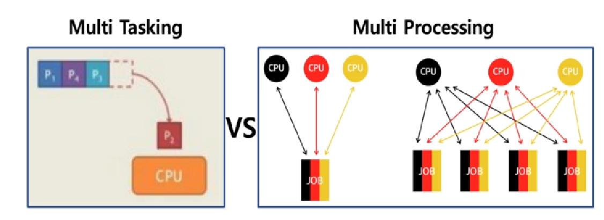

# chapter02 배치 처리, 멀티태스킹, 멀티프로세싱 상세

## 프로세스 스케쥴링

- 배치처리 시스템, 시분할 스스템, 멀티 태스킹

## 배치 처리 시스템

- Queue와 처리 방식이 흡사(FIFO)

### 배치 처리 시스템과 시분할 시스템/멀티 프로그래밍 비교

- 배치는 여러 프로그래을 순차적으로 실행시킬 수 있도록 하기 위해 등장

  - 어떤 프로그램은 실행이 너무 오래 걸려서, 다른 실행 시간이 짧은 프로그램을 함께 실행시키는데 비효율적. 다른 프로그램이 실행되는데 너무 많은 시간이 걸린다

  - 나는 MP3 음악을 들으면서, 문서 작성을 하고 싶어요! (동시에 여러 응용 프로그램 실행)

  - 여러 사용자가 동시에 하나의 컴퓨터를 쓰려면 어떻게 해야 하나요?(다중 사용자 지원)

    - 이는 배치 처리 시스템에서는 불가능한 일
    - 멀티프로그래밍/시분할 시스템 등장의 이유

    

## 시분할 시스템

- 시분할 시스템: 다중 사용자 지원을 위해 컴퓨터 응답 시간을 최소화하는 시스템 

## 멀티 태스킹

- 멀티 태스킹: 단일 CPU에서 여러 응용 프로그램이 동시에 실행되는 것처럼 보이도록 하는 시스템
  - 나는 MP3 음악을 들으며, 문서 작성을 한다
    - 시분할 시스템과 같은 방식을 취하면서, 이 주기를 빠르게 가져가면 여러 응용 프로그램이 동시에 실행되는 것처럼 사용자가 느끼게 된다.

### 실제 멀티 태스킹

- 1000 밀리초(ms) = 1초
- 10 ~ 20ms 단위로도 실행 응용 프로그램이 바뀌더라
- 사용자에게는 동시에 실행되는 것처럼 보임

### 멀티 태스킹과 멀티 프로세싱

- 멀티 태스킹과 멀티 프로세싱 

- 멀티 태스킹: 단일 CPU
- 멀티 프로세싱: 여러 CPU에 하나의 프로그램을 병렬로 실행해서 실행 속도를 극대화시키는 시스템

