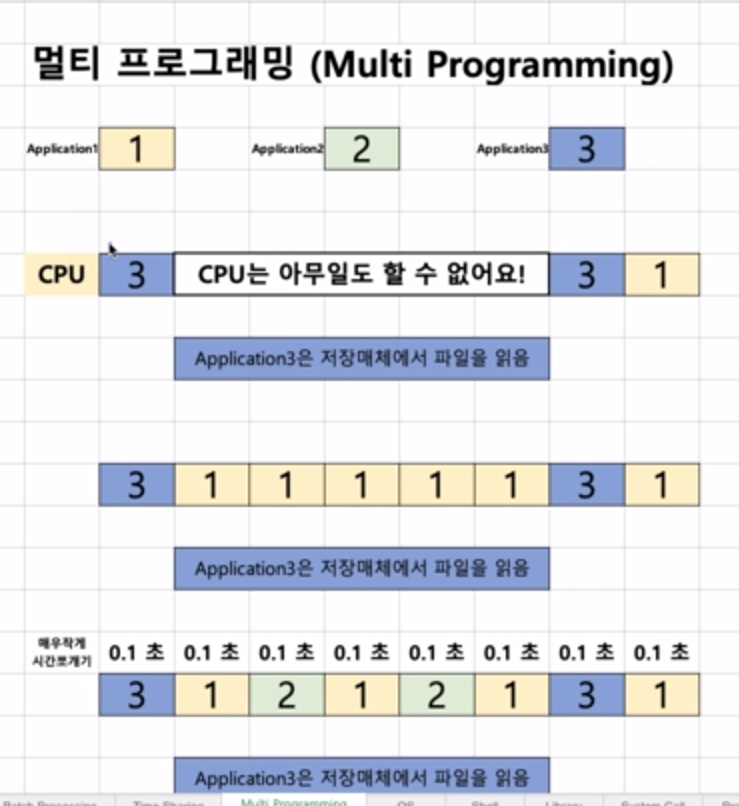

# chapter02 history

## 1950 - 1960초반

### 1950년대

- ENIAC: 첫 번째 컴퓨터

- 운영체제가 없었음
  - 1개의 응용 프로그램을 실행시키도 바빴음
  - 응용 프로그램이 직접 시스템 자원을 제어

### 1960년대 초기

> 프로그램 종류도 많아지고, 사용자도 슬슬 많아지기 시작 

- 철수: 프로그램1 - 예상 실행 시간 12시간
- 영희: 프로그램2 - 예상 실행 시간 1분
- 프로그램 실행 방법(순서)
  - 프로그램1 -> 프로그램2
    - 영희는 프로그램1이 끝날 때까지 기다리고 있어야함 -> 비효율적
  - 프로그램2 -> 프로그램1

- 배치 처리 시스템(batch processing system) 출현
  - 여러 응용 프로그램을 등록시켜놓으면, 순차적으로 실행하는 시스템 -> 앞선 프로그램이 끝날 때까지 기다리지 않아도 된다. 등록만 시켜놓고 딴 일 하러가도 됨
  - 배치 처리 시스템을 기반으로 운영체제가 출현
  - 순서를 어떻게 등록하느냐에 따라서 응용 프로그램의 실행 시간이 달라지게 된다

## 1960년대 후반

- 새로운 개념이 제안됨
  - 시분할 시스템(Time Sharing System)
  - 멀티 태스킹(Multi Tasking)

### 시분할 시스템과 멀티 태스킹

- 응용 프로그램이 CPU를 사용하는 시간을 잘게 쪼개서, 여러 개의 응용 프로그램을 동시에 실행하는 기법

- 시분할 시스템: 다중 사용자를 지원하고, 컴퓨터 응답 시간을 최소화하는 시스템

  - 배치 시스템은 다중 사용자 환경에서 컴퓨터 응답 시간을 최소화하기에 적합하지 못하다

- 멀티 태스킹: 가능한 CPU를 많이 활용하도록 하는 기능(시간 대비 CPU 사용율을 높이는 것이 목표)

  - 단일 CPU에서, 여러 응용 프로그램의 벙렬 실행을 가능케 하는 시스템
  - 여러 응용 프로그램이 동시에 실행되는 것처럼 보인다

- 보통은 시분할 시스템 = 멀티 태스킹으로 보는 시각이 지배적

  > 멀티 프로그래밍: 최대한 CPU를 많이 활용하도록 하는 시스템(시간 대비) -> CPU 활용도를 높이자

### 배치 처리 시스템의 단점

1. 컴퓨터 응답 시간(response time)이 오래 걸릴 수 있다(앞단에 실행 시간이 많이 필요로 하는 응용 프로그램이 실행될 경우)
2. 실행 시간도 오래 걸릴 수 있음(CPU가 필요 없음에도 응용 프로그램이 CPU를 점유할 수 있기 때문)

## 1970년대

> 제대로된 운영체제가 나온 시기

### UNIX(유닉스) OS

- 미국 AT&T 사의 벨 연구소
  - 켄 톰슨, 데니스 리치
  - 데니스 리치: C 언어를 개발

### 쉬어가기: 운영체제 개발에 C언어가 필요했던 이유

- 1970년대 이전: Assembly 언어로 소프트웨어를 개발하였음

  - CPU(명령어), Memory(주소)
  - 컴퓨터마다 각각 다시 개발해줘야하는 단점
  - 프로그래밍 복잡도가 높음

- 1970년대 C언어가 개발된 후

  - 컴파일러가 해당 컴퓨터에 알맞게 기계어로 번역해줌
  - 한 번 C로 만든 프로그램은 다시 작성할 필요가 없고 재컴파일만 해주면되기 때문에 프로그래밍의 효율성이 비약적으로 상승. 복잡도가 줄어들었다

  > C언어를 기반으로 운영체제를 개발하였다

### UNIX 특징

- 현대 운영체제의 기본 기술을 모두 포함한 최초의 운영체제
  - 멀티 태스킹, 시분할 시스템, 멀티 프로그래밍
    - 다중 사용자 지원

## 1980년대

- 개인용 컴퓨터 시대
  - 1980년대 이전: 대형 컴퓨터를 여러 명이 접속해서 사용 (UNIX)
  - 1980년대 ~: Personal Computer(PC)  보급
- 용어 이해: CLI와 GUI
  - CLI (Command Line Interface) : 터미널 환경
  - GUI(Graphical User Interface) :  GUI 환경
- CLI -> GUI 변화의 시대
  - 1980년대 초반: 아직 터미널 환경
  - 1980년대 중후반: GUI 환경(마우스)

## 1990년대 

1. 응용 프로그램 시대 by GUI 환경, 개인용 컴퓨터의 보급(사용자 증대)

   - 엑셀, 워드 프로세서 등등

   - Windows OS 대중화

2. 네트워크 기술 발전 - 월드와이드웹(WWW) 인터넷 대중화

3. 오픈 소스 운동 활성화 시작

   - UNIX 계열 OS + 응용 프로그램 자체 개발, 소스 오픈

   - LINUX(리눅스) 운영체제, 소스 오픈, 무료

### 쉬어가기 : Killer Application

> 1. 위닝(축구 게임) 프로그램을 위해 플레이스테이션 기기를 구매하였음
> 2. 엑셀 프로그램을 사용하기 위해서, Windows 컴퓨터를 구매하였음

## 2000년대와 총정리

1. 오픈 소스 활성화

   - LINUX(리눅스) 운영체제
   - Apache(아파치, 웹서버)
   - MySQL(데이터베이스)
   - 요즘.. 안드로이드, 딥러닝, 데이터사이언스, IoT 관련

2. 가상 머신, 대용량 병렬 처리 등 활성화

   

### 정리

> 다음 내용을 알아두세요

1. 운영체제는 응용 프로그램과 시스템 자원을 제어하고, 관리한다.
2. 응용 프로그램(Application) 용어 이해
3. 배치 처리 시스템, 시분할 시스템, 멀티 태스킹 개념
4. CLI(터미널) vs GUI 환경 용어 이해
5. History 전반은 가볍게만 알아두기

