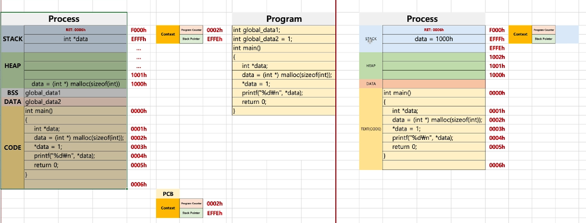
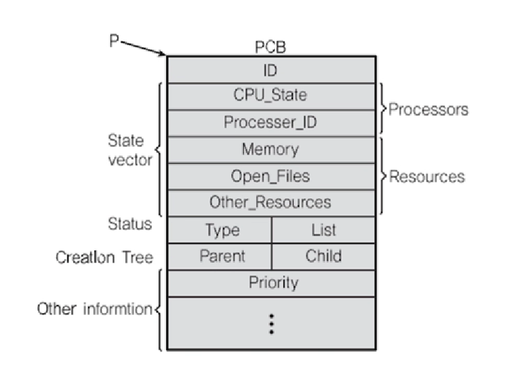

# chapter03 컨텍스트 스위칭

## 01 컨텍스트 스위칭 원리

### 프로세스와 컨텍스트 스위칭

> 다시 PC, SP에 주목하자

- PC(Program Counter) + SP(Stack Pointer) -> 어떻게 동작하는지 이해하는 것이 정말 중요

> Stack, Heap, Data(BSS, Data), Text(code)

> 컨텍스트 스위칭이 될 때 현재 프로세스의 PC와 SP에 저장된 주소를 PCB(프로세스의 상태를 나타내는 구조체)에 저장한다.

### PCB

> PC, SP는 어디에 저장하나?

**Process Control Block(PCB)에 저장! **

> Process Context Block이라고도 함

1. Process ID
2. Register 값(PC, SP 등)
3. Scheduling Info(Process State)
4. Memory Info(메모리 사이즈 limit)

> PCB: 프로세스가 실행중인 상태를 캡쳐/구조화해서 저장
>
> 리눅스의 커널은 C로 만들어져 있기 때문에 리눅스의 PCB는 C의 구조체를 이용해서 만든다

## 02 컨텍스트 스위칭 개념 정리

- Context Switching(문맥 교환)
  - CPU에 실행할 프로세스를 교체햐는 기술

1. 실행 중지할 프로세스 정보(레지스터에 저장된 값들)를 해당 프로레스의 PCB에 업데이트해서, 메인 메모리에 저장
2. 다음 실행할 프로세스 정보를 메인 메모리에 있는 해당 PCB 정보(PC, SP)를 CPU의 레지스터에 넣고, 실행
   - 디스패치(dispatch): ready 상태의 프로세스를 running 상태로 바꾸는 것
   - 이 동작은 매우 짧은 시간(ms 단위)에 일어남
   - 컨텍스트 스위칭은 빈번하게 일어나는 작업이기 때문에 이것이 오래 걸린다면 사용자 경험에 나쁜 영향을 준다. CPU 사용도 비효율적.

> 컨텍스트 스위칭도 프로그램임.
>
> C언어가 아니라 어셈블리어로 보통 작성

### 여기서 잠깐! - 컴파일러

- 초기 컴퓨터 프로그램들은 어셈블리어로 작성
  - 서로 다른 CPU 아키텍처가 등장할 때마다 매번 똑같은 프로그램 작성 -> 이식성이 떨어진다
  - 리눅스의 경우 컨텍스트 스위칭 코드는 각 CPU마다 별도로 존재
  - 어셈블리어로는 프로그램 작성 속도가 매우 떨어짐
- 컴파일러 등장
  - CPU 아키텍처에 따라서는 컴파일러 프로그램만 만들면 됨. 기존 코드는 재작성할 필요 없음
  - 그러나, 어셈블리어로 작성한 코드보다는 속도가 떨어질 수 있음

### 정리

- 프로세스 구조
  - heap, stack, data(bss, data), text(code)
- PCB
  - 프로세스 상태 정보 - PC, SP, 메모리, 스케쥴링 정보 등
- 컨텍스트 스위칭
  - 프로세스 상태 정보를 PCB로부터 CPU에 로드하고, 실행

