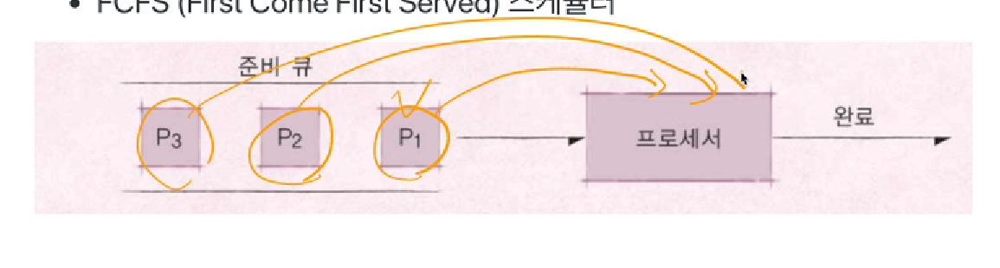
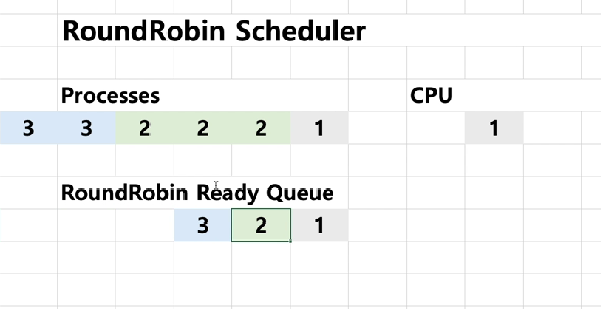
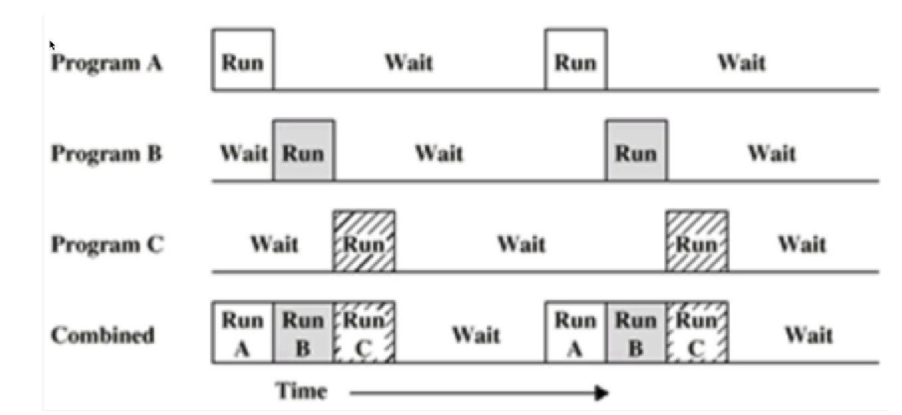
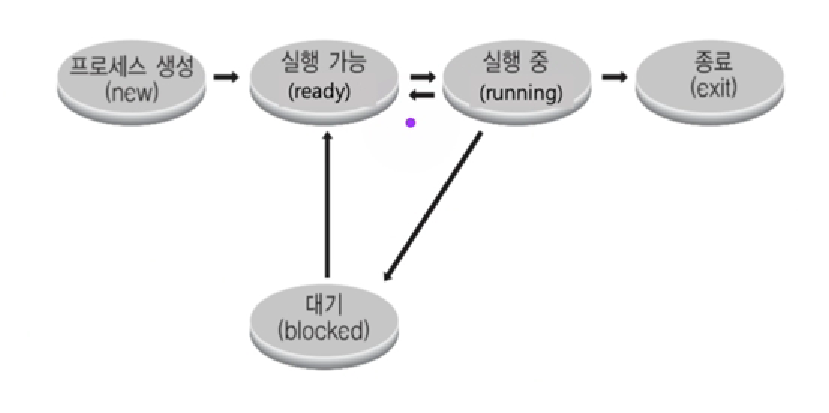
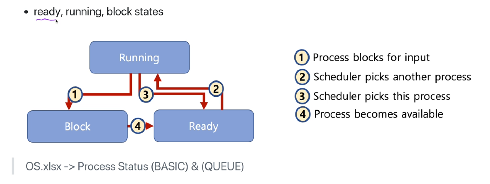
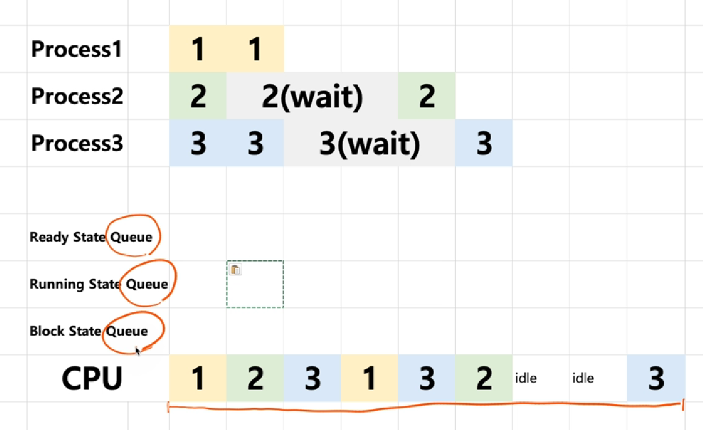
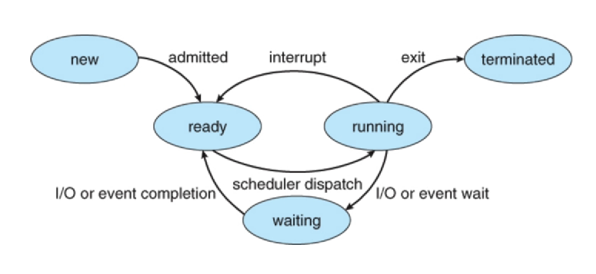
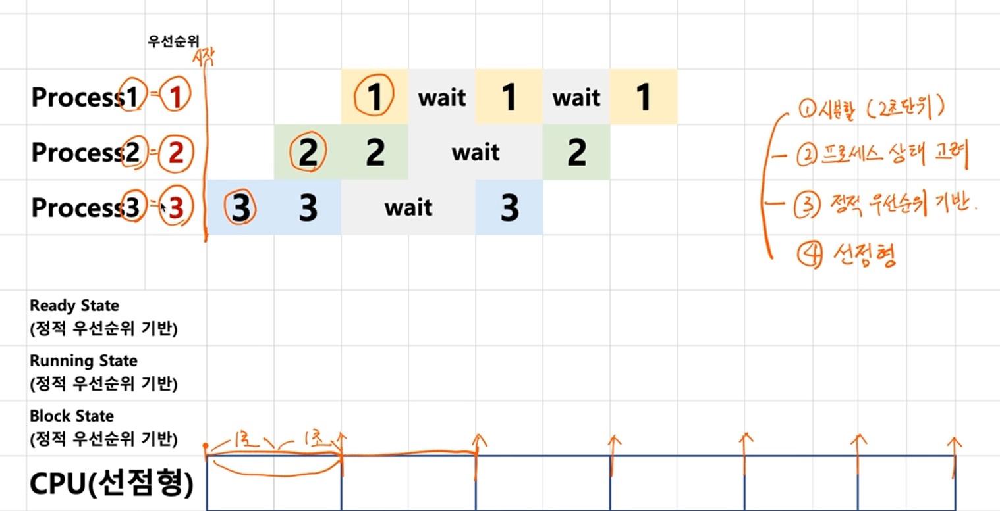
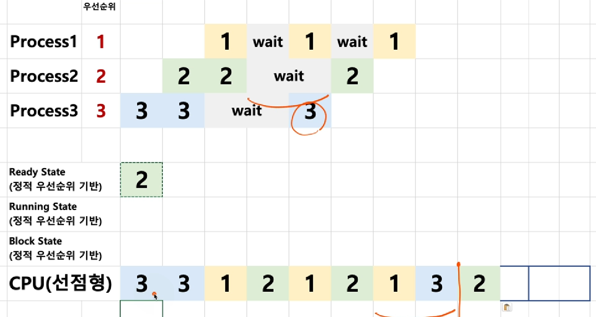

# chapter03 프로세스와 스케쥴러의 이해

## 01. 스케쥴링 알고리즘 기본1

### 프로세스(process)란?

- 실행중인 프로그램은 프로세스라고 함

  - 폰 노이만 구조에서 프로세스는 메모리에 올려져서, 실행 중인 프로그램
  - 코드 이미지(바이너리): 실행파일, 예: ELF format

  > 프로세스라는 용어는 작업, task, job이라는 용어와 혼용

- 응용 프로그램 != 프로세스

  - 응용 프로그램은 여러 개의 프로세스로 이루어질 수 있음

- 하나의 응용 프로그램은 여러 개의 프로세스(프로그램)가 상호작용을 하면서 실행될 수도 있음

  > 간단한 C/C++ 프로그램을 만든다면 -> 하나의 프로세스
  >
  > 여러 프로그램을 만들어서, 서로 통신하면서 프로그램을 작성할 수도 있음(IPC 기법, 프로세스간 통신 기법)

### 스케쥴러와 프로세스

> 누가 프로세스와 실행을 관리하는가? -> 스케쥴러

#### 스케쥴링 알고리즘

> 어느 순서대로 프로세스를 실행시킬까?

- 스케쥴링의 알고리즘은 수행하고자 하는 목표에 따라서 다르게 작성된다
  - 시분할 시스템 예 : 프로세스 응답 시간을 가능한 짧게
  - 멀티 프로그래밍 예: CPU 활용도를 최대로 높여서, 프로세스를 빨리 실행

#### FIFO 스케쥴러

> 프로세스가 저장매체를 읽는다던지, 프린팅을 한다던지 하는 작업 없이, 쭉 CPU를 처음부터 끝까지 사용한다고 가정하고 이 스케쥴링 알고리즘을 생각

- 가장 간단한 스케쥴러(배치 처리 시스템과 유사)
- FCFS(First Come First Served)
- 실행 요청을 빨리 한 프로세스의 순서대로 작업을 처리하는 방식

- 큐 자료주조와 원리가 동일, 그래서 이 스케쥴러를 구현할 때 큐를 사용하는 것임

#### 최단 작업(SJF) 스케쥴러

- SJF(Shortest Job First) 스케쥴러
  - 가장 프로세스 실행시간이 짧은 프로세스부터 먼저 실행시키는 알고리즘
  - FIFO 알고리즘보다 응답시간이 짧을 수 있음

## 02. 스케쥴링 알고리즘 기본2

### 여기서 잠깐!

- RealTime OS(RTOS): 응용 프로그램 실시간 성능 보장을 목표로 하는 OS
  - 정확하게 프로그램 시작, 완료 시간을 보장
  - 시간에 민감한 프로세스들이 동작해야하는 경우에 사용
  - GPOS 보다 간단하게 구성되어 있는 경우가 많음
  - 공정 등에 사용
  - Harware RTOS, Software RTOS
- General Purpose OS(GPOS)
  - 프로세스 실행시간에 민감하지 않고, 일반적인 목적으로 사용되는 OS
  - Windows, Linux 등

### 우선순위 기반 스케쥴러

- Priority-Based 스케쥴러
  - 프로세스에 미리 우선순위를 매겨놓고, 우선순위에 따라 프로세스를 실행시킨다.
  - 정적 우선순위
    - 프로세스마다 우선순위를 미리 지정
  - 동적 우선순위
    - 스케쥴러가 상황에 따라 우선순위를 동적으로 변경

### Round Robin 스케쥴러

## 03.  프로세스 상태와 스케쥴러

### 멀티 프로그래밍과 Wait

- 멀티 프로그래밍: CPU 활용도를 극대화하는 스케쥴링 알고리즘
- Wait: 간단히 저장매체로부터 파일 읽기를 기다리는 시간으로 가정

###  프로세스 상태

- running state: 현재 CPU에서 실행상태
- ready state: CPU에서 실행가능 상태(실행 대기 상태)
- block state: 특정 이벤트 발생 대기 상태(예: 프린팅이 다 되었다!)

- 싱글코어 상태에서는 특정시점에서 running state인 프로세스가 최대 1개일 것임
- new는 아직 생성중인 상태, ready 이전인 상태
- exit 단계는 시스템 리소스를 풀어주는 등 말그대로 종료를 위한 작업을 수행하는 상태

#### 프로세스 상태간 관계

> input은 특정 이벤트 발생 대기를 의미(파일 읽기가 완료되었다고 알림이 오는 등)

ready 상태의 프로세스가 여러 개가 있을 때 어떤 프로세스 먼저 CPU를 할당할지는 스케쥴링 알고리즘에 따라 달라지는 것임 -> 상태기반 스케쥴링 알고리즘 필요

## 04. 프로세스 상태기반 스케쥴링 알고리즘 기본

- 여러 알고리즘이 존재

  - ex) state 별로 세 개의 큐를 둔다
    - ready state queue, running state queue, block state queue

- CPU가 아무것도 하지 않는 상태를 idle 상태라고 한다

  - ready state queue가 비어있을 때 idle 상태가 된다. 

  

## 05. 선점형과 비선점형 스케쥴러

- 선점형 스케쥴러(Preemtive Scheduling)
  - 하나의 프로세스가 다른 프로세스 대신 프로세서(CPU)를 차지할 수 있음
- 비선점형 스케쥴러(Non-preemtive Scheduling)
  - 하나의 프로세스가 끝나지 않으면 다른 프로세스는 CPU를 사용할 수 없음

### 선점형과 비선점형 스케쥴러 차이

- 비선점형: 프로세스가 자발적으로 blocking 상태로 들어가거나, 실행이 끝났을 때만, 다른 프로세스로 교체 가능

- 선점형: 프로세스 running 중에 스케쥴러가 이를 중단시키고, 다른 프로세스로 교체 가능
- 무엇이 더 좋다고는 말할 수 없다. 응답시간을 빠르게 할 것인지, 스케쥴러 구현을 더 간단하게 할 것인지 등 목적에 따라 알고리즘 선택을 다르게 가져가면 된다.

## 06. 스케쥴링 알고리즘 조합

현대 스케쥴링 알고리즘은 하나로만 되어있는 것이 아니고 여러 알고리즘이 목적, 정책에 맞게 조합되어 있다.

### 스케쥴러 구분

- FIFO(FCFS), SJF, Priority-based는 어떤 프로세스를 먼저 실행시킬지에 대한 알고리즘
  - 비선점형 스케쥴러에 가까움
- RoundRobin은 시분할 시스템을 위한 기본 알고리즘
  - 선점형 스케쥴러에 가까움

### 렉? : 마우스/키보드 반응이 느린 경우?

> 스케쥴러가 해결해야하는 이슈
>
> 다양하고 복잡한 스케쥴링 알고리즘 필요

- 리눅스 스케쥴러: O(1), CFS와 같이 다양한 방식으로 변경시도 중
  - 인터렉티브, IO, CPU 중심 프로세스로 미리 구분할 수 있다면 보다 개선된 스케쥴링이 가능함(타입에 따라 우선순위를 메길 수 있다)
- 프로세스 수가 많다면 사용하고 있는 프로그램의 응답속도가 늦어지고, 마우스/키보드의 반응이 늦어질 가능성이 높아진다

