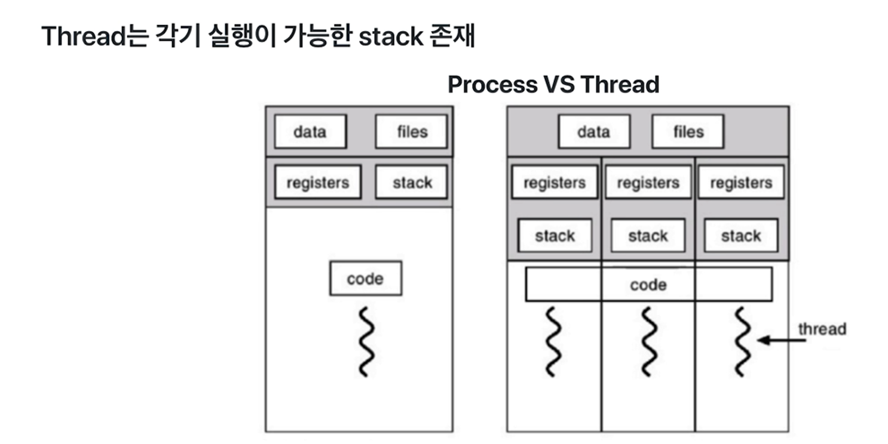
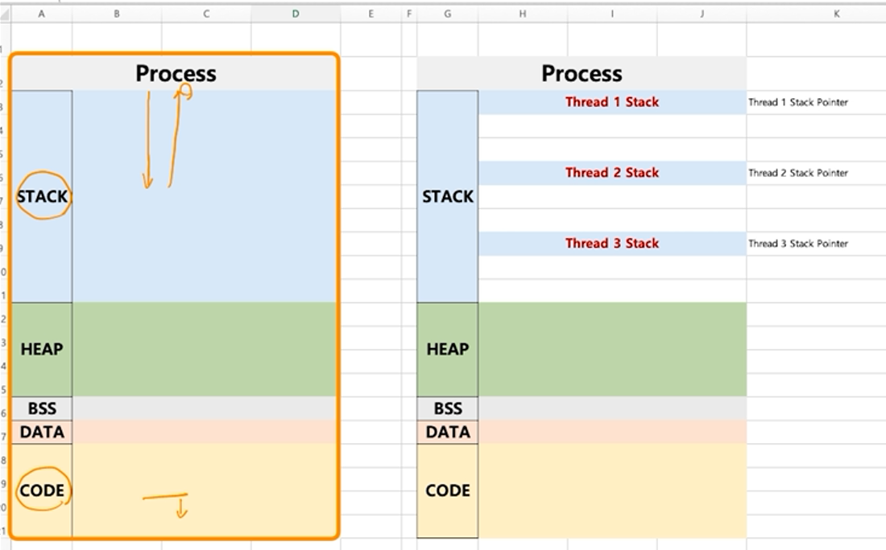
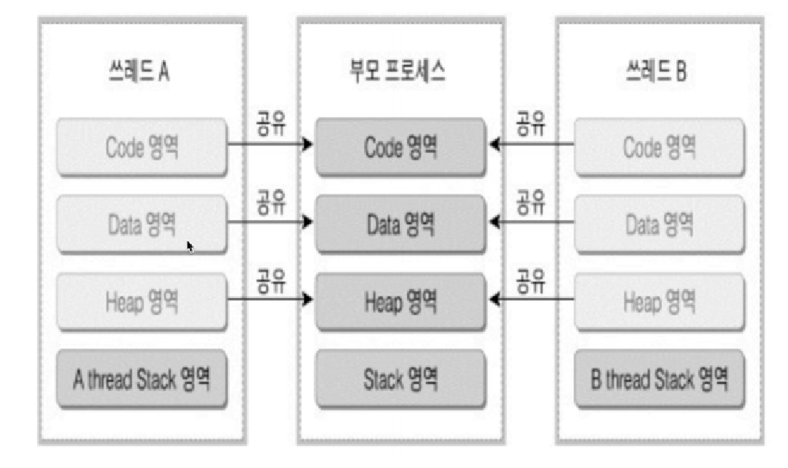
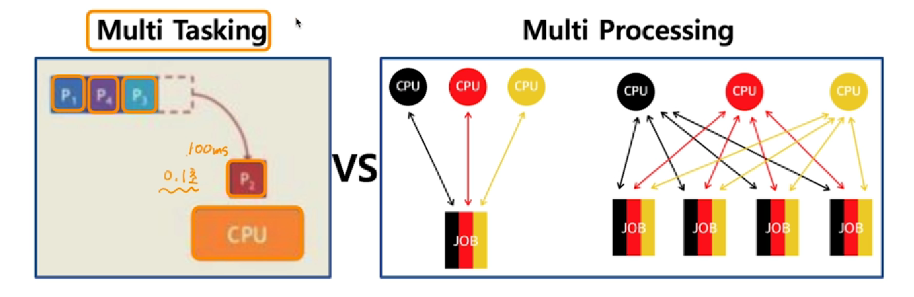
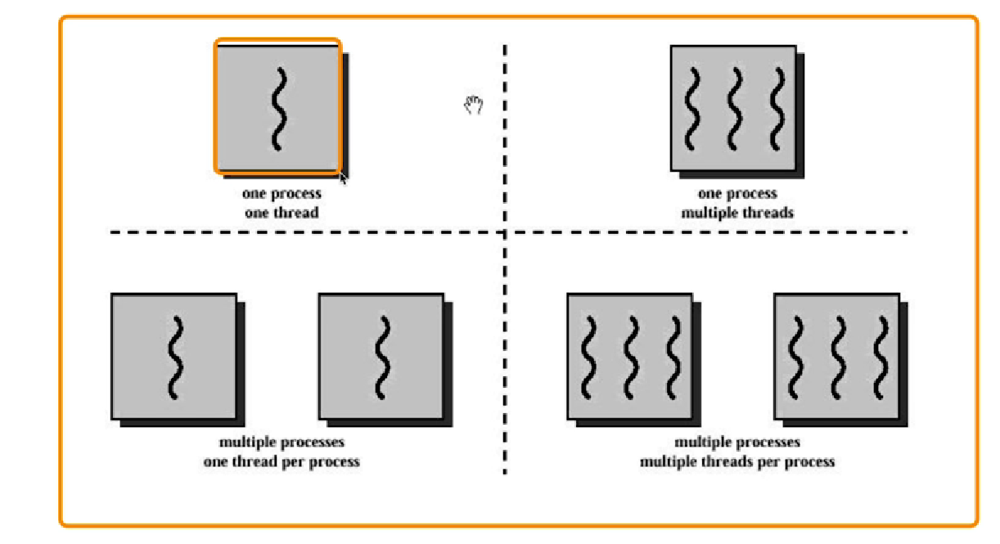
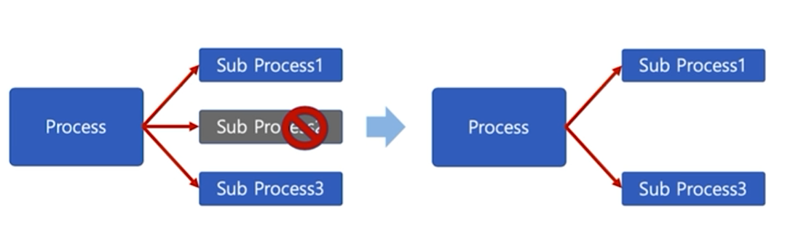
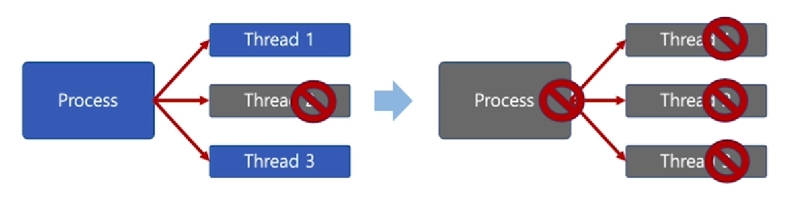
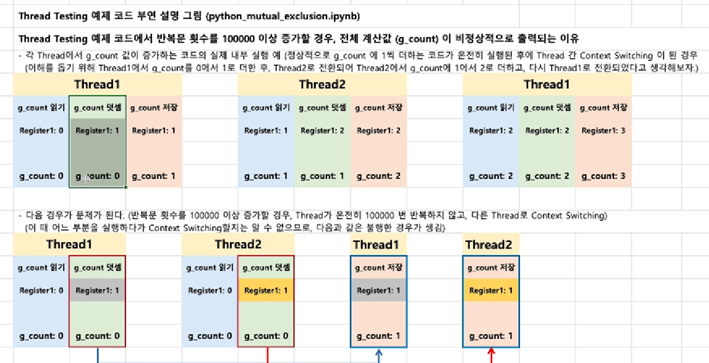
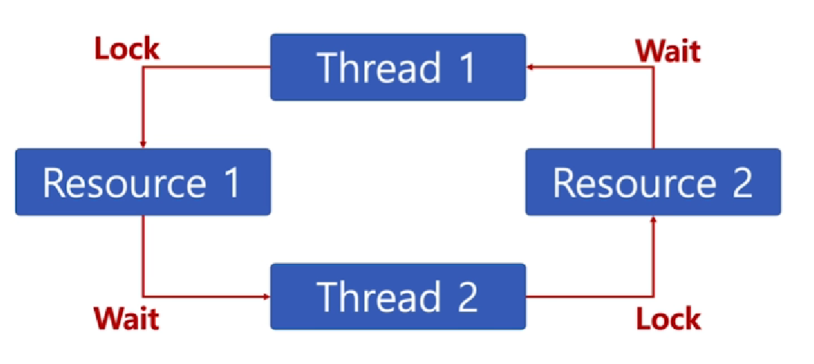

# chapter04 쓰레드의 이해

## 01 스레드 개념

### Thread

- Light Weight Process라고도 함
- 프로세스
  - 프로세스 간에는 각 프로세스의 데이터 접근이 불가
- 스레드
  - 하나의 프로세스에 여러 개의 스레드 생성 가능
  - 스레드들은 동시에 실행 가능
  - 프로세스 안에 있으므로, 프로세스의 데이터를 모두 접근 가능
    - 다른 프로세스에 있는 스레드에 접근가능하다는 소리가 아님!






### Multi Trhead(멀티 스레드)

- 소프트웨어 병행 작업 처리를 위해 multi Thread를 사용함




### 멀티프로세싱과 Thread

- 멀티 태스킹과 멀티 프로세싱
- 최근 CPU는 멀티 코어를 가지므로, Thread를 여러 개 만들어, 멀티 코어의 활용도를 높임



- 멀티 태스킹: 하나의 CPU에서 여래 개의 프로세스를 빠르게 돌려가면서 실행시켜서 모든 프로세스가 마치 동시에 실행되는 것처럼 보이게 하는 기술
- 하나의 프로세스를 여러 개의 CPU를 사용해서 프로그램의 속도를 높이는 방법(병렬 실행을 통해)
  - 이걸 멀티스레드를 통해 실현시킬 수 있음(하나의 프로세스에 여러 개의 스레드를 만들어서 병렬 실행할 수 있음)




## 02 스레드의 장단점

### Thread의 장점

1. 사용자에 대한 응답성 향상

   

2. 자원 사용 효율
   - IPC 기법과 같이 프로세스 간 자원 공유를 위해 번거로운 작업이 필요 없음
   - 프로세스 안에 있으므로, 프로세스의 데이터를 모두 접근 가능
   - 병렬처리를 위해 여러 개의 프로세스를 만들면 메모리를 매우 많이 할당해줘야하지만(ex- 4gb * 4 = 16), 스레드는 하나의 프로세스 안에 여러 개의 스레드를 만들어서 병렬처리를 하기 때문에 공간을 많이 할당해주지 않아도 된다.

3. 작업의 분리되어 코드가 간결
   - 사실 작성하기 나름
   - deadlock, starvation 등의 문제가 발생할 수 있고, 멀티스레드 프로그래밍은 디버깅하기 어렵다.

### Thread의 단점

- 스레드 중 한 스레드만 문제가 생겨도, 전체 프로세스가 영향을 받음

- 멀티 프로세스

  

- 멀티 스레드

  

- 스레드를 많이 생성하면, Context Switching이 많이 일어나, 성능 저하
- 예: 리눅스 OS에서는 Thread를 Process와 같이 다룸
  - 스레드를 많이 생성하면, 모든 스레드를 스케쥴링해야 하므로, Context Switching이 빈번할 수 밖에 없음


### Thread vs Process

- 프로세스는 독립적, 스레드는 프로세스의 서브셋
- 프로세스는 각각 독립적인 자원을 가짐, 스레드는 프로세스 자원 공유
- 프로세스는 자신만의 주소영역을 가짐, 스레드는 주소영역 공유
- 프로세스  간에는 IPC기법으로 통신해야함, 스레드는 필요 없음
- 스레드는 스레드 동기화 문제가 있어서 사용하기가 까다로울 수 있음


### PThread

- POSIX 스레드(POSIX Threads, 약어:  PThread)
  - Thread 관련 표준 API


## 03 스레드 동기화 문제

### 동기화(Synchronization)이슈 예제

```python
import threading

g_count = 0
def thread_main():
    global g_count
    for i in range(1000000):
        g_count = g_count + 1
threads = []

for i in range(50):
    th = threading.Thread(target=thread_main)
    threads.append(th)

for th in threads:
    th.start()
for th in threads:
    th.join()
    
print('g_count = ', g_count)
```

- 의도한 결과는 50,000,000이지만 이상한 결과값이 나온다.
- 그 이유를 간략히 설명하면, 만약 g_count가 50인 시점에 두 스레드가 동시에 g_count를 가져가서 +1을 하게 되면 g_count가 51이 되는데, 이는 의도하였던 52가 아니다. 한 스레드에서 값을 가져다가 write 하는 순간에는 다른 스레드에서 write하는 것을 막아줘야한다.(lock 개념)
- `g_count+1`은 하나의 단계가 아니라 내부적으로는 몇 단계로 실행될 수 있음(g_count를 읽고, register에 저장하고, +1을 하고, 다시 g_count에 저장)
  - 만약 thread1에서 register에 g_count 값 50을 저장했을 때 context switching이 일어나서 thread2가 해당 연산을 수행한다고 하자. 그러고 g_count에 51을 저장하고 다시 thread1으로 context switching이 일어난다면, thread1은 이전에 하던 작업인 register에 50을 저장한 다음 단계인 +1을 하는 작업을 이어 수행할 것이고 결과적으로 g_count에 51을 다시 저장하게 된다. 결과적으로 기대한 값 52가 되지 않고 51이 될 수 있다.(mutext 개념, 임계영역 설정)




- Lock 설정 코드

  ```python
  import threading
  
  g_count = 0
  def thread_main():
      global g_count
      lock.acquire() # lock을 걸어두면 context switching이 되어도 다른 스레드에서 접근할 수 없음. 이를 통해 동기화 문제 해결
      for i in range(1000000):
          g_count = g_count + 1
      lock.release()
  threads = []
  
  for i in range(50):
      th = threading.Thread(target=thread_main)
      threads.append(th)
  
  for th in threads:
      th.start()
  for th in threads:
      th.join()
      
  print('g_count = ', g_count)
  ```

  

## 04 세마포어

### 동기화(Synchronization)

- 동기화: 작업들 사이에 실행 시기를 맞추는 것
- 여러 스레드가 동일한 자원(데이터) 접근시 동기화 이슈 발생
  - 동일 자원을 여러 스레드에서 동시 수정시, 각 스레드 결과에 영향을 줌

#### 동기화 이슈 해결 방안

- Mutual Exclusion(상호 배제)
- 스레드는 프로세스의 모든 데이터를 접근할 수 있으므로, 
  - 여러 스레드가 변경하는 공유 변수에 대해 Exclusive access 필요
  - 어느 한 스레드가 공유 변수를 갱신하는 동안 다른 스레드가 동시 접근하지 못하도록 막아야함

#### 상호배제(Mutual Exclusion)

- 임계 자원(critical resource)

  - 아래 코드에서는 g_count

- 임계 영역(critical section)

  - 임계 영역에 여러 스레드가 동시에 들어와서 작업(write)할 수 없음

  ```python
  lock.acquire()
  for in in range(1000):
      g_count+=1
  lock.release()
  ```


### Mutex와 세마포어(Semaphore)

- Critical Section(임계 구역)에 대한 접근을 막기 위해 LOCKING 메커니즘이 필요

  - Mutex(binary semaphore)
    - 임계구역에 하나의 스레드만 들어갈 수 있음
  - Semaphore
    - 임계구역에 여러 스레드가 들어갈 수 있음
    - counter를 두어서 동시에 리소스에 접근할 수 있는 허용 가능한 스레드 수를 제어
    - counter를 너무 크게 두면 성능 저하가 일어날 수 있어서 적당히..

- P: 검사(임계영역에 들어갈 때)

  - S값이 1 이상이면, 임계 영역 진입 후, S값 1 차감(S값이 0이면 대기)

- V: 증가(임계영역에서 나올 때)

  - S 값을 1 더하고, 임계 영역을 나옴

- S: 세마포어 값(초기 값만큼 여러 프로세스가 동시 임계 영역 접근 가능)

  ```
  P(S): wait(S) {
  	while S <= 0 // 대기
  	;
  	S--; // 다른 프로세스 접근 제한
  }
  
  V(S): signal(S) {
  	S++; // 다른 프로세스 접근 허용
  }
  ```


### 세마포어(Semaphore) - 바쁜 대기

- wait() S가 0이라면, 임계영역에 들어가기 위해, 반복문 수행
  - 바쁜 대기, busy waiting

```
P(S): wait(S) {  ->> 계속 loop를 돌며 CPU를 점유하기 때문에 비효율적임
	while S <= 0 // 대기
	;
	S--; // 다른 프로세스 접근 제한
}
```


### 세마포어(Semaphore) - 대기큐

> 운영체제 기술로 보완 - 대기큐

- S가 음수일 경우, 바쁜 대기 대신, 대기큐에 넣는다

  ```
  Wait(S) {
  	S->count--;
  	if (S->count < 0) {
  		add this process to S->queue;
  		block(); // loop를 돌지 않아도 됨
  	}
  }
  ```

- wakeup() 함수를 통해 대기큐에 있는 프로세스 재실행

  ```
  signal(S) {
  	S->count++;
  	if (S->count >= 1) {
  		remove a process P from S->queue;
  		wakeup(P)
  	}
  }
  ```

  

### 참고 : 주요 세마포어 함수(POSIX 세마포어)

- sem_open(): 세마포어를 생성
- sem_wait(): 임계영역 접근 전, 세마포어를 잠그고, 세마포어가 잠겨있다면, 풀릴 때까지 대기
- sem_post(): 공유자원에 대한 접근이 끝났을 때 세마포어 잠금을 해제한다.


## 05 deadlock과 starvation

## 교착상태(Deadlock)와 기아상태(Starvation)

### 교착상태란?

- 무한대기상태: 두 개 이상의 작업이 서로 상대방의 작업이 끝나기만을 기다리고 있기 때문에, 다음 단계로 진행하지 못하는 상태

  - 서로가 서로의 lock이 풀리기를 기다리는 중

  

> 배치 처리 시스템에서는 일어나지 않는 문제 
>
> 프로세스, 스레드 둘다 이와 같은 상태가 일어날 수 있음


### 참고: 교착상태 발생 조건

- 다음 네 가지 조건이 모두 성릴될 때, 교착상태 발생 가능성이 있음
  - 상호배제(Mutual exclusion): 프로세스들이 필요로 하는 자원에 대해 배타적인 통제권을 요구한다
  - 점유대기(Hold and wait): 프로세스가 할당된 자원을 가진 상태에서 다른 자원을 기다린다
  - 비선점(No preemption): 프로세스가 어떤 자원의 사용을 끝낼 때까지 그 자원을 뺏을 수 없다.
  - 순환대기(Circular wait): 각 프로세스는 순환적으로 다음 프로세스가 요구하는 자원을 가지고 있다.


### 기아상태

- 특정 프로세스의 우선순위가 낮아서 원하는 자원을 계속 할당받지 못하는 상태
- 동기화 문제에서만 일어나는 문제는 아님
- 교착상태와 기아상태
  - 교착상태는 여러 프로세스가 동일 자원 점유를 요청할 때 발생
  - 기아상태는 여러 프로세스가 부족한 자원을 점유하기 위해 경쟁할 때, 특정 프로세스는 영원히 자원 할당이 안되는 경우를 주로 의미함

#### 기아상태 해결 방안

- 우선순위 변경
  - 프로세스 우선순위를 수시로 변경해서, 각 프로세스가 높은 우선순위를 가질 기회주기
  - 오래 기다린 프로세스의 우선순위를 높여주기
  - 우선순위가 아닌, 요청 순서대로 처리하는 FIFO기반 요청큐 사용

