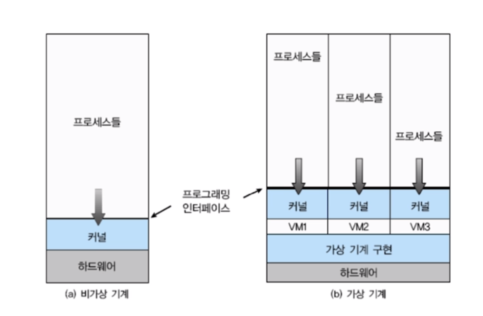
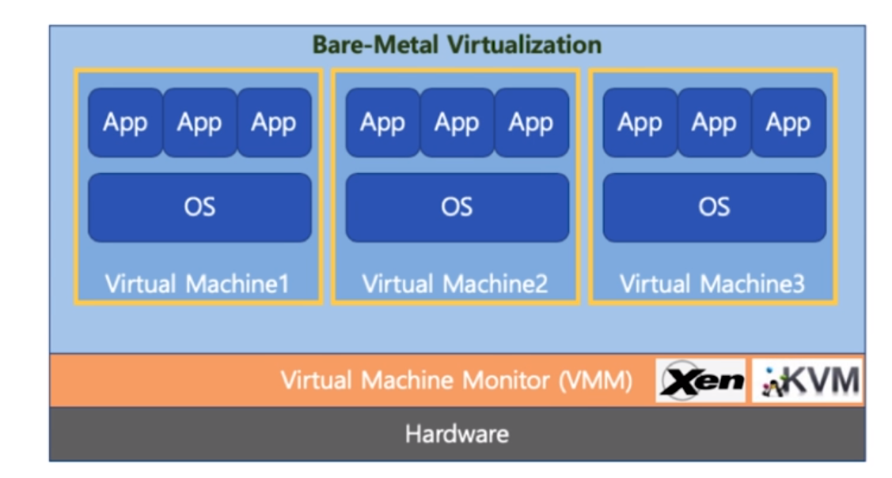
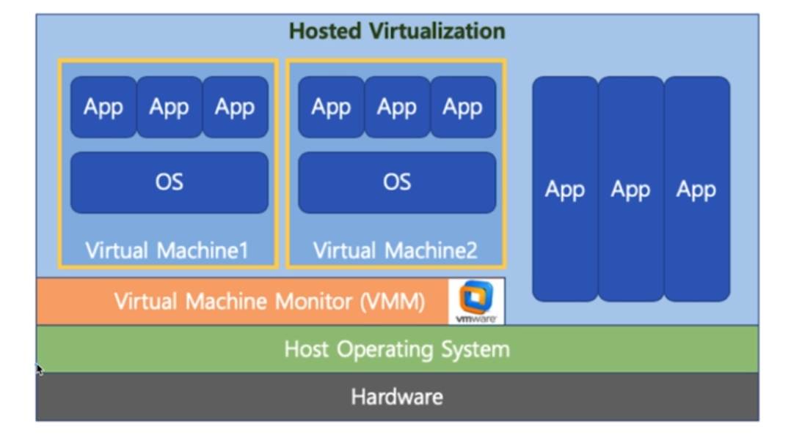
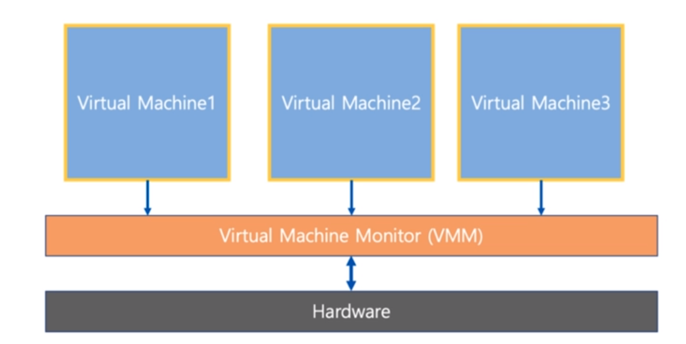
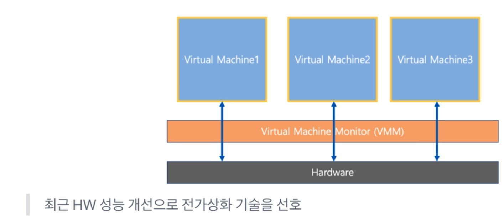
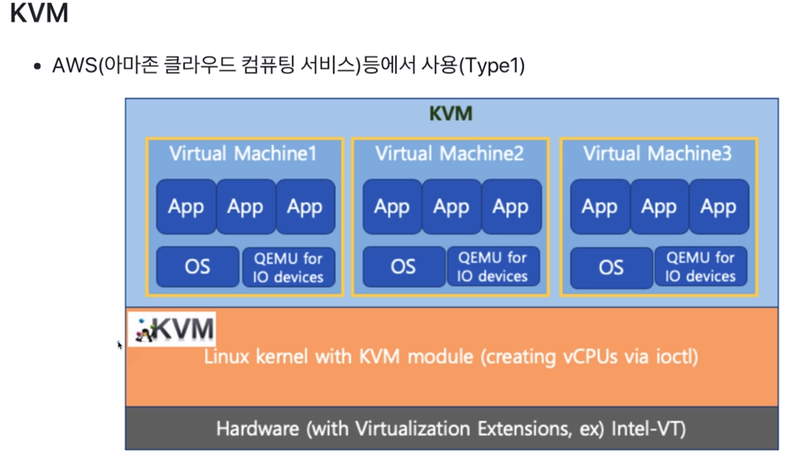
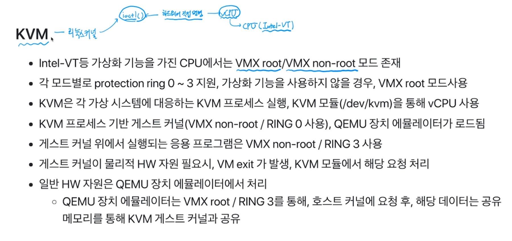
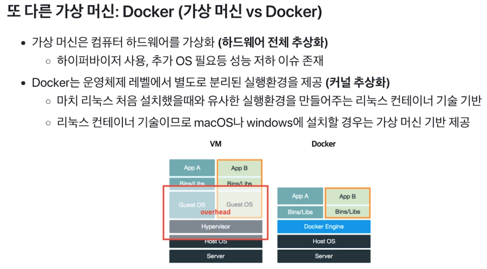
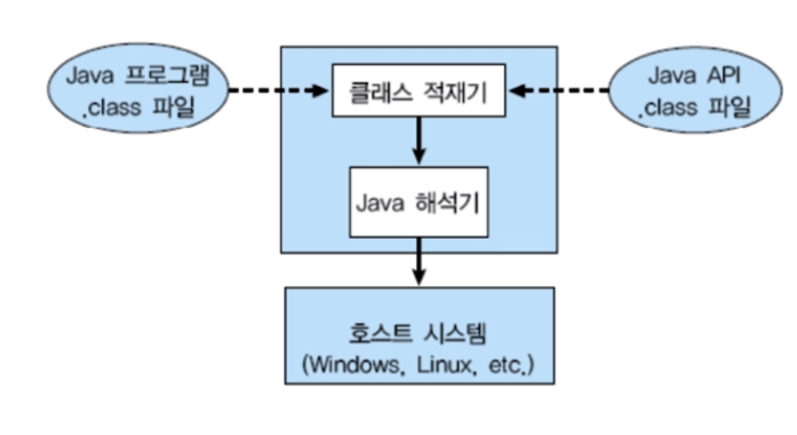

# chapter08 가상 머신의 이해

## 가볍게 이해하기: Virtual Machine(가상 머신 )

- 하나의 하드웨어(CPU, Memory 등)에 다수의 운영체제를 설치하고, 개별 컴퓨터처럼 동작하도록 하는 프로그램 -> 여러 개의 하드웨어가 있는 것처럼 동작, 이걸 deep하게 하려면 대학원 과정임. 

## Virtual Machine Type1(native 또는 bare metal)

- 하이퍼 바이저(또는 VMM): 운영 체제와 응용프로그램을 물리적 하드웨어에서 분리하는 프로세스
- 하이퍼 바이저 또는 버추얼 머신 모니터(VMM)라고 하는 소프트웨어가 Hardware에서 직접 구동
  - Xen, KVM
- 구현하기 나름이지만 Type1이 Type2보다 속도가 일반적으로 빠름

## Virtual Machine Type2

- 하이퍼바이저 또는 버추얼 머신 모니터(VMM)라고 하는 소프트웨어가 Host OS 상위에 설치
  - VMWare, Parallels Desktop(MAC)

## Full Virtualization(전가상화) vs Half Virtualization(반가상화)

- 전가상화: 각 가상머신이 하이퍼바이저를 통해서 하드웨어와 통신
  - 하이퍼바이저가 마치 하드웨어인 것처럼 동작하므로, 가상머신의 OS는 자신이 가상 머신인 상태인지를 모름

- 반가상화: 각 가상머신에서 직접 하드웨어와 통신
  - 각 가상머신에 설치되는 OS는 가상 머신인 경우, 이를 인지하고, 각 명령에 하이퍼바이저 명령을 추가해서 하드웨어와 통신
  - VMM이 리소스를 관리해줌
  - 성능은 반가상화 방식이 좋다. 하지만 나의 코드가 가상머신에서 실행되는 것인지, 실제 하드웨어에서 실행되는  것인지에 따라 코드를 수정해아하고 프로그램의 복잡도가 올라간다. 높아진 복잡도에 따라 성능이 저하될 수 있다.

## Java  Virtual Machine

- 가상 머신과는 다른 목적(응용프로그램 레벨 가상화)

- Java 컴파일러는 CPU dependency를 가지지 않는 bytecode를 생성함 

- 이 파일을 java Virtual Machine에서 실행함

- 각 운영체제를 위한 Java Virtual Machine 프로그램 존재

  

