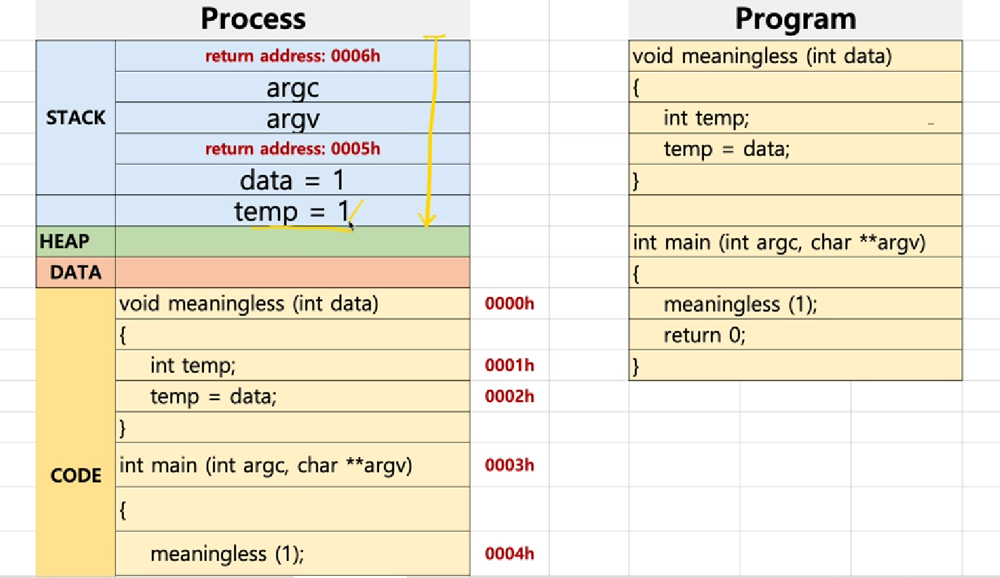
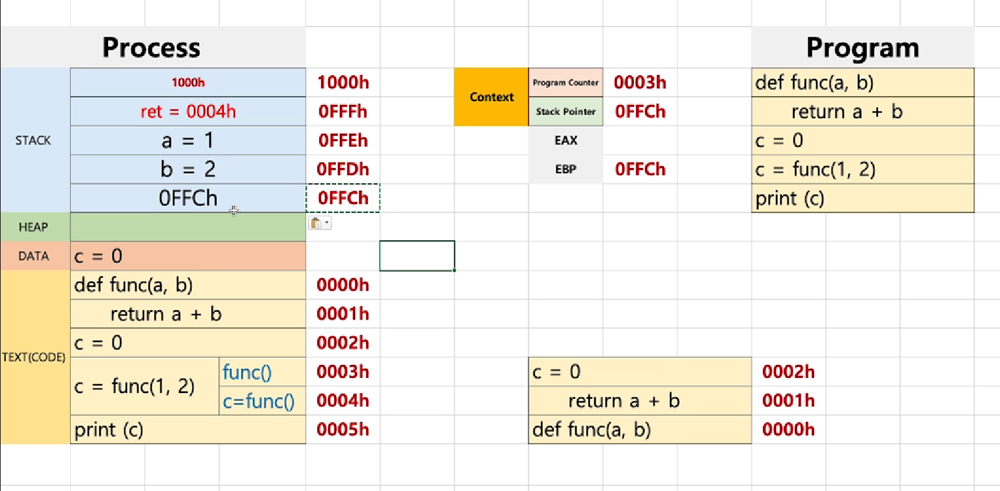
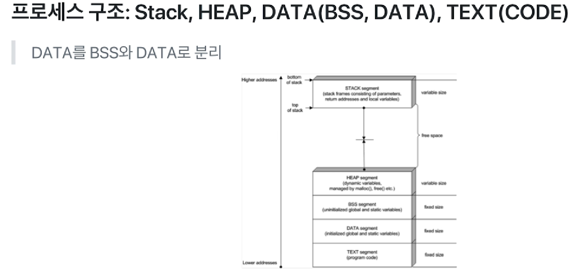

# chapter03 프로세스와 스케쥴러의 이해 - 프로세스 구조

## 프로세스와 컨텍스트 스위칭

- 컨텍스트 스위칭: 프로세스 스케쥴러에 의해 CPU를 점유하는 프로세스가 A->B로 변화하는 것

- 프로세스(process)는 일반적으로 어떻게 구성되어 있을까?

  - text(CODE): 코드

  - data: 변수/초기화된 데이터

  - stack: 임시 데이터(함수 호출, 로컬 변수 등)

  - heap: 코드에서 동적으로 만들어지는 데이터

    

- PC(Program Counter) + SP(Stack Pointer)

- EBP에 저장된 SP는 프로그램이 뻑이 났을 때 어떤 스택 프레임에서 문제가 생겼는지 디버깅을 하기 쉽게 도와준다.

- BSS: 초기화 되지 않은 전역변수
- DATA: 초기값이 있는 전역변수
- 스택 오버플로우: 주로 해커들의 공격에 활용되었음
  - return address에 본래 return 되려는 주소가 아니라 해킹과 관련된 코드가 적혀있는 주소로 바꿔치기해서 해킹에 활용할 수도 있음. 
  - 프로세스 구조를 이해하고 있다면 이러한 방법을 사용할 수도 있음

