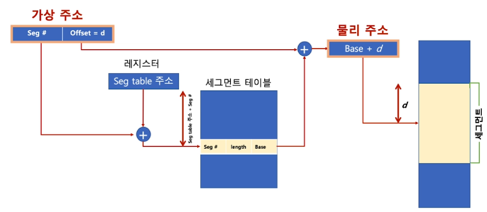

#  Chapter05 가상 메모리의 이해

## 01 가상메모리 개념

### 가상 메모리(Virtual Memory System)

> 실제 각 프로세스마다 충분한 메모리를 할당하기에는 메모리 크기가 한계가 있음

- 예 : 리눅스는 하나의 프로세스가 4GB임
- 통상 PC에 사용되는 메모리는 8~16GB

> 폰노이만 구조 기반이므로, 코드는 메모리에 반드시 있어야 함

>  프로세스 전체를 물리 메모리에 올리는 것이 아니라 현재 실행되는 부분, 실행될 부분을 물리 메모리에 올린다. 그래서 여러 프로그램을 동시에 띄워놓고 실행할 수 있는 것이다.

### 가상 메모리가 필요한 이유

- 하나의 프로세스만 실행 가능한 시스템(배치 처리 시스템 등)
  - 프로그램을 로드(load)
  - 프로세스를 실행
  - 프로세스 종료(메모리 해제)
- 여러 프로세스 동시 실행 시스템
  - 메모리 용량 부족 이슈
  - 프로세스 메모리 영역 간에 침범 이슈

#### 가상메모리의 정의

- 가상 메모리: 메모리가 실제 메모리보다 많아 보이게 하는 기술
  - 실제 사용하는 메모리는 프로세스 전체 메모리보다 작다는 점에 착안해서 고안된 기술
  - 프로세스간 공간 분리로, 프로세스 이슈가 전체 시스템에 영향을 주지 않을 수 있음

> 리눅스의 예시

- 가상 메모리의 기본 아이디어 
  - 프로세스는 가상 주소를 사용하고, 실제 해당 주소에서 데이터를 읽고?쓸 때만 물리 주소로 바꿔주면 된다. 
  - vitual address(가상 주소): 프로세스가 참조하는 주소
  - physical address(물리 주소): 실제 메모리 주소
- MMU(Memory Management Unit)
  - CPU에 코드 실행 시, 가상 주소 메모리 접근이 필요할 때, 해당 주소를 물리 주소값으로 변환해주는 하드웨어 장치

- 실제 각 프로세스의 데이터가 메인 메모리가 조각으로 씌여있다.

### 가상 메모리와 MMU

- CPU는 가상 메모리를 다루고, 실제 해당 주소 접근시 MMU 하드웨어 장치를 통해 **물리 메모리 접근**

  - 하드웨어 장치를 이용해야 주소 변환이 빠르기 때문에 별도 장치를 둠

    

- 프로세스 생성시, 페이지 테이블 정보 생성

  - PCB 등에서 해당 페이지 테이블 접근 가능하고. 관련 정보는 물리 메모리에 적재 
  - 프로세스 구동시, 해당 페이지 테이블 base 주소가 별도 레지스터에 저장(CR3)
  - CPU가 가상 주소 접근시, MMU가 페이지 테이블 base 주소를 접근해서, 물리 주소를 가져옴

## 02 페이징 시스템

### 페이징 시스템(Paging System)

- 페이징(Paging) 개념
  - 크기가 동일한 페이지로 가상 주소 공간과 이에 매칭하는 물리 주소 공간을 관리
  - 하드웨어 지원이 필요
    - 예) Intel x86 시스템(32bit)에서는 4KB, 2MB, 1GB 지원
  - 리눅스에서는 4KB로 paging
  - 페이지 번호를 기반으로 가상 주소/물리 주소 매핑 정보를 기록/사용

- 실질적인 예시

  - 프로세스(4GB)의 PCB에 Page Table 구조체를 가리키는 주소가 들어 있음

  - page Table에는 가상 주소와 물리 주소간 매핑 정보가 있음

    

### 페이징 시스템 구조

- page 또는 page frame: 고정된 크기의 block(4KB)

- paging system

  - 가상 주소 v=(p,d)

    - p : 가상 메모리 페이지

    - d : p안에서 참조하는 위치

      

  - 이를 통해 실제 물리메모리의 해당 데이터 위치를 알 수 있음

- 페이지 크기가 4KB 예 
  - 가상 주소의 0비트에서 11비트가 변위(d)를 나타내고, 
  - 12비트 이상이 페이지 번호가 될 수 있음

### 페이지 테이블(page table)

- page table
  - 물리 주소에 있는 페이지 번호와 해당 페이지의 첫 물리 주소 정보를 매핑한 표
  - 가상주소 v=(p,d)라면
    - p: 페이지 번호
    - d: 페이지 처음부터 얼마나 떨어진 위치인지
- paging system 동작
  - 해당 프로세스에서 특정 가상 주소 엑세스를 하려면
  - 해당 프로세스의 page table에 해당 가상 주소가 포함된 page번호가 있는지 확인
  - page번호가 있으면 이 page가 매핑된 첫 물리주소를 알아내고(p`)
  - p`+d가 실제 물리 주소가 됨

> 필요없는 페이지는 물리 메모리에서 날려버리면 되니까 메모리 관리가 간편해짐. 모든 페이지가 물리 메모리에 올라가있을 필요가 없음

## 03 다중 단계 페이징 시스템과 페이징 시스템 장점

### 다중 단계 페이징 시스템 

- 32bit 시스템에서 4KB 페이지를 위한 페이징 시스템은
  - 하위 12bit는 오프셋
  - 상위 20bit가 페이징 번호이므로, 2의 20승(1048576)개의 페이지 정보가 필요함
- 페이징 정보를 단계를 나누어 생성 
  - 필요없는 페이지는 생성하지 않으면, 공간 절약 가능

- 페이지 번호를 나타내는 bit 를 구분해서, 단계를 나눔(리눅스는 3단계, 최근 4단계)

  
  - 페이지 디렉토리 중에 실제 쓰는 부분만 페이지 테이블을 생성. 모든 디렉토리에 페이지 테이블을 생성하면 어마어마한 용량을 차지하므로..
  - 페이지 정보와 오프셋을 가지고 물리 메모리에 접근하여 원하는 데이터를 가지고 오게 된다.

### MMU와 TLB(컴퓨터 구조)

- MMU가 물리 주소를 확인하기 위해서는 메모리를 갔다와야 함

  

  
  - 하지만 메인 메모리에 갔다오는 시간도 오래 걸림.

- TLB(Translation Lookaside Buffer) : 페이지 정보 (일종의) 캐쉬

  - 곧장 메모리에 가보는게 아니라 TLB를 먼저 확인해서 캐싱된 것이 있는지 확인함. 메모리에 접근하는 단계를 두 번에서 한 번으로 줄일 수 있음

  

### 페이징 시스템과 공유 메모리

- 프로세스간 동일한 물리 주소를 가리킬 수 있음(공간 절약, 메모리 할당 시간 절약)
  - 프로세스가 만들어질 때마다 1기가의 커널 공간을 만들어서 공간 낭비를 하는 것처럼 보이지만 실제로는 동일한 물리 메모리 공간을 가리키게 해서 공간 절약을 이뤄낼 수 있음

- 물리 주소 데이터 변경시

  - 물리 주소 데이터 수정 시도시, 물리 주소를 복사할 수 있음(copy-on-write)

    - A 프로세스에서 write가 일어날 경우에는 동일한 물리 주소를 가리키면 안되기 때문에 그 전에 변경전 값을 다른 공간에 복사하고 나서  write를 한다.

    

- 이를 통해서 프로세스 생성시간을 줄일 수 있다. 또한 공간 절약도 가능하다.

## 04 페이지 폴트

### 요구 페이징(Demand Paging 또는 Demanded Paging)

- 프로세스 모든 데이터를 메모리로 적재하지 않고, 실행 중 필요한 시점에서만 메모리로 적재함
  - 선행 페이징( anticipatory paging 또는 prepaging)의 반대 개념: 미리 프로세스 관련 모든 데이터를 메모리에 올려놓고 실행하는 개념
  - 더이상 필요하지 않은 페이지 프레임은 다시 저장매체에 저장(**페이지 교체 알고리즘 필요**)

### 페이지 폴트(page fault)

- 어떤 페이지가 실제 물리 메모리에 없을 때 일어나는 인터럽트

- 운영체제가 page fault가 일어나면, 해당 페이지를 물리 메모리에 올림

- 이를 통해 요구 페이징을 구현하는 메커니즘을 만들어낼 수 있음
  

> 인터럽트가 일어나면 IDT에 가서 안티럽트 번호에 대한 OS 안에 있는 번호에 해당하는 함수를 가져와서 실행 

- 페이지 폴트가 자주 일어난다면?
  - 실행되기 전에, 해당 페이지를 물리 메모리에 올려야 함
    - 시간이 오래 걸림
- 페이지 폴트가 자주 안 일어나게 하려면?
  - 향후 실행/참조될 코드/데이터를 미리 물리 메모리에 올리면 됨
    - 앞으로 있을 일을 예측해야 함 - 신의 영역

## 05 페이지 교체 알고리즘

### 페이지 교체 정책(page replacement policy)

- 운영체제가 특정 페이지를 물리 메모리에 올리려 하는데, 물리 메모리가 다 차있다며?
  - 기존 페이지 중 하나를 물리 메모리에서 저장 매체로 내리고(저장)
  - 새로운 페이지를 해당 물리 메모리 공간에 올린다.

> 어떤 페이지를 물리 메모리에서, 저장 매체로 내릴 것인가? -> Page Replacement(Swapping) Algorithm

### 페이지 교체 알고리즘

#### FIFO

- FIFO Page Replacement Algorithm
  - 가장 먼저 들어온 페이지를 내리자

#### OPT

- 최적 페이지 교체 알고리즘(OPTimal Replacement Algorithm)
  - 앞으로 가장 오래동안 사용하지 않을 페이지를 내리자
  - 일반 OS에서는 구현 불가

#### LRU

- LRU(Lease Recently Used) Page Replacement Algorithm
  - 가장 오래 전에 사용된 페이지를 교체
  - OPT 교체 알고리즘 구현이 불가하므로, 과거 기록을 기반으로 시도

#### LFU

- LFU(Lease Frequetly Used) Page Replacement Algorithm
  - 가장 적게 사용된 페이지를 내리자

#### NRU

- NRU(Not Used Recently) Page Replacement Algorithm
  - LRU와 마찬가지로 최근에 사용하지 않은 페이지부터 교체하는 기법
  - 각 페이지마다 참조 비트(R), 수정 비트(M)을 둠(R, M)
    - (0,0), (0,1), (1,0), (1,1) 순으로 페이지 교체

### 스레싱(Thrashing)

- 반복적으로 페이지 폴트가 발생해서, 과도하게 페이지 교체 작업이 일어나, 실제로는 아무일도 하지 못하는 상황

- 다른 건 못하고 페이제 교체만 하고 있음.

  

## 06 세그멘테이션(Segmentation)

- 페이징 시스템이 가상메모리에서 가장 많이 사용하는 기법
- 페이징 시스템과 세그멘테이션을 비교해보는 정도로 짚고 넘어가면 된다.

### 세그멘테이션 기법

- 가상 메모리를 서로 크기가 다른 논리적 단위인 세그먼트(Segment)로 분할
  - 페이징 기법에서는 가상 메모리를 같은 크기의 블록으로 분할
  - 예:  x86 리얼모드
    - CS(Code Segment), DS(Data Segment), SS(Stack Segment), ES(Extra Segment)로 세그먼트를 나누어, 메모리 접근

- 세그먼트 가상주소

  - v = (s,d): s는 세그먼트 번호, d는 블록 내 세그먼트의 변위

    

- 세그멘테이션은 크기가 다른 segment 단위로 물리 메모리에 로딩

  

#### 참고

- 내부 단편화(페이지 기법)
  - 페이지 블록만큼 데이터가 딱 맞게 채워져있지 않을 때 공간 낭비
- 외부 단편화(세그멘테이션 기법)
  - 물리 메모리가 원하는 연속된 크기의 메모리를 제공해주지 못하는 경우
- 세그멘테이션/페이징 모두 하드웨어 지원 필요
  - 다양한 컴퓨터 시스템에 이식성을 중요시하는 리눅스는 페이징 기법을 기반으로 구현