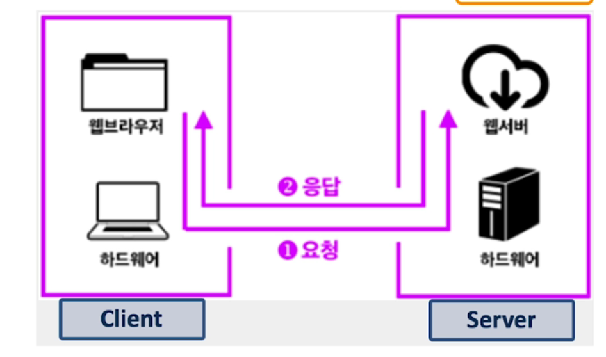
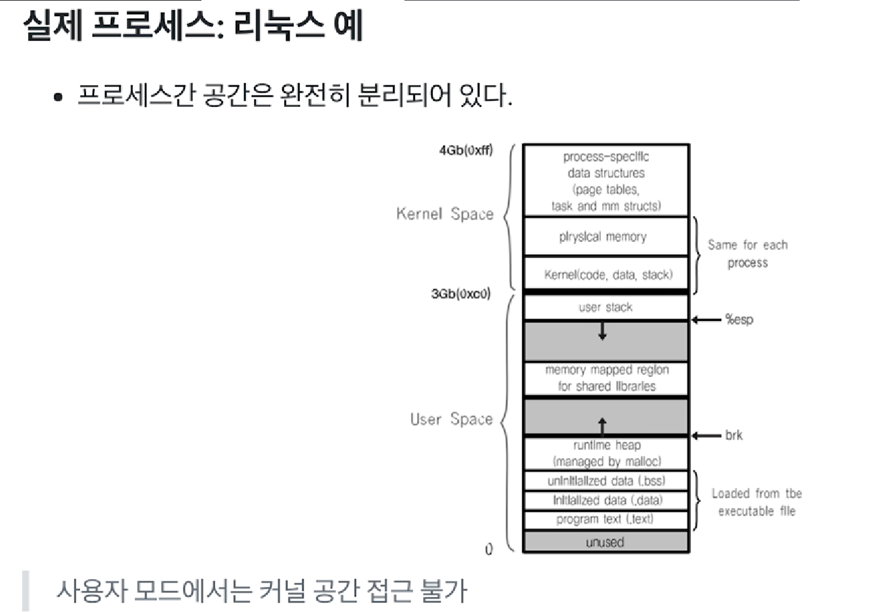
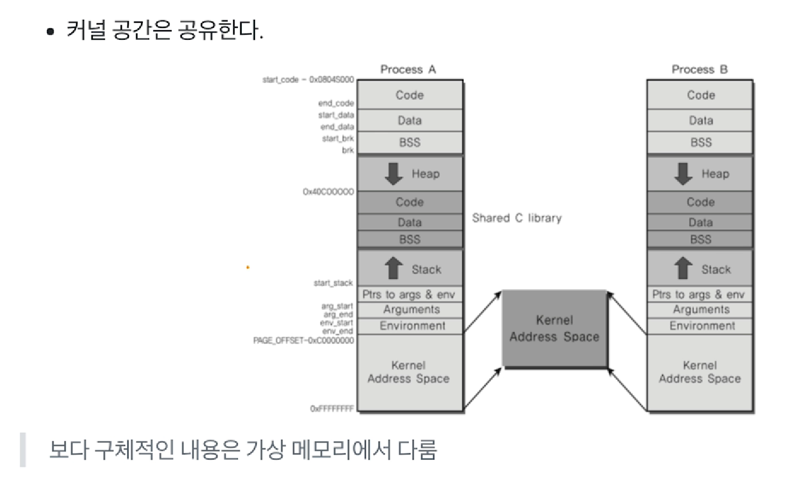
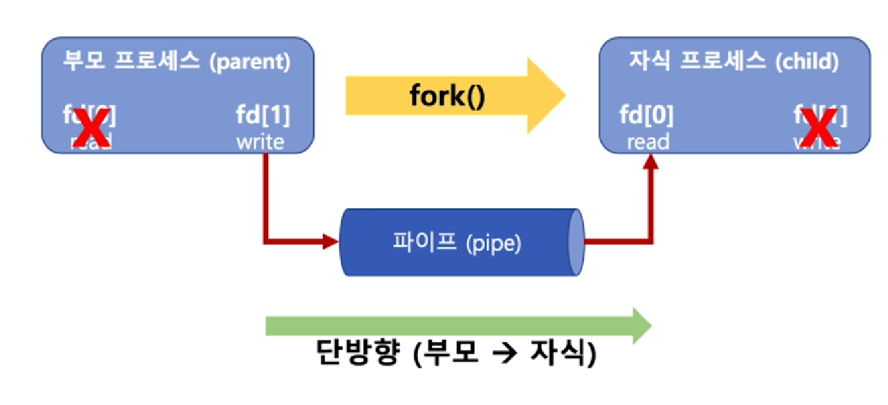
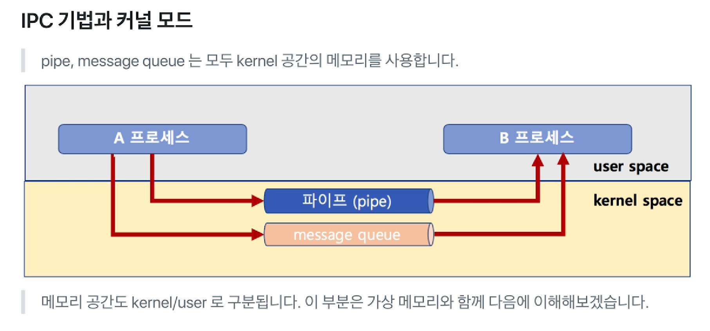
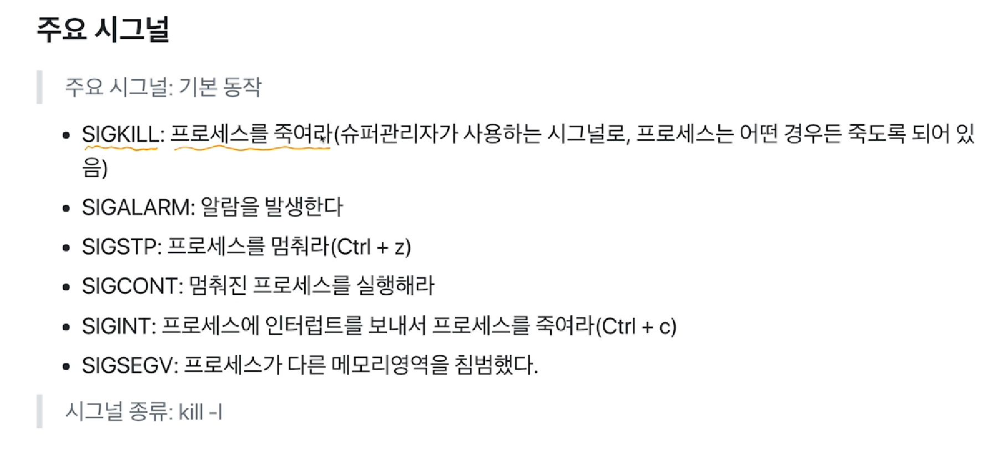
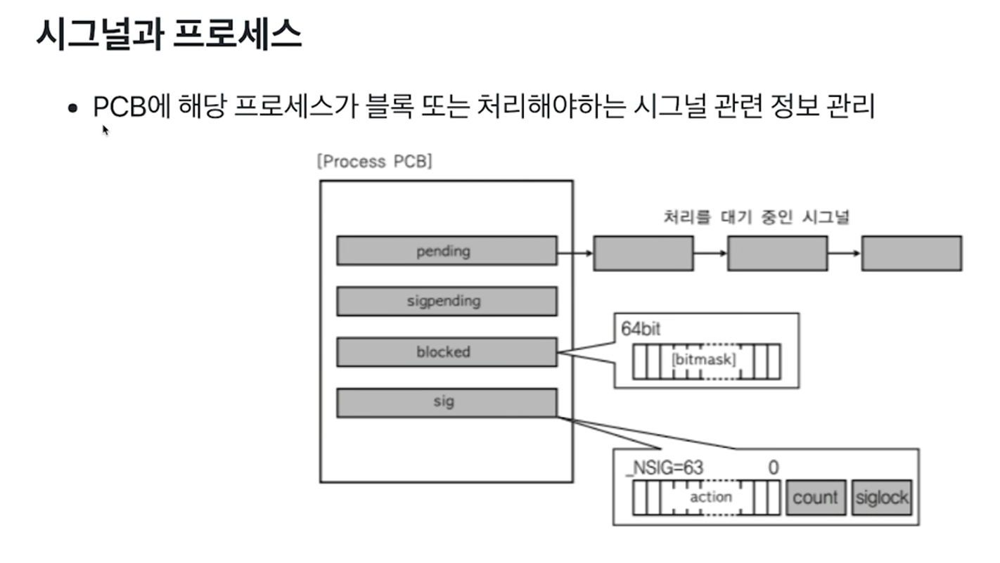
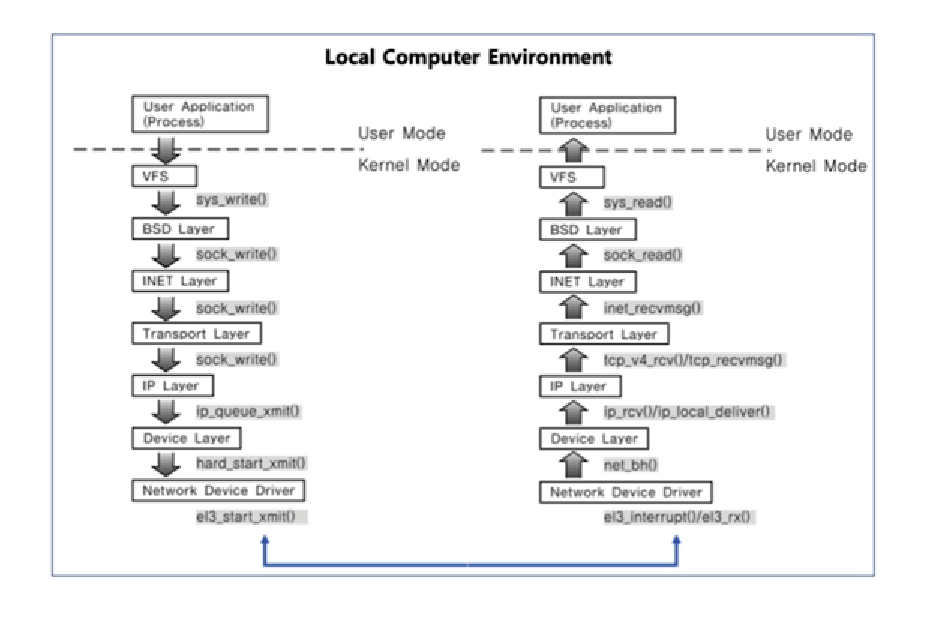

# chapter03 프로세스간 커뮤니케이션

## 01 프로세스간 커뮤니케이션(InterProcess Communication)

> 프로세스들이 서로의 공간을 쉽게 접근할 수 있다면? - 프로세스 데이터/코드가 바뀔 수 있으니 얼마나 위험할까?

- 프로세스는 다른 프로세스의 공간을 접근할 수 없다.
- 따라서 원칙적으로는 프로세스간 커뮤니케이션은 금지가 되어있다.


### IPC(InterProcess Communication)

> 그런데 만약  프로세스간에 커뮤니케이션을 해야한다면 어떻게 해야할까?

- 별도의 통신 방법을 제공하는데 그것이 IPC이다.


### 프로세스간 통신이 필요한가?

- 성능을 높이기 위해 여러 프로세스를 만들어서 동시 실행(특히 멀티 코어 환경, 병렬처리)
- 이 때 프로세스간 상태 확인 및 데이터 송수신이 필요

#### 가볍게 생각해보기

- fork() 시스템콜
  - fork()함수로 프로세스 자신을 복사해서 새로운 프로세스를 만들 수 있음
    - 부모 프로세스, 자식 프로세스
  - 프로세스를 forkt()해서 여러 프로세스를 동시에 실행시킬 수 있음
- 여러 프로세스 동시 실행하기 예
  - 1~10000까지 더하기
    - fort() 함수로 10개 프로세스 만들어서, 각각 1~1000, 1001~2000 식으로 더하기
    - 각 더한 값을 모두 합하면, 더 빠르게 동작 가능

> 이때 각 프로세스가 더한 값을 수집해야하므로, 프로세스간 통신 필요

- 웹서버의 예

  - 클라이언트와 서버

  
  - 웹서버란, 요청이 오면 HTML 파일을 클라이언트에 제공하는 프로그램
  - 새로운 사용자 요청이 올 때마다, fork()함수로 새로운 프로세스를 만들고, 각 사용자 요청에 즉시 대응

> CPU 병렬 처리가 가능하다면 더 빠른 대응이 가능
>
> 단, 이때 각 프로세스 제어 및 상태 정보 교환을 위해 프로세스간 통신 필요


### 파일을 사용한 커뮤니케이션

- IPC의 한 가지 방법으로 **file**을 사용
- 간단히 다른 프로세스에 전달할 내용을 파일에 쓰고, 다른 프로세스가 해당 파일을 읽으면 됨

- 파일을 사용하면, 실시간으로 직접 원하는 프로세스에 데이터 전달이 어려움
  - 왜? 해당 프로세스가 파일을 읽어야 하는데, 계속 실시간으로 읽고만 있을 수는 없으니. 계속 무한반복하면서 데이터가 변경되었는지 체크하는 것은 낭비임. 저장매체 갔다오는 것도 시간이 많이 든다.
  - 그래서 다양한 IPC 기법이 있다


## 02 프로세스와 IPC





- 프로세스가 만들어질 때마다 Kernel Address Space를 할당하는 것은 공간 낭비이기 때문에 커널 공간은 공유하게끔 만들어져 있다.

### 다양한 IPC 기법 

1. file 사용(시간이 많이 걸림)
2. Message Queue
3. Shared Memory
4. Pipe
5. Signal
6. Semaphore
7. Socket 등

> 2번부터는 모두 커널 공간을 사용하는 것임 - 이것이 핵심

커널 공간은 물리 공간에 있기 때문에 접근 시간이 짧음.

 

## 03 IPC 기법 1

> 각 IPC 기법 이해하기

### 파이프

- pipe(파이프)
  - 기본 파이프는 단방향 통신
  - fork()로 자식 프로세스 만들었을 때, 부모와 자식간의 통신
  - fd[1]에 부모가 쓰면, 자식에서 fd[0]에서 읽을 수 있음! -> 통신 성공



```c
char* msg = "Hello Child Process!";
int main(){
    char buf[255];
    int fd[2], pid, nbytes;
    if (pipe(fd) < 0) // pipe(fd)로 파이프 생성
        exit(1):
    pid = fork(); // 이 함수 실행 다음 코드부터 부모/자식 프로세스로 나뉘어짐
    if (pid > 0){ // 부모 프로세스는 pid에 실제 프로세스 ID가 들어감
        write(fd[1], msg, MSGSIZE); // fd[1]에 씁니다
       	exit(0);
    }else{
        // 자식 프로세스는 pid가 0이 들어감
        nbytes = read(fd[0], buf, MSGSIZE); // fd[0]으로 읽음
        printf("%d %s\n", nbytes, buf);
        exit(0);
    }
    return 0;
}
```


### 메시지 큐(Message Queue)

- 큐니까, 기본은 FIFO 정책으로 데이터 전송
- 프로세스간에 공유하는 공간에 메시지 큐를 만들고, 어떤 프로세스는 데이터를 넣고, 다른 프로세스는 빼가는 식으로 해서 통신이 가능

### 메시지 큐 코드 예제

- A 프로세스

```
msqid = msgget(key, msgflg) // key는 1234, msgflg는 옵션
msgsnd(msqid, &buf, buf_length, IPC_NOWAIT)
```

- B 프로세스

```
msqid = msgget(key, msgflg) // key는 동일하게 1234로 해야 해당 큐의 msgid를 얻을 수 있음
msgrcv(msqid, &rbuf, MSGSZ, 1, 0)
```

#### 파이프와 메시지 큐 차이

- Message Queue는 부모/자식이 아니라, 어느 프로세스간에라도 데이터 송수신이 가능
- 먼저 넣은 데이터가 먼저 읽혀진다

##### pipe vs message queue

- 부모/자식 프로세스간 only or not 

- 단반향만 가능 or 양방향 가능

  

### 공유 메모리(shared memory)

- 노골적으로 kernel space에 메모리 공간을 만들고, 해당 공간을 변수처럼 쓰는 방식
- message queue처럼 FIFO 방식이 아니라, 해당 메모리 주소를 마치 변수처럼 접근하는 방식
- 공유메모리 key를 가지고, 여러 프로세스가 접근 가능


## 04 IPC 기법 2

- 각 IPC 기법 개념 이해하기(signal과 socket)
  - IPC 기법이지만, 이외에도 많이 사용되는 두 가지 기술

### 시그널(signal)

- 유닉스에서 30년 이상 사용된 **전통적인 기법**
- 커널 또는 프로세스에서 다른 프로세스에 어떤 이벤트가 발생되었는지를 알려주는 기법
- 프로세스 관련 코드에 관련 시그널 핸들러를 등록해서, 해당 시그널 처리 실행
  - 시그널 무시
  - 시그널 블록(블록을 푸는 순간, 프로세스에 해당 시그널 전달)
  - 등록된 시그널 핸들러로 특정 동작 수행
  - 등록된 시그널 핸들러가 없다면, 커널에서 기본 동작 수행



#### 시그널 관련 코드 예제

- 시그널 핸들러 등록 및 핸들러 구현

```c
static void signal_handler(int signo)P
    printf("Catch SIGINT!\n");
	exit(EXIT_SUCCESS);
}

int main(void){
    if (signal(SIGINT, signal_handler) == SIG_ERR) {
        printf("Cant't catch SIGINT!\n");
        exit(EXIT_FAIURE);
    }
    for(;;)
        pause();
    return 0;
}
```



> 커널에서 사용자 모드로 전환할 때 시그널 모드를 사용할 수 있음


### 소켓(socket)

- 소켓은 네트워크 통신을 위한 기술
- 기본적으로는 클라이언트와 서버 등 두 개의 다른 컴퓨터 간의 네트워크 기반 통신을 위한 기술

- 소켓을 하나의 컴퓨터 안에서, 두 개의 프로세스 간에 통신 기법으로 사용 가능



