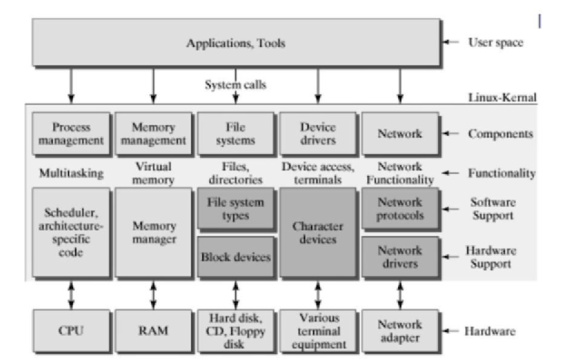
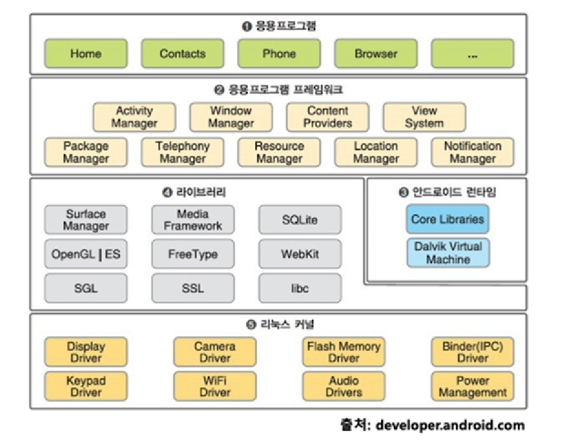
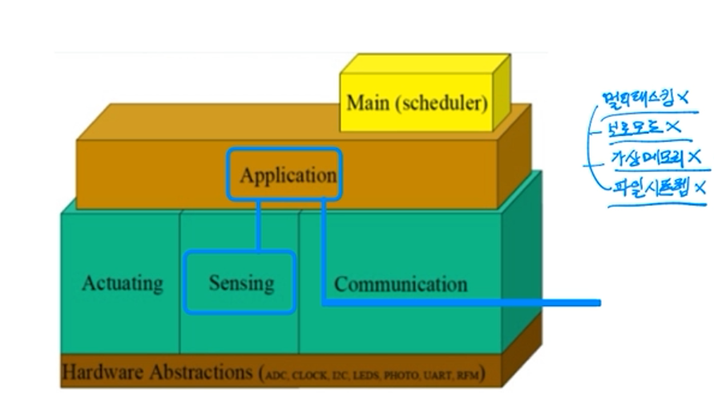

# 운영체제 정리

## 실제 운영체제의 이해 

- 리눅스 운영체제

  - 리눅스 커널(운영체제) + 시스템 프로그램(쉘) + 응용 프로그램

  

## 쉘 종류

- 쉘(shell): 사용자와 컴퓨터 하드웨어 또는 운영체제간 인터페이스
  - 사용자의 명령을 해석해서, 커널에 명령을 요청해주는 역할
  - 관련된 시스템콜을 사용해서 프로그래밍이 작성되어 있다.
- 쉘 종류
  - Korn SHell(ksh): 유닉스에서 가장 많이 사용됨
  - C shell (csh)
  - Bourne Shell(sh)
  - Bourn-Again Shell(bash) : GNU 프로젝트의 일환으로 개발됨, 리눅스 거의 디폴트임

## 실제 운영체제의 이해

- process management
  - 응용 프로그램은 여러 개의 process로 관리됨
  - process scheduler
    - process 실행, 종료 관리
    - 인터럽트 처리 관리

-  memory management
  - 가상 메모리
    - page 기반 메모리 관리
- IO Device management
  - VFS(Virtual File System)
  - file, Device drivers, Network 관리

- 시스템 프로그램
  - 핵심은 쉘
    - bash(Bourne-Again shell)
    - 내부는 시스템콜을 호출하도록 구현
  - 각 프로그래밍 언어
    - 필요시 해당 운영체제의 시스템콜 호출

### 안드로이드 스마트폰(Android)

- Linux Kernel + (Shell + Some basic programs) + Android Framework

  
  - 안드로이드 자체는 운영체제가 아니라 안드로이드는 `리눅스 OS + 안드로이드 플랫폼` 라고 볼 수 있다.

### 가볍게 이해하기: IoT

- IoT: 사물인터넷(Internet of Things)
  - 각종 사물에 센서와 통신 기능을 내장하여 인터넷에 연결하는 기술

- 초소형 기기의 경우, OS기능 최소화

  - 가상 메모리 이런 것도 필요가 없을 것임.. 

- use case와 하드웨어 형태에 따라 OS 구성요소가 달리진다.

- TinyOS 예

  

