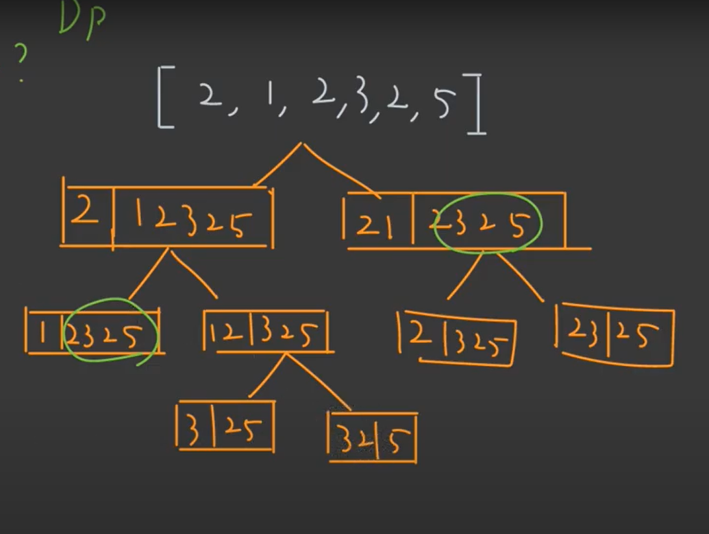

# leetcode 91 Decode Ways



이런 식으로 subproblem 나누는게 가능하다. 이걸 이용해서 풀이해야한다.

dp array 만드는게 쉽지 않았다.

## 코드

```python
class Solution:
    def numDecodings(self, s: str) -> int:
        n = len(s)
        dp = [0] * (n+1)
        dp[0] = 1
        
        if s[0] != '0':
            dp[1] = 1
        
        for idx in range(1, n):
            singleNum = int(s[idx])
            singleCnt = 0
            if singleNum > 0:
                singleCnt = dp[idx]
            doubleNum = int(s[idx-1:idx+1])
            doubleCnt = 0
            if 10 <= doubleNum <= 26:
                doubleCnt = dp[idx-1]
            
            dp[idx+1] = singleCnt + doubleCnt
        return dp[n]
```


