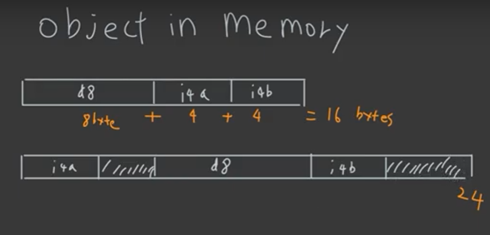
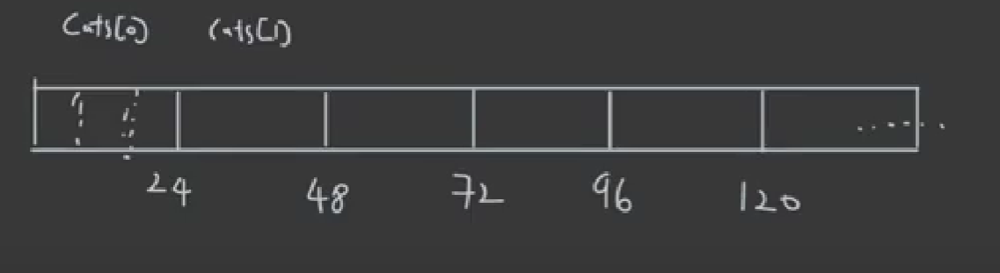
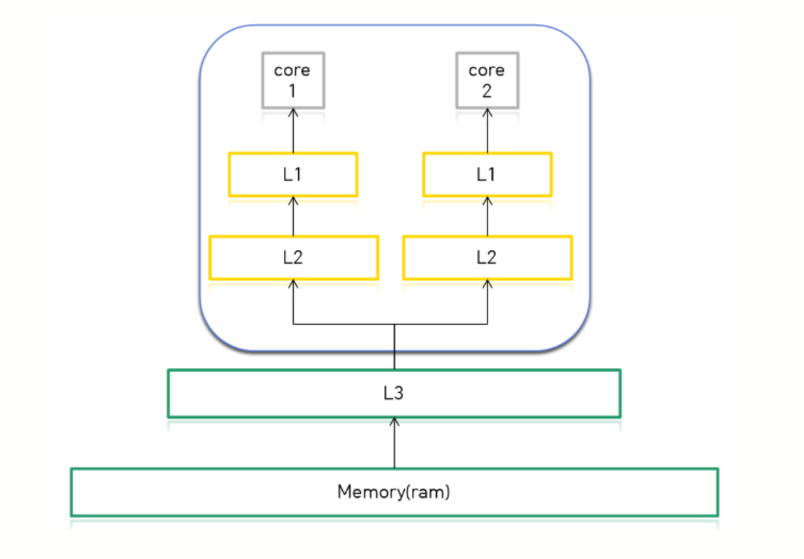
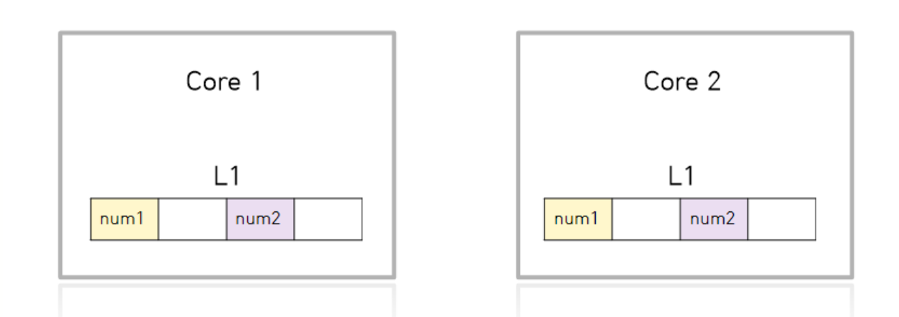
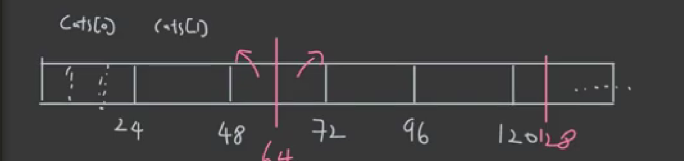

# OOP

## OOP Intro

OOP는 `easy to read` `easy to understand` `easy to modify`를 이루기위한 수단이 되어야지 너무 OOP 개념에 매몰되어 이것 자체가 목적이 되고 퍼포먼스를 잃어서는 안된다. 

- C++은 High Performance를 가지면서도 Multi Paradigm을 지원하는 언어
  - Procedual
  - functional
  - Object Oriented
  - generic
- 그중에서 OOP가 중심인 언어이다.
  - JAVA, C#, Python 등이 그러한 언어이다.
- 하지만 C++의 OOP를 잘못 적용할 경우 퍼포먼스를 잃을 수 있기 때문에 정확히 C++을 이해하고 올바른 프로그래밍 기법을 익히는 것이 중요하다.


### OOP 구성요소

- Abstraction
  - Class라는 개념 자체가 추상화라고 생각하면 됨
  - 어떤 개념을 정의하기 위해 필요한 요소 몇 가지를 이용해 모델링하는 것을 의미
  - 예를 들어 고양이를 정의한다고 하면 일반적으로 다리가 네 개고 꼬리가 있고 등등..
- Encapsulation
  - 외부에서 접근을 못하게 캡슐화하는 것.
  - C++에서는 private 등을 통해서 구현
- Inheritance
- Polymorphism
  - 다형성
  - function overloading
  - function overriding


## 객체 메모리(Object Alignment)

객체가 메모리에 어떻게 올라가는지 확인해보기(Object in memory)

### Intro

```c++
#include <iostream>
using namespace std;

class Cat{
    public:
    	void speak();
    private:
    	int mAge; // 4Byte
};

int main() {
    cout << sizeof(Cat) << endl; // 4
    return 0;
}
```

### 멤버변수의 순서바꿔보기

```c++
#include <iostream>
using namespace std;

class Cat{
    public:
    	void speak();
    private:
    	double d8; // 8byte
    	int i4a; // 4byte
    	int i4b; // 4byte
};

int main() {
    Cat stackCat;
    cout << sizeof(stackCat) << endl; // 16byte
    return 0;
}
```

```c++
#include <iostream>
using namespace std;

class Cat{
    public:
    	void speak();
    private:	
    	int i4a; // 4byte
	    double d8; // 8byte
    	int i4b; // 4byte
};

int main() {
    Cat stackCat;
    cout << sizeof(stackCat) << endl; // 24byte
    return 0;
}
```

둘의 size가 달라지게 되는 이유는 Memory Alignment 룰 차이 때문이다. 빈 공간에 padding이 들어가게 된다.

1. 멤버 변수는 그 사이즈의 배수의 위치에서 시작되어야 한다.

   ex) 4byte의 멤버변수는 4의 배수의 위치에서 시작되어야함. 8byte의 멤버변수는 8의 배수에서 시작이 되어야하는데, i4a를 먼저 선언하면 8의 배수에서 시작할 수 없기 때문에 4byte만큼 padding을 넣어주게 된다.

2. object의 전체 사이즈는 가장 큰 멤버 변수의 배수에서 끝나야한다. 




### Cache Line 고려해보기

```c++
#include <iostream>
using namespace std;

class Cat{
    public:
    	void speak();
    private:
    	char c1; //1byte
    	int i4a; //4byte
    	int i4b; //4byte
    	double d8; //8byte
};

int main() {
    Cat stackCat; // 24byte
    
    Cat cats[100];
   	
}
```

위 cats 배열은 아래와 같이 메모리 공간을 차지할 것이다.



하지만 위 상태는 병렬 프로그래밍 환경에서 문제가 될 수 있는데 바로 Cache line 때문이다. CPU는 연산을 할 때 더 빠른 작업을 위해 RAM이 아니라 캐쉬 메모리에 작업 대상을 올려놓게 된다. 근데 이 캐쉬라인의 사이즈는 보통 64byte를 가지고 있는데, L1캐쉬공간은 코어마다 각각 가지고 있기 때문에 각 코어가 같은 메모리 공간에 접근하게 되면 동기화 문제로 인하여 false sharing이 일어나게 된다. 





예를 들어 core1은 num1만 연산 대상이고, core2는 num2만 연산 대상이라고 해도 cache line 단위가 64byte이기 때문에 core1의 경우 연산에 필요없는 num2까지 L1에 올려놓게 된다. 하지만 num2가 바뀌게 되면 그 값을 업데이트해줘야하는 작업이 추가되기 때문에 num1만 올려놨을 때보다 연산속도가 느려지게 된다. 


다시 원래 예제로 돌아가보자. 64byte 단위로 캐시에 올려놓게 되면 cat[2]의 경우에는 중간에 짤리게 되어 false sharing 문제가 발생할 수도 있다.



이 문제를 방지하기 위해서 object에 padding을 강제로 넣어줘서 object의 사이즈를 32byte로 만들어줄 수 있다. 이렇게 되면 cats[2]가 다른 코어에 짤려서 들어가지 않게 된다. 

```ㅊc++
class alignas(32) Cat{
	... ... 
}
```


## Static in Class

- static member function

- static member variable
- static variable in a function

### static member function

```c++
class Cat{
    public:
    	void speack(){
            cout << "meow" << endl;
        }
    	static void staticSpeak(){ // 이 함수는 멤버와 관련이 없음
            cout << "CAT" << endl;
            cout << mAge << endl; // 얘는 에러남.
            this->speak(); // 얘도 에러남
        }
    private:
    	int mAge;
    
};

int main(){
    Cat::staticSpeak(); // 객체 안만들어줘도 함수 사용 가능
    
    return 0;
}
```


### static member variable

```c++
class Cat{
    public:
    	void speack(){
            cout << "meow" << endl;
        }
    	static int count;
    private:
    	int mAge;
    
};

int Cat::count = 0; // 초기화해줘야함

int main(){
    Cat::staticSpeak(); // 객체 안만들어줘도 함수 사용 가능
    
    return 0;
}
```


## Member init list

>  효율적인 객체 생성, 멤버 생성 리스트

```c++
class Cat(){
public:
    Cat(){
        mAge = 1;
    }
    Cat(int age){
        mAge = age;
    }
private:
    int mAge;
};

class Zoo{
public:
    Zoo() {};
    Zoo(int kittyAge){
        mKitty = Cat(kittyAge); //  이런 식으로 생성자를 통해 멤버 변수를 할당하게 되면, Cat 임시 객체가 만들어졌다가 사라지게 되는 과정을 통해 멤버변수가 할당되게 되므로 비효율적이다.
    }
    Zoo(int kittyAge) : mKitty(Cat(kittyAge)) {}; // 이렇게 멤버  생성 리스트를 쓰면 임시 Cat 객체를 만들지 않는다.
private:
    Cat kitty;
};

int main(){
  Zoo cppZoo(5);
    
    return 0;
}

```


## 복사, 이동 생성자

> Copy/Move Constructor / Assignment


컴파일러는 class를 정의하게 되면 기본적으로 만들어주는 메소드가 몇 개 있는데 대표적으로 생성자, 소멸자, 복사/이동 생성자가 있다. 그래서 아래와 같이 `print()`메소드를 하나 정의하여도 앞서 말한 메소드가 보이지는 않지만 생성이 되게 된다. (참고: C++ rule of three or five)

```c++
#include <iostream>
#include <string>
class Cat{
    public:
    void print(){
        std::cout << mName << " " << mAge << std::endl;
    }
    private:
    std::string mName;
    int mAge;
};
```

### 복사 생성자, 이동 생성자 예시

이동 생성자는 소유권을 빼앗기게 된다.

```c++
#include <iostream>
#include <string>
class Cat{
    public:
    Cat() = default;
    Cat(std::string name, int age) : mName{std::move(name)}, mAge{age}{
        std::cout << mName << " constructor" << std::endl;
    }
    ~Cat(){
        std::cout << mName << " destructor" << std:endl;
    }
    // 복사생성자
    Cat(const Cat& other) : mName{other.mName}, mAge{other.mAge} {
        std::cout << mName << " " << mAge << std::endl;
    }
    // 이동생성자
    Cat(Cat&& other) : mName{other.mName}, mAge{other.mAge} {
        std::cout << mName << " " << mAge << std::endl;
    }
    void print(){
        std::cout << mName << " " << mAge << std::endl;
    }
    private:
    std::string mName;
    int mAge;
};

int main() {
    Cat kitty{"kitty" , 1};
    Cat kitty2{kitty}; 
    Cat kitty3 = kitty; // not assignment but copy constructor, 이런 부분이 헷갈리기 때문에 curly brace를 이용해서 생성하는 것을 권장 
    Cat kitty4{std::move(kitty)}; // move constructor
    
    
    return 0;
}
```


## 대입 연산자

> copy assignment, move assignment


### copy assignment

> object1 = object2 // object2의 내용물을 복사

```c++
#include <iostream>
#include <string>
class Cat{
    public:
    Cat() = default;
    Cat(std::string name, int age) : mName{std::move(name)}, mAge{age}{
        std::cout << mName << " constructor" << std::endl;
    }
    ~Cat(){
        std::cout << mName << " destructor" << std:endl;
    }
    // 복사생성자
    Cat(const Cat& other) : mName{other.mName}, mAge{other.mAge} {
        std::cout << mName << " " << mAge << std::endl;
    }
    // 이동생성자
    Cat(Cat&& other) : mName{other.mName}, mAge{other.mAge} {
        std::cout << mName << " " << mAge << std::endl;
    }
    // 복사 대입 연산자
    Cat& operator=(const Cat& other){
        mName = other.mName;
        mAge = ohter.mAge;
        std::cout <, mName << " copy assignment" << std::endl;
        return *this;
    }
    void print(){
        std::cout << mName << " " << mAge << std::endl;
    }
    private:
    std::string mName;
    int mAge;
};

int main() {
    Cat kitty{"kitty", 1};
    Cat nabi{"nabi", 2};
    
    kitty = nabi;
    kitty.print();
    
    return 0;
}
```

### move assignment

> object1 = object2 // object2가 rValue라면 복사 대입이 되는 것이 아니라 이동 대입이 된다.

```c++
#include <iostream>
#include <string>
class Cat{
    public:
    Cat() = default;
    Cat(std::string name, int age) : mName{std::move(name)}, mAge{age}{
        std::cout << mName << " constructor" << std::endl;
    }
    ~Cat(){
        std::cout << mName << " destructor" << std:endl;
    }
    // 복사생성자
    Cat(const Cat& other) : mName{other.mName}, mAge{other.mAge} {
        std::cout << mName << " " << mAge << std::endl;
    }
    // 이동생성자
    Cat(Cat&& other) : mName{other.mName}, mAge{other.mAge} {
        std::cout << mName << " " << mAge << std::endl;
    }
    // 복사 대입 연산자
    Cat& operator=(const Cat& other){
        mName = other.mName;
        mAge = ohter.mAge;
        std::cout <, mName << " copy assignment" << std::endl;
        return *this;
    }
    // 이동 대입 연산자
    Cat& operator=(Cat&& other){
        mName = std::move(other.mName);
        mAge = ohter.mAge;
        std::cout <, mName << " move assignment" << std::endl;
        return *this;
    }
    void print(){
        std::cout << mName << " " << mAge << std::endl;
    }
    private:
    std::string mName;
    int mAge;
};

int main() {
    Cat kitty{"kitty", 1};
    Cat nabi{"nabi", 2};
    
    kitty = nabi;
    kitty.print();
    
    return 0;
}
```


## 연산자 오버로딩

operator에는 `*, /, %, new, delete, =, [], ()`등이 있다.

### 연산자 오버로딩 예시

```c++
#include <iostream>

using namespace std;

struct complexNum{
    double real;
    double imag;
    
    complexNum(double r, double i): real{r}, imag{i} {};
    void print() const{
        std:: cout << real << " " << imag << "i" << std::endl;
    }
};

complexNum operator+(const complexNum& lhs, const complexNum& rhs) {
    complexNum c{lhs.real+rhs.real, lhs.imag+rhs.imag};
    return c;
};

int main() {
    complexNum c1{1,1}; // 1+i
    complexNum c2{1,2}; // 1+2i
    
    complexNum c{c1+c2}; // 2+3i
    c.print();
}
```

```c++
#include <iostream>
#include <string>

using namespace std;

struct complexNum{
    double real;
    double imag;
    
    complexNum(double r, double i): real{r}, imag{i} {};
    void print() const{
        std:: cout << real << " " << imag << "i" << std::endl;
    }
};

complexNum operator+(const complexNum& lhs, const complexNum& rhs) {
    complexNum c{lhs.real+rhs.real, lhs.imag+rhs.imag};
    return c;
};

class Cat {
 public:
  Cat(int age, string name) : mAge(age), mName(name){};

  void Print() {
    cout << "age = " << mAge << " "
         << "name = " << mName << endl;
  }

  bool operator<(Cat& rhs) {
    if (mAge < rhs.mAge) {
      rhs.Print();
      return true;
    } else {
      Print(); 
      return false;
    }
  }


 public:
  int mAge;
  string mName;
};

int main() {
  Cat kitty{10, "kitty"};
  Cat nabi{20, "nabi"};
  
bool result =  kitty < nabi;
  return 0;
}
```


## 클래스 키워드들

### const

- 붙여줄 수 있는 모든 곳에 붙여줘라.

- 메소드에 const가 붙어있으면 member variable를 바꿀 수 없다.(mutable 키워드가 붙어있는 멤버변수는 예외)
- const 객체는 const가 붙어있는 메소드만 호출할 수 있다.


- 출처
  -  https://hwan-shell.tistory.com/230
  - https://youtube.com/playlist?list=PLDV-cCQnUlIYTBn70Bd822n2nlJwafCQE

