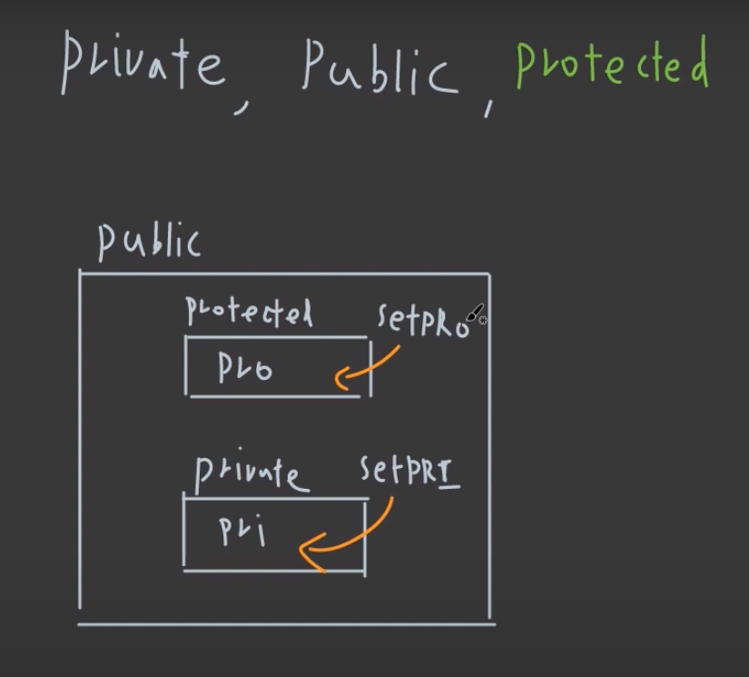
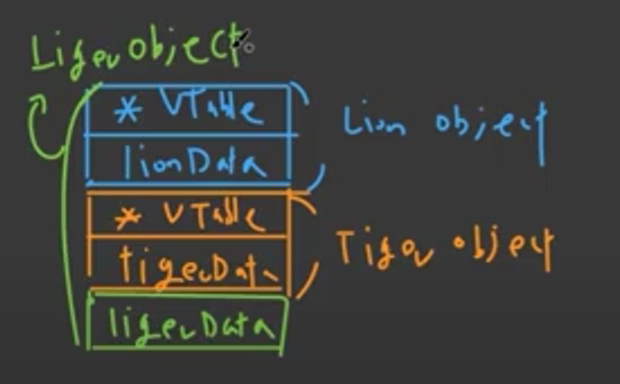
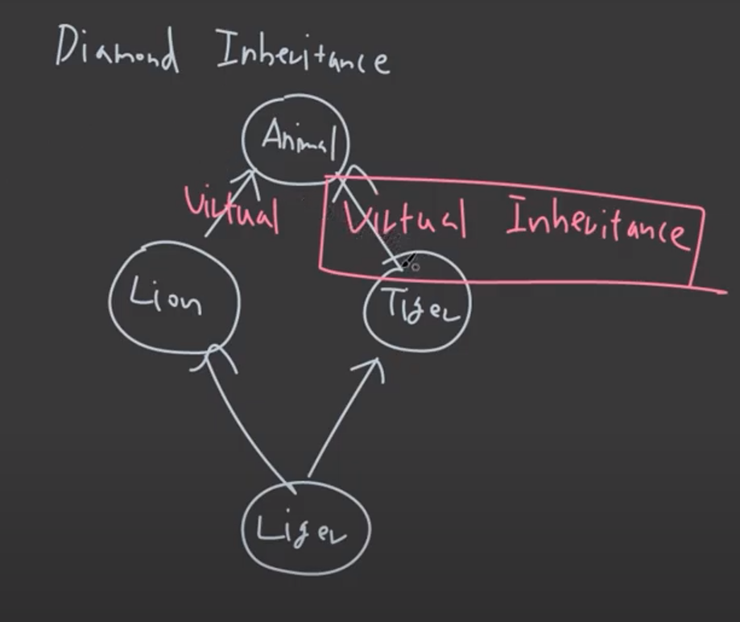
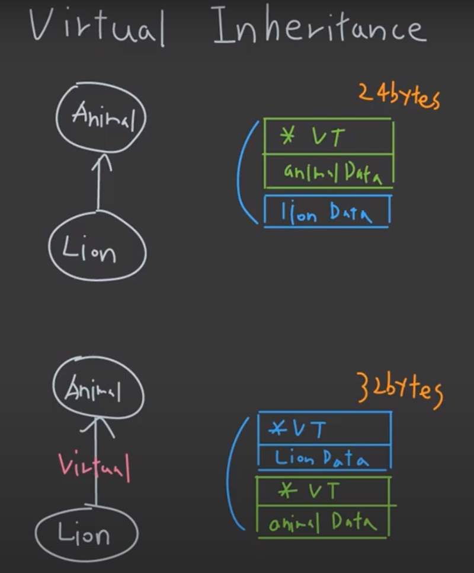
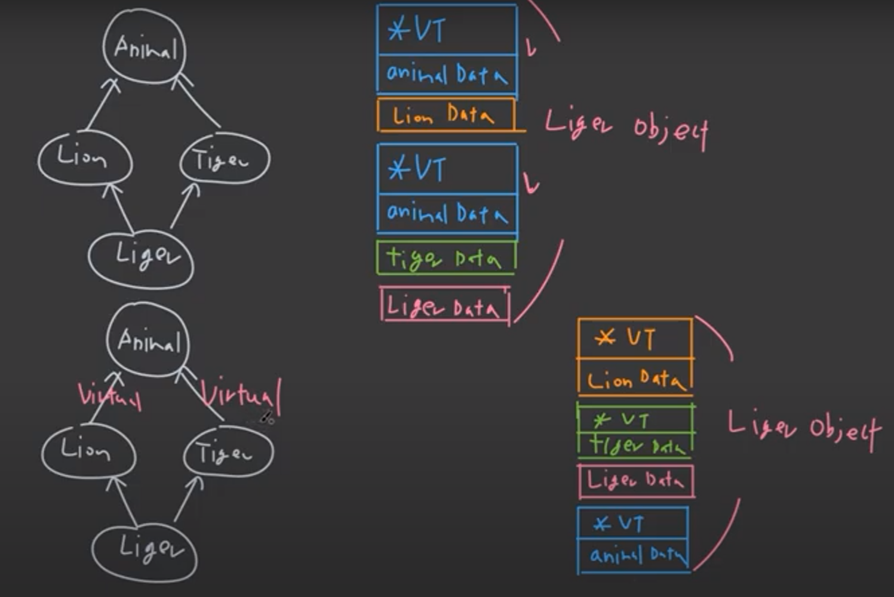
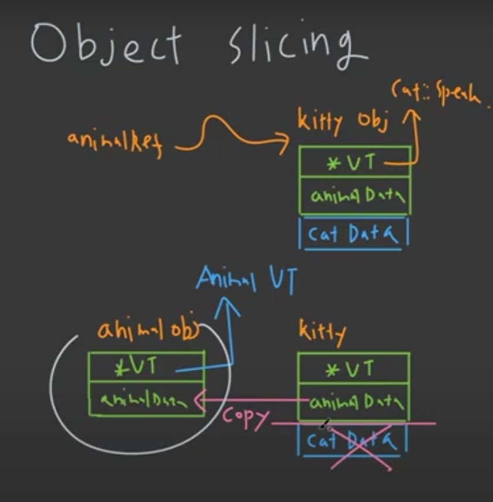
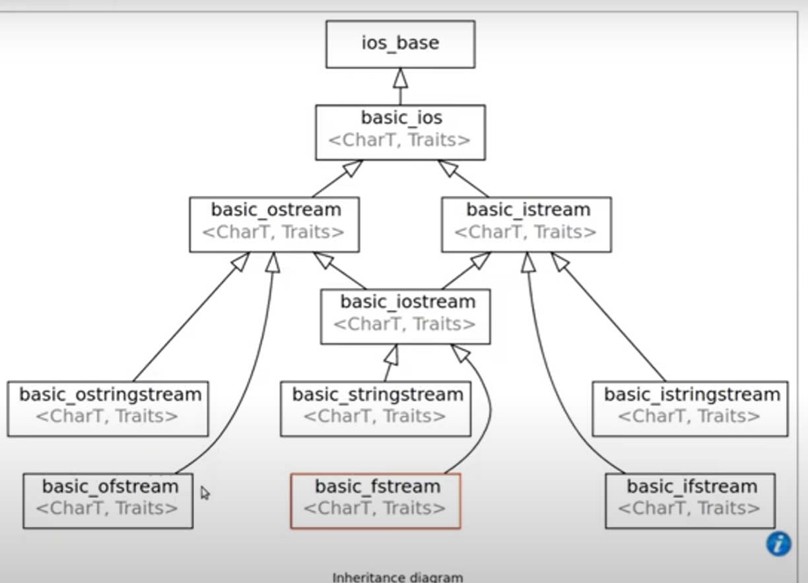

# 상속inheritance

## 상속 intro

### 상속을 사용하는 이유

-  class 간의 관계를 설정하기 위하여
  - Animal class가 있을 때 이로부터 Cat, Dog 등의 class를 만들 수 있고, 이를 통해 코드의 재사용성을 높일 수 있음
- 코드의 재사용성
- class interface consistency
  - 일관적인 클래스 인터페이스를 만들 수 있다.
  - abstract, interface 등을 사용하여 pure virtual function 구현
- Dynamic function binding(?)

### class keyword

- public

- private

- protected

  

상속 시에도 public, private, proteced로 상속이 가능하다
- public으로 상속 시
  - public -> pulbic
  - protected -> protected
  - private은 derived class에서 접근이 불가능
    - Base에서 private에 선언한 멤버변수를 파생 클래서에서는 접근할 수 없다

- protected로 상속 시
  - protected -> protected
  - public -> public

- private으로 상속 시
  - public -> private
  - protected -> private


```c++
class Base
{
    private:
    	int pir;
    protected:
    	int pro;
    public:
    	void setPRI(int n)
        {
            pri = n;
        }
    	void setPRO(int n)
        {
            pro = n;
		}
};

class Derived : public Base
{
    public:
    	void Test()
        {
            mVar = 10; // 불가능
        }
};

int main(int argc, char const* argv[])
{
    Base base;
    base.setPRI(10);
    base.setPRO(100);
    
    // base.pro = 0; // 불가능
    // base.pri = 0; // 불가능
}
```


## 가상함수Virtual Function

```c++
class Animal
{
    public:
    	Animal()
        {
            std::cout << "animal constructor" << std::endl;
        }
    	~Animal()
        {
            std::cout << "animal destructor" << std::endl;
        }
};

class Cat : public Animal
{
    public:
    	Cat()
        {
            std::cout << "Cat constructor"<< std::endl;
        }
    	~Cat()
        {
            std::cout << "Cat Destructor" << std::endl;
        }
};

int main()
{
    //Animal animal;
    Cat cat;
    // 실행결과
animal constructor
Cat constructor
Cat Destructor
animal destructor
;
}


int main()
{
    Animal* polyCat = new Cat();
    delete polyCat;
    // 실행결과
    // Cat 소멸자가 호출되지 않음
    animal constructor
	Cat constructor
	animal destructor
}

```

위 두 번째 예시에서 Cat 소멸자가 호출되지 않는 경우를 막기위하여 Base Class의 소멸자는 virtual public 또는 protected로 선언해야한다. 대개 virtual public으로 선언을 한다.

```c++
#include <iostream>
#include <algorithm>

class Animal
{
    public:
    	Animal()
        {
            std::cout << "animal constructor" << std::endl;
        }
    	virtual ~Animal()
        {
            std::cout << "animal destructor" << std::endl;
        }
};

class Cat : public Animal
{
    public:
    	Cat()
        {
            std::cout << "Cat constructor"<< std::endl;
        }
    	~Cat()
        {
            std::cout << "Cat Destructor" << std::endl;
        }
};

int main()
{
    //Animal animal = Cat();
    //Animal animal;
    Animal* polyCat = new Cat();
    delete polyCat;
	
    //실행결과
    animal constructor
Cat constructor
Cat Destructor
animal destructor

    return 0;
}

```

### dynamic(runtime) polymorphism

virtual을 활용해서 Cat 객체를 생성할지, Animal 객체를 런타임 시간에 결정할 수 있다.

이렇게 런타임에 어떤 객체를 생성할지, 어떤 함수를 실행할지 등이 결정되는 것이 dynamic polymorphism이다.

```c++
#include <iostream>
#include <algorithm>

class Animal
{
public:
	virtual void Speak()
	{
		std::cout << "Animal~" << std::endl;
	}

	virtual ~Animal() = default;
};

class Cat : public Animal
{
public:
	void Speak() override
	{
		std::cout << "Cat~" << std::endl;
	}
};

int main()
{
	//Animal animal = Cat();
	//Animal animal;

	int i = 0;
	std::cin >> i;

	Animal* polyAnimal;
	if (i == 1)
	{
		polyAnimal = new Cat();
	}
	else
	{
		polyAnimal = new Animal();
	}
    polyAnimal->Speak();

	delete polyAnimal;
	
	return 0;
}

```


## 순수가상함수 pure virtual function

- pure virtual function을 하나라도 가지고 있으면 abstract class라고 한다.
  - `virtual void speak() = 0;` 이런 식으로 구현가능
  - abstract class는 object를 만들어낼 수 없음
  - abstract class를 상속한 class는 pure virtual function을 반드시 override 해줘야한다.
- 실무에서 base class의 함수를 모두 pure vitual function으로 만듦으로써 해당 class를 interface class로 기능하게할 수 있다.
  - implentation x, member variable x 를 통해 더 안전한 interface 구현	
  - 처음부터 유지보수를 잘할 수 있게 설계를 잘 하는 것이 중요하다.
  - 하지만 이 경우에 파생 클래스는 매번 중복된 declaration을 하게되는 경우가 발생할 수 있는데, 정의만 해놓은 base class와 선언을 해놓은 base class를 두 개 만들고, 이를 다중상속하는 방법을 통해 문제를 해결할 수도 있다.


## 다중 상속multiple inheritance

다중상속예시

```c++
#include <iostream>
#include <algorithm>

using namespace std;

class Lion
{
public:
	Lion()
	{
		std::cout << "Lion 생성자" << std::endl;
	}
	virtual ~Lion()
	{
		std::cout << "Lion 소멸자" << std::endl;
	}
private:
	double lionData;
};

class Tiger
{
public:
	Tiger()
	{
		std::cout << "Tiger 생성자" << std::endl;
	}
	virtual ~Tiger()
	{
		std::cout << "TIger 소멸자" << std::endl;
	}
private:
	double tigerData;
};

class Liger : public Lion, public Tiger
{
public:
	Liger()
	{
		std::cout << "Liger 생성자" << std::endl;
	}

	~Liger() override
	{
		std::cout << "Liger 소멸자" << std::endl;
	}
};


int main()
{
	std::cout << "lion" << std::endl;
	Lion* lion = new Liger();
	std::cout << std::endl;
	delete lion;
	std::cout << std::endl;
	std::cout << "tiger" << std::endl;
	Tiger* tiger = new Liger();
	std::cout << std::endl;
	delete tiger;
	std::cout << std::endl;
	std::cout << "Liger" << std::endl;
	Liger* liger = new Liger();
	std::cout << std::endl;
	delete liger;


	return 0;
}

```

### 다중상속된 class의 size

```c++
#include <iostream>
#include <algorithm>

using namespace std;

class Lion
{
public:
	Lion()
	{
		std::cout << "Lion 생성자" << std::endl;
	}
	virtual ~Lion()
	{
		std::cout << "Lion 소멸자" << std::endl;
	}
private:
	double lionData;
};

class Tiger
{
public:
	Tiger()
	{
		std::cout << "Tiger 생성자" << std::endl;
	}
	virtual ~Tiger()
	{
		std::cout << "TIger 소멸자" << std::endl;
	}
private:
	double tigerData;
};

class Liger : public Lion, public Tiger
{
public:
	Liger()
	{
		std::cout << "Liger 생성자" << std::endl;
	}

	~Liger() override
	{
		std::cout << "Liger 소멸자" << std::endl;
	}
private:
	double ligerData;
};


int main()
{
	cout << sizeof(Liger) << endl;  // 16 + 16 + 8 = 40 byte

	return 0;
}

```




위의 예시에서 Tiger형 포인터에 Liger 객체를 넣으면 해당 포인터는 Tiger Object만큼만 볼 수 있고, 가상함수테이블 포인터는 Liger의 가상함수테이블을 가리키게 된다. Lion의 경우도 마찬가지이다. 그리고 Liger형 포인터에 Liger객체를 넣게 되면 해당 포인터는 Tiger + Lion object만큼을 볼 수 있다. 그리고 Lion 객체의 가상함수테이블 포인터와 Tiger 객체의 가상함수테이블 포인터는 모두 동일한 Liger 객체의 가상함수 테이블을 가리키게 된다.


## 가상 상속virtual interitance



위와 같은 다이아몬드 상속 구조에서 일반적인 방법으로 Liger 객체를 만들게 되면 Animal 생성자가 두 번 호출이 된다. 이건 바람직하지 않은 상황인데, 이를 막기위해서 virtual inheritance를 활용할 수 있다.





다이아몬드 상속구조에서는  virtual 상속을 하는 것이 매우 중요하다. animal data의 중복 생성도 막을 수 있고, 어떤 animal data를 가리켜야하는지와 같은 모호성도 제거할 수 있기 때문이다.


## 오브젝트 슬라이싱object slicing

- C++ 상속에서만 있는 개념



object slicing을 막는 대표적인 방법은 copy constructor와 copy assignment를 없애주는 것이다. 하지만 이 방법은 derived class 끼리의 copy의 경우도 막게되는 문제가 존재한다.

상속은 다양한 문제를 야기할 수 있기 때문에 base class를 pure abstract class로 만드는 것이 중요하다.


## 다이나믹 캐스트Dynamic Cast

- todo : type 공부 후


## 입출력 상속IO inheritance



```c++
#include <iostream>
#include <algorithm>

using namespace std;

class Cat
{
public:
	Cat(string name, int age) : mName{ move(name) }, mAge{ age }{}
	void Print(ostream& os)
	{
		os << mName << " " << mAge << endl;
	}

private:
	string mName;
	int mAge;
};

int main()
{
	Cat cat{ "nabi", 10 };
	cat.Print(cout);
	return 0;
}

```

이런 식으로 fstream 객체를 넘겨줄 수도 있다.

```c++
int main()
{
	Cat cat{ "nabi", 10 };
	ofstream ofs{ "test.txt" };
	if (!ofs)
	{
		cout << "cannot open the file" << endl;
	}
	cat.Print(ofs);
	return 0;
}
```

