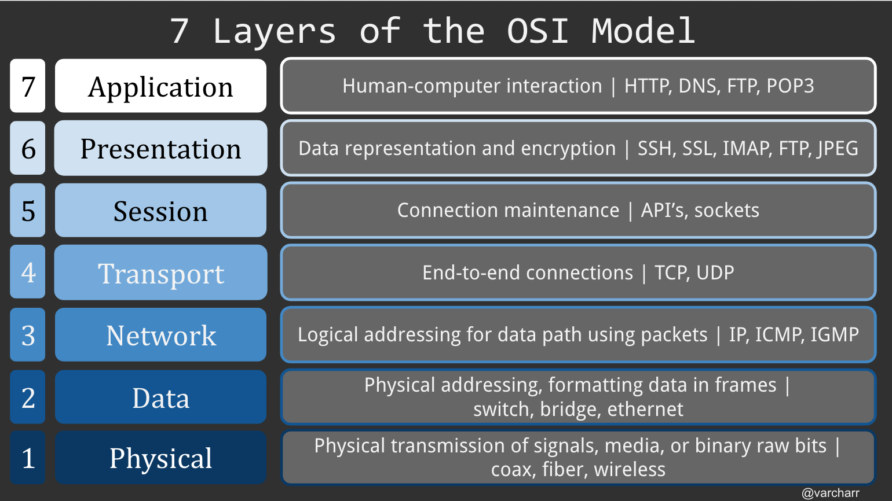

# Protocol TCP/UDP

## Protocol

- protocol이란 약속, 규약을 일컫는다.
  - 컴퓨터 사이에서 통신을 할 때, 데이터를 어떤 형식으로 어떻게 보낼건지와 같은 통신 규약이 필요하다.
  - 게임에서는 대표적으로 TCP, UDP(상대적으로 상위 계층,  IP보다), IP(상대적으로 하위 계층)의 개념이 중요하다.
  - 더 윗 계층에는 HTTP(web), SMTP(email) 등이 있다.
- 송신 단계에서 계층을 거칠 때마다 필요한 데이터가 조금씩 붙어서(포장이 점점 늘어남) 수신 측에 전달이 된다.
  - 수신 측에서는 포장을 하나하나 까보면서 맞는 위치로 보낸다.
  - 예를 들어서 미국에서 서울 동대문구로 택배를 보낼 때, 미국 공항에서 목적지가 한국이라는 것을 보고 일단 한국으로 보내고, 한국에 도착했을 때 목적지가 서울이라는 것을 보고 서울로 보내고, 서울에 도착하면 동대문구 물건이라는 것을 확인하고 동대문구로 보내는 식이다.

## 데이터의 전송 과정

- 보내고자하는 컴퓨터의 IP 주소가 `10.10.25.3`이라고 할 때, 데이터를 보낼 때 특정 gateway를 거쳐서 간다. 그 게이트웨이는 `10.10~`로 시작하는 주소의 데이터가 거쳐가는 관문이다. 데이터를 보낼 때는 IP와 port를 적어서 보낸다.
- 그 게이트웨이에서 아 이건 내가 처리해야하는 데이터가 맞는지 확인이 되면 그 포장을 뜯어버리고 그 다음 포장인 TCP/UDP의 정보를 확인한다. UDP에는 port정보가 있음
- port는 항구와 같은 것인데, 서로 보내고 받는 포트 번호를 정해놓고(binding) 그 터미널을 통해서만 데이터를 교환한다.
  - 버퍼라는 공간에 데이터를 적재해두는데, 정확하게 버퍼에 짐을 쌓는 것도 중요하지만 수신측에서 바로바로 짐 빼주는 일도 중요하다. 그래야 버퍼가 꽉차서 딜레이가 발생하는 일이 없어지니깐.

## TCP/UDP

### TCP

#### 일반적인 네트워킹의 특징

- 저번 시간에 살펴본 바와 같이 일반적으로 네트워크는 아래와 같은 몇 가지 문제점을 안고 있었다.
  - 지연시간 발생
  - 연결보장x
  - 순서보장x
  - 패킷 전송 보장x - 보낸게 100퍼센트 다 보내졌는지, 중간에 유실이 발생했는지 확인이 되지 않는다.
- 이런 문제를 해결하기 위해 TCP를 사용
  - 하드웨어에서 몇 가지를 보장해준다.
    - 연결 유무 확인
    - 순서 보장
    - 송신 보장

#### TCP의 특징

- 연결
  - 사람 간의 연결은 두 사람이 악수하고 있으면 물리적으로 연결하고 있다고 볼 수 있음
  - 하지만 컴퓨터에는 이렇게 생각하기 어려운게, 물리적인 선으로 다이렉트로 컴퓨터가 연결되어있는 것이 아니다. 여러 곳을 거쳐서 연결되어 있다. 
    - 하지만 **추상적으로** 연결되어있다고 생각하자. 그런 환경을 프로그래머가 만들어줘야함
    - `3 way handshake` 방식을 사용
      - 간단하게 비유를 들어 설명하자면 `a가 b에게 1. b야 내말 잘 들리니? b가 a에게 2. 응 잘들려 a야 너도 내말 잘 들리니? 3. 응 잘들려!` 라고 대화를 주고받는 것과 같은 방법
      - `b가 a에게 잘 들려 너도 잘들리지?`라고 보냈는데 아무리 기다려도 응답을 안하면 그건 연결이 끊어졌다고 **간주**
    - 또는 한 쪽이 확실하게 이별 통보(disconnect)할 경우 연결 종료
- 순서 보장
  - 5개의 짐을 5개의 배에 실어서 보내면 순서대로 도착할지 알 수가 없음. 뭐가 앞내용이고 뒷내용이 구분이 어렵다!
    - 이 문제를 해결하기 위한 가장 간단한 방법은 데이터에 번호를 매겨놓는 것이다.
    - 에를 들어, 1-2-3-4의 짐을 보냈는데 3이 누락되어있으면, 상대방이 `야 3번이 누락됐다!` 라고 알려주는 것이다.
- 송신 보장
  - 순서 보장 과정에서 3번이 누락되면 3번이 누락됐다는 것을 확인시켜주니까 송신까지 보장된다.

### UDP

#### UDP 특징

- 연결 유무 x
- 순서 보장 x
- 송신 보장 x

### TCP와 UDP 의 비교 : 그러면 UDP는 왜 쓰냐? 다 보장 안해주는데

- TCP의 3 way handshake는 말 그대로 뭐 하나 보내면 세 번 왔다갔다니까 리소스 소모가 있고 속도도 느린 것이다.
- 반면에 UDP는 속도가 빠르다. 그래서 반응이 중요한 게임은 UDP를 좋아하게 되는 것이다. 지연시간이 작다! 
- UDP 사용하는 곳
  - 격투게임, 슈팅 게임, LOL, AOS, 오버워치, 스타크래프트
- TCP를 사용하는 곳
  - MMORPG : 아이템 먹었는데 아이템 날아가 있으면 딥빡. 속도는 상대적으로 덜 중요
  - 보드게임

### Reliable UDP

- UDP는 빠르지만 데이터 유실이 존재한다는 치명적 단점이 존재
- 이를 해결하기 위하여 게임 프로그래머들이 Reliable UDP를 만들어서 사용
- TCP는 하드웨어적으로 해결했다면 Reliable UDP는 소프트웨어적으로 문제를 해결
  - 안정성이 덜 중요한 부분에서는 속도를 올리는 대신 안정성을 깎아주고,
  - 안정성이 중요한 부분에서는 속도를 약간 낮추더라도 안정성 확보
- BUT, 만들기가 매우 힘들다. 네트워크 환경에서는 변수가 매우 많기 때문이다.
  - 요즘에는 Unreal, Unity 등의 게임 엔진에서 만들어서 제공해주기도 하고, 많은 오픈소스들이 존재한다.

## 참고 

- [Tucker Programming](https://www.youtube.com/channel/UCZp_ftx6UB_32VfVmlS3o_A)

