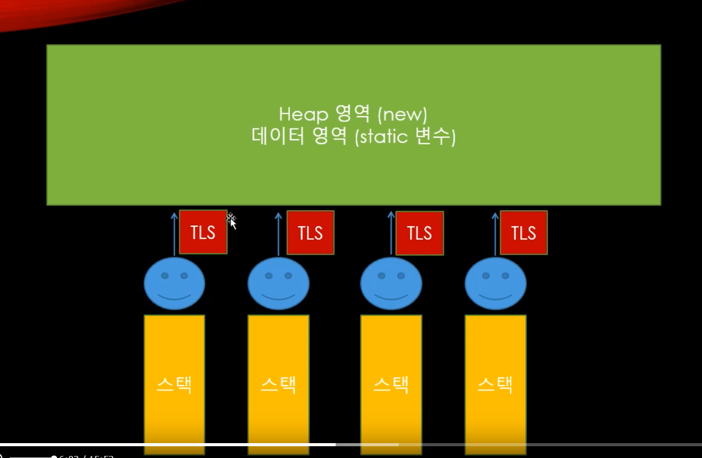

멀티스레드에서 중요한거는 스레드를 늘리는게 아니라 일감을 스레드에 적절하게 나누는 것이 중요하다.




TLS : 스레드마다 가지고 있는 로컬 저장소

스택과 TLS의 차이? 

스택은 함수를 위한 메모리 공간. 함수가 끝나고 스택 프레임이 정리가 되기 때문에 불안정한 저장 공간이라고 볼 수 있어서 중요한 데이터를 스택에 넣는 것은 불안한 부분이 있다. 그래서 TLS를 쓴다. 


실습

```c++
#include "pch.h"
#include <iostream>
#include "CorePch.h"
#include <thread>
#include <atomic>
#include <mutex>
#include <Windows.h>
#include <future>

// C++ 11 이전 사용 방법: 운영체제 별로 상이
// __declspec(thread) int32 value;
thread_local int32 LThreadId = 0;   // 일반적인 전역변수가 아니라 thread 별로 사용되는 변수. 스레드끼리 공유되는 변수가 아님.

void ThreadMain(int32 threadId)
{
	LThreadId = threadId;

	while (true)
	{
		cout << "Hi! I am Thread " << LThreadId << endl;
		this_thread::sleep_for(1s);
	}
}
int main()
{
	vector<thread> threads;

	for (int32 i = 0; i < 10; i++)
	{
		int32 threadId = i + 1;
		threads.push_back(thread(ThreadMain, threadId));
	}

	for (thread& t : threads)
		t.join();
	
}
```

