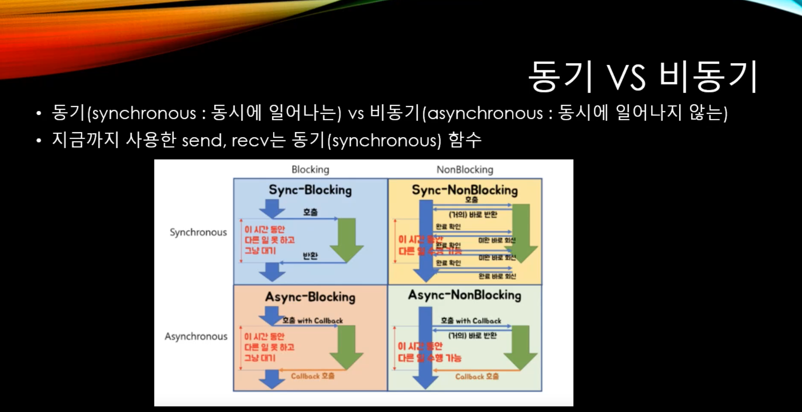
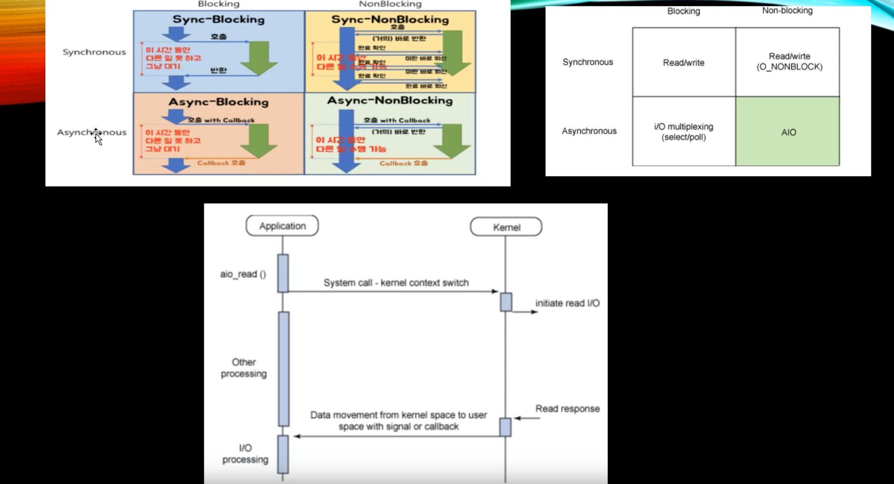

늘 헷갈리는 동기 비동기 / block non-block

# block vs non-block

- block: 어떤 함수를 호출했을 때 return될 때까지 block되어있는 상태를 말한다. 예를 들어 어떤 파일을 읽는 작업을 수행할 때 요청한 파일을 return 받을 때까지 그 다음 명령으로 넘어가지 않는 상태를 말한다.
- non-block: 어떤 함수를 호출했을 때 무조건 바로 return을 해버리는 것을 말한다. 어떤 파일을 읽는 작업을 수행했을 때 파일을 받았건 안받았건 일단 return을 한 다음에 여러 방법을 통해서 원하는 파일을 받았는지 추후에 확인할 필요가 생긴다.

# 동기 vs 비동기

- 동기: 용어 그대로 동시에 일어난다라는 뜻이다. 무엇이 동시에 일어나냐면 함수의 호출과 반환이 같은 시점에 이루어진다는 것이다. 
- 비동기: 동시에 일어나지 않는다는 뜻이다. 함수를 호출했을 때 호출한 시점에 반환을 받는 것이 아니고 함수의 호출 행위 자체를 예약만 해두고 나중에 반환을 받을 수 있는 것이다. 즉 함수를 부르는 시점과 실행되는 시점이 다르다는 뜻이다. 

