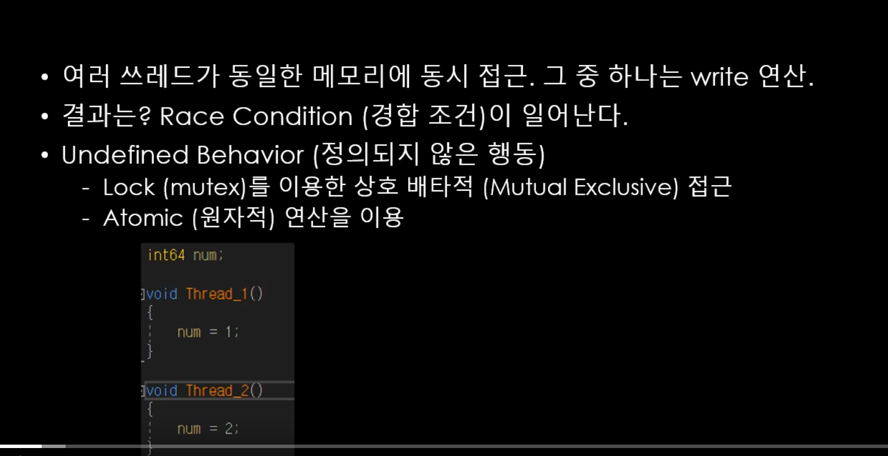

사실 read는 크게 문제될 일이 없지만 write는 이야기가 다르다.

race condition:  공유 자원에 대하여 여러 스레드가 사용권한을 획득하기 위하여 경합하는 상황

이를 해결하기 위해서 lock을 이용해 상호 배타적 접근을 사용하거나, atomic 연산을 이용하는 것.


하지만 atomic 연산 자체가 이 문제를 해결해주지는 않는다.

atomic 연산에 한해, 모든 스레드가 동일 객체에 대해서 동일한 수정 순서를 관찰함.

여기서 말하는 원자적 연산은 단지 atomic class를 쓰는 경우를 말하는 것이 아니고, 더이상 쪼갤 수 없는 한 번에 일어나는 연산을 모두 일컫는 것이다.


C++에서 원자적 연산인지 확인하는 방법

```c++
#include "pch.h"
#include <iostream>
#include "CorePch.h"
#include <thread>
#include <atomic>
#include <mutex>
#include <Windows.h>
#include <future>

int main()
{
	atomic<bool> flag = false;

	flag.is_lock_free();  // true 라면 atomic을 안했어도 원자적으로 실행되는 연산이라는 뜻
}

```


atomic & CAS 복습

```c++
#include "pch.h"
#include <iostream>
#include "CorePch.h"
#include <thread>
#include <atomic>
#include <mutex>
#include <Windows.h>
#include <future>

atomic<bool> flag;
int main()
{
	 flag = false;

	//flag.is_lock_free();  // true 라면 atomic을 안했어도 원자적으로 실행되는 연산이라는 뜻

	// flag = true;
	flag.store(true, memory_order::memory_order_seq_cst);;

	// bool val = flag;
	bool val = flag.load(memory_order::memory_order_seq_cst);

	// 이전 flag 값을 prev에 넣고, flag 값을 수정
	{
		bool prev = flag.exchange(true);
		/*bool prev =  flag; 
		flag = true;*/
	}

	// CAS (compare-and-swap) 조건부 수정
	{
		bool expected = false; 
		bool desired = true;
		flag.compare_exchange_strong(expected, desired);

		// Spurious Failure
		// CAS 의사코드
		/*
			if (flag == expected)
			{
				flag = desired;
				return true;
			}
			else
			{
				expected = flag;
				return  false;
			}
		*/
		
	}

	
}

```


메모리 정책에 대한 내용 -> 좀 어려운데 씹어먹는C++에 보면 이 부분에 대한 내용이 있으니 필요할 때 다시 살펴볼 것

```c++
#include "pch.h"
#include <iostream>
#include "CorePch.h"
#include <thread>
#include <atomic>
#include <mutex>
#include <Windows.h>
#include <future>

atomic<bool> ready; 
int32 value;

void Producer()
{
	value = 10;
	ready.store(true, memory_order::memory_order_seq_cst);
	// ---------------------절취선------------------------ memory_order_release 사용시
}

void Consumer()
{
	// ---------------------절취선------------------------ memory_order_acquire 사용시
	while (ready.load(memory_order::memory_order_seq_cst) == false)
	{
		
	}

	cout << value << endl;

}

int main()
{
	ready = false; 
	value = 0;
	thread t1(Producer);
	thread t2(Consumer);
	t1.join();
	t2.join();
	// Memory Model(정책)
	// 1) Sequentially Consistent (seq_cst)
	// 	   가시성 문제 바로 해결! 코드 재배치 바로 해결!
	// 2) Acquire-Release (consume, acquire, release, acq_rel)
	// 3) Relaxed(relaxed)

	// 1) seq_cst (가장 엄격 = 컴파일러 최적화 여지 적음 = 직관적) -> 코드 재배치도 잘 일어나지 않는다.
	// 
	// 2) acquire_release
	// 중간 정도의 자유도
	// release 명령 이전의 메모리 명령들이, 해당 명령 이후로 재배치 되는 것을 금지한다. 조건부 금지 느낌.
	// 그리고 acquire로 같은 변수를 읽는 쓰레드가 있다면,
	// release 이전의 명령들이 -> acquire 하는 순간에 관찰 가능(가시성이 보장된다)
	
	// 3) relaxed (자유롭다 = 컴파일러 최적화 여지 많음 = 직관적이지 않음)
	// 너무나도 자유롭다!
	// 코드 재배치도 컴파일러가 멋대로 가능! 가시성 해결NO!
	// 가장 기본 조건 (동일 객체에 대한 동일 관전 순서만 보장)
	// 사실 멀티스레드 환경에서 이거 사용할 일이 거의 없음

	// 인텔, AMD의 경우 애당초 순차적 일관성을 칩 자체에서 보장읋 한다
	// seq_cst(디폴트임)를 써도 별다른 부하가 없음
	// 하지만 ARM의 경우 꽤 차이가 있다.

	
}

```

