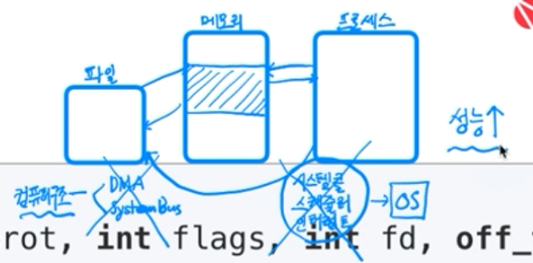
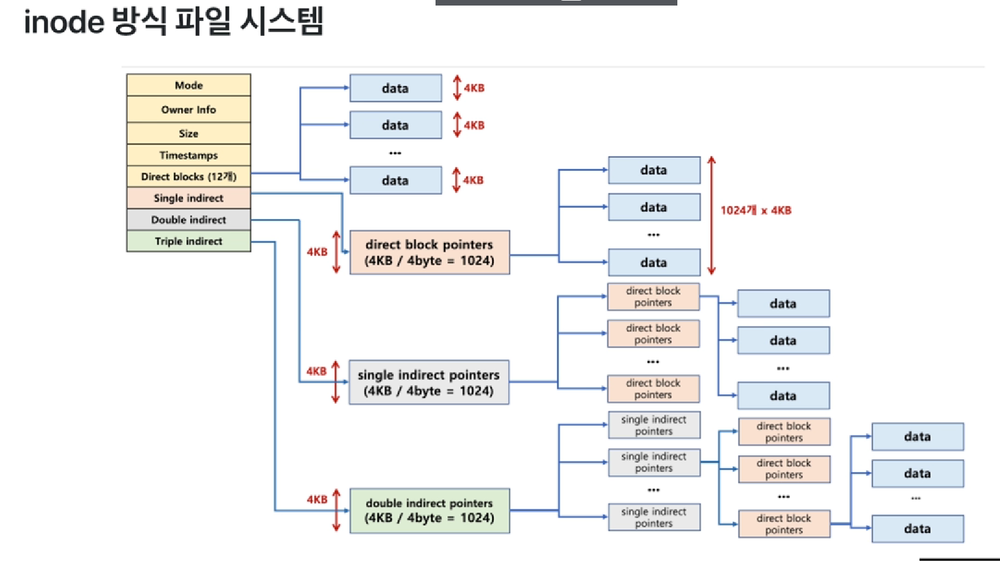
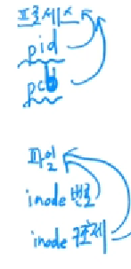
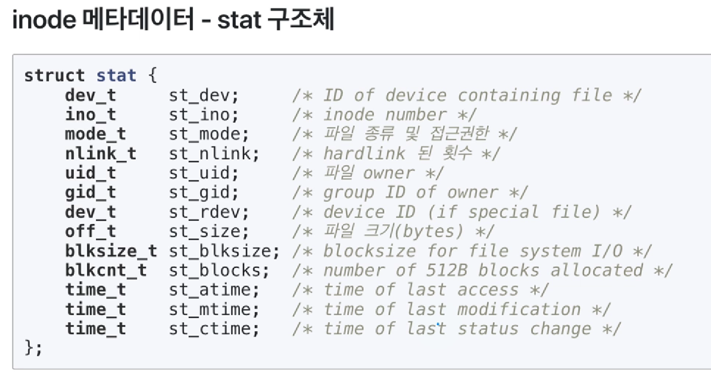
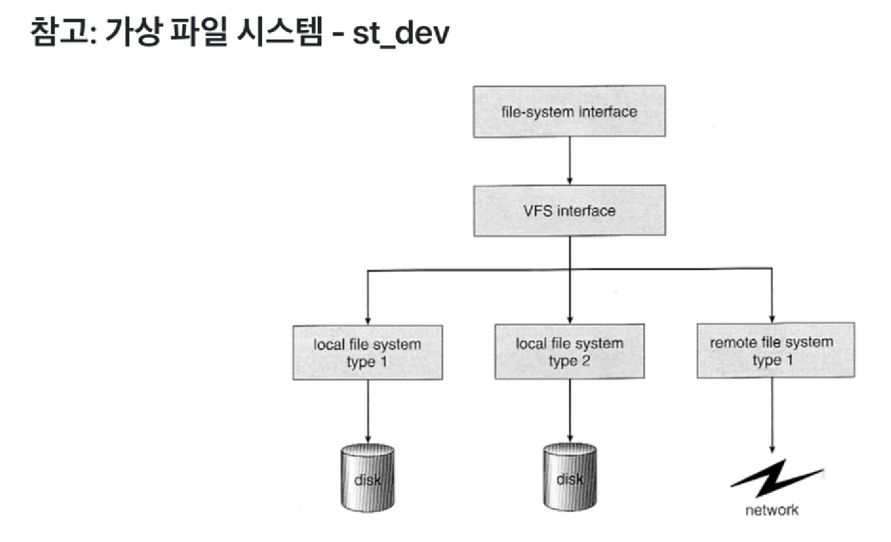
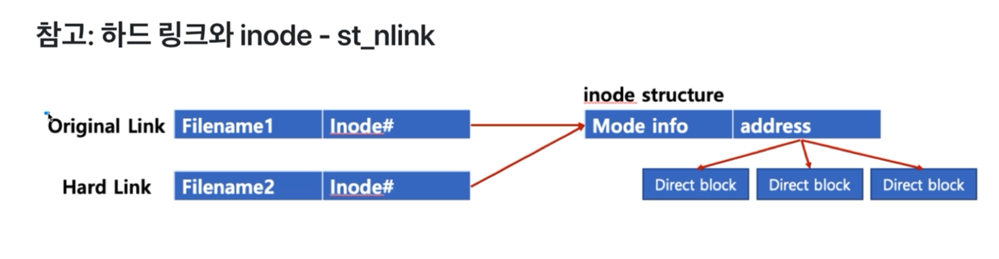

# chapter10 시스템 프로그래밍

## 01 메모리와 mmap - 메모리와 파일 시스템 관련

### 동적 메모리 생성하기

- heap  영역에 생성 
  - malloc 함수 - 생성
  - free 함수 - 해제


### 파일 처리 성능 개선 기법 - 메모리에 파일 매핑

```c
#include <sys/mman.h>
void *mmap(void *start, size_t length, int prot, int flags, int fd, off_t offset);
```

- 파일 엑세스가 COST가 큰 작업이기 때문에 파일 엑세스를 줄이기 위한 기법이 mmap

  - 파일의 특정 공간을 메모리의 특정 공간과 mapping 시킴.

  - 그러면 프로세스는 마치 파일(디스크)에 접근하는 것처럼 메모리에 접근 -> 속도 향상

    

- [start + offset] ~ [start + offset + length]만큼의 물리 메모리 공간을 mapping 할 것을 요청

- 보통 start: NULL 또는 0 사용, offset: mapping 되기 원하는 물리 메모리 주소로 지정

- prot: 보호 모드 설정

  - PROT_READ(읽기 가능) / PROT_WRITE(쓰기 가능) / PROT_EXEC(실행 가능) / PROT_NONE(접근 불가)
  - 일반적으로 읽기/쓰기 사용

- flags: 메모리 주소 공간 설정

  - MAP_SHARED(다른 프로세스와 공유 가능) / MAP_PRIVATE(프로세스 내에서만 사용 가능) /  MAP_FIXED(지정된 주소로 공간 지정)

- FD: device_file에 대한 file descriptor


#### mmap 동작 방식으로 이해하는 실제 메모리 동작 총정리

> 운영체제, 가상 메모리 이해를 기반으로 실제 활용 총정리
>
> 컴퓨터 공학 이해 없이는 mmap 동작을 이해하기 어려움

1. mmap 실행 시, 가상 메모리 주소에 file 주소 매핑(가상 메모리 이해)

2. 해당 메모리 접근 시, (요구 페이징, lazy allocation)

   - 디스크에 있는 것을 메모리에 올리거나, 다른 메모리 공간에 있는 것을 특정 메모리 공간에 올리는 작업

   - 페이지 폴트 인터럽트 발생

   - OS에서 file data를 복사해서 물리 메모리 페이지에 넣어줌

3. 메모리 read 시: 해당 물리 페이지 데이터를 읽으면 됨

4. 메모리 write 시: 해당 물리 페이지 데이터 수정 후, 페이지 상태 flag 중 dirty bit(페이지 데이터가 수정이 되었는지 안되었는지를 확인시켜주는 bit)를 1로 수정

5. 파일 close 시, 물리 페이지 데이터가 file에 업데이트됨(성능 개선)


#### 파일, 메모리, 그리고 가상 메모리

- 장점
  - read(), write() 시 반복적인 파일 접근을 방지하여 성능 개선
  - mapping된 영역은 파일 처리를 위한 lseek()을 사용하지 않고 간단한 포인터 조작으로 탐색 가능
- 단점
  - mmap은 페이지 사이즈 단위로 매핑
    - 페이지 사이즈 단위의 정수배가 아닌 경우, 한 페이지 정도의 공간 추가 할당 및 남은 공간을 0으로 채워주게 됨(단편화)

#### mmap으로 할당한 메모리 해제

```c
int munmap(void *addr, size_t length)
```

- *addr에 mapping된 물리 메모리 주소를 해제한다. 
- length: mapping된 메모리의 크기(mmap에서 지정했던 동일 값을 넣음)


## 02 mmap 예제 및 활용

### msync

```c
int msync(void *start, size_t length, int flags);
```

- 메모리에 있는 값이 변경이 되면, 이것을 파일에 업데이트 해줘야하는데, 이 작업을 강제적으로 해주는 작업이 msync
- start: mmap()를 통해 리턴 받은 메모리 맵의 시작 주소
- length: 동기화를 할 길이, 시작 주소로부터 길이를 지정하면 된다.
- flags
  - MS_ASYNC: 비동기 방식, 동기화(Memory->File)하라는 명령만 내리고 결과에 관계 없이 다음 코드 실행(따라서, 동기화가 완료안된 상태로 다음 코드 실행 가능)
  - MS_SYNC: 동기 방식, 동기화(Memory->File)가 될 때까지 블럭 상태로 대기
  - MS_INVALIDATE: 현재 메모리 맵을 무효화하고 파일의 데이터로 갱신. 즉 File -> Memory


## 03 파일 시스템 관련 시스템콜 이해





### inode 메타데이터 - stat 함수

- inode를 가져오는 시스템콜

```c
#include <sys/types.h>
#include <sys/stat.h>
#include <unistd.h>

int stat(const char* path, struct stat *buf);
int fstat(int filedes /*file descriptor*/, struct stat *buf);
```





> 추상화와 관련된 개념
>
> UNIX: 모든 것은 파일이다 -> 이것에 부합하는 것이 가상 파일 시스템



### Standard Stream(표준 입출력)과 파일 시스템콜

- command로 실행되는 프로세스는 세 가지 스트림을 가지고 있음
  - 표준 입력 스트림(Standard Input Stream) - stdin
  - 표준 출력 스트림(Standard Output Stream) - stdout
  - 오류 출력 스트림(Standard Error Stream) - stderr
- 모든 스트림은 일반적인 plain text로 console에 출력하도록 되어 있음

