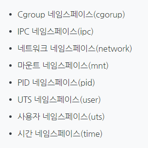
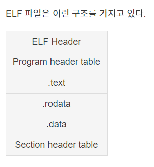

# chapter02 시스템 프로그래밍 시작 - 기본 구성 알아두기

## 리눅스와 파일

- 모든 것은 파일이라는 철학을 따름

  - 모든 인터렉션은 파일을 읽고, 쓰는 것처럼 이루어져있음
  - 마우스, 키보드와 같은 모든 디바이스 관련된 기술도 파일과 같이 다루어짐

- 파일 네임스페이스

  - 전역 네임스페이스 사용

    - 프로세스를 실행할 때 시스템의 리소스를 분리해서 실행할 수 있도록 도와주는 기능

    - 한 시스템의 프로세스들은 기본적으로 시스템의 리소스들을 공유해서 실행하는데, 이를 단일 네임스페이스로 생각해볼 수 있다. 리눅스에서는 1번 프로세스(init)에 할당되어 있는 네임스페이스들을 자식 프로세스들이 모두 공유해서 사용하는 구조로 되어 있다.

    - /prod/<PID>/ns 디렉터리에서 현재 프로세스에서 사용하고 있는 네임스페이스의 고유 ID를 확인하는 것이 가능

      

    - /media/floofy/

- 파일은 inode 고유값과 자료구조에 의해 주요 정보가 관리된다.

  - inode는 파일 시스템 내부에 파일을 유지하는 중요한 정보를 담고 있다. 유닉스에서 파일 시스템을 생성할 때, 수많은 inode 집합을 생성한다. 사용자가 파일에 접근하려면, 유닉스 시스템은 올바른 inode번호로 inode 테이블을 탐색한다. inode 번호를 발견하면, 사용자가 내린 명령이 inode에 접근해서 가능하다면 적절한 변경 작업을 진행한다.

  - inode 구조체의 중요 정보 몇 가지

    

## 리눅스와 프로세스

- 리눅스 실행 파일 포멧 - ELF(Executable and Linkable Format)

  - 운영체제의 실행, 오브젝트 파일, 공유 라이브러리, 또는 코어 덤프를 할 수 있게 하는 바이너리 파일이다. 간단히 말해서 실행 파일을 말한다.

  - call stack, code(text), data, BSS section 등의 구조

    

- 다양한 시스템 리소스와 관련
  - 시스템콜 호출을 통해 리소스 처리 가능하도록 구성
    - 타이머, 시그널, 파일, 네트워크, 디바이스, IPC 기법 
- 가상 메모리 지원
  - 가상 메모리를 지원한다는 것은 추가적인 하드웨어도 필요하다.
  - 물리적 주소 - 논리적 주소를 매핑하는 것은 작업이 더 추가되고, 저장공간도 더 필요하기 때문에 성능이 떨어지는 장치에 가상 메모리를 지원할 필요는 없다.
- 각 프로세스는 pid(프로세스  ID)  고유값으로 구분
- init 프로세스(첫 번째 프로세스)를 기반으로 fork()라는 시스템콜을 사용해서, 신규 프로세스가 생성 - 부모자식간의 관계가 형성됨

## 리눅스와 권한

- 운영체제는 사용자/리소스 권한을 관리
- 리눅스는 사용자/그룹을 기반으로 권한을 관리
- root는 슈퍼 관리자
- 파일마다 소유자, 소유자 그룹, 모든 사용자에 대해
  - 읽고, 쓰고, 실행하는 권한을 관리
  - 접근 권한 정보는 inode의 자료구조에 저장