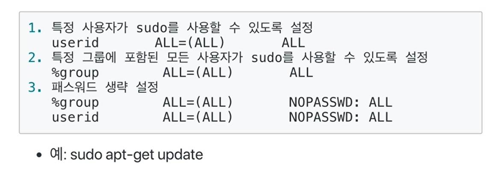
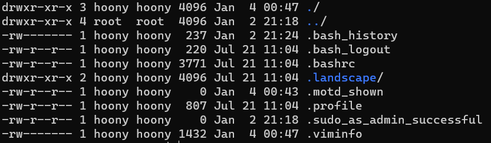
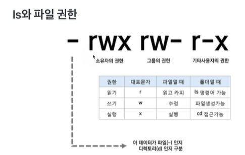

# chapter3-02 파일 및 권한 관리 -1

## sudo 명령어: root 권한으로 실행하기

- root 계정으로 로그인 하지 않은 상태에서 root 권한이 필요한 명령을 실행 할 수 있도록 하는 프로그램
- 기본 사용법
  - sudo 명령어
  - 사용 예
    - sudo apt-get update

- /etc/sudoers 설정 파일에서 다음과 같이 설정을 변경할 수 있음

  - visudo가 설치되어 있다면, 해당 명령을 통해 설정 파일이 오픈되어 바로 수정 가능

    

## ls와 와일드 카드

- *는 임의 문자열
- ?는 문자 하나

## ls와 파일 권한

- 파일마다 소유자, 소유자 그룹, 모든 사용자에 대해 

  - 읽고, 쓰고, 실행하는 권한 설정

  - 소유자 접근 권한 정보는 inode에 저장

    

