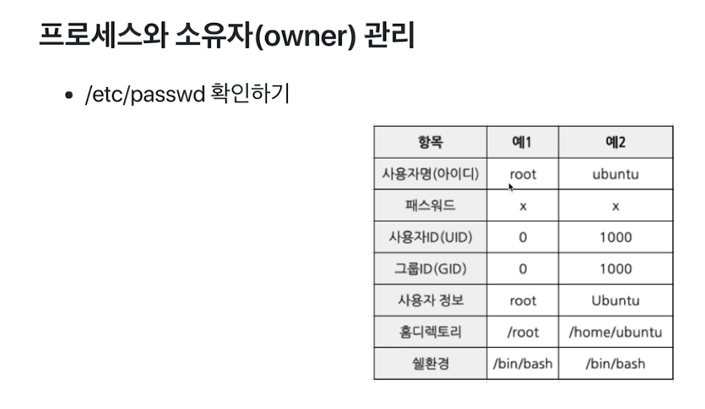
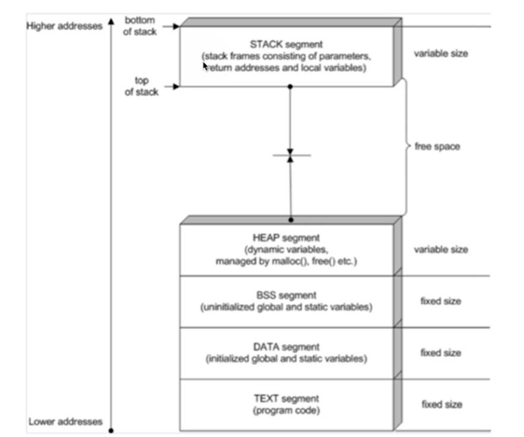
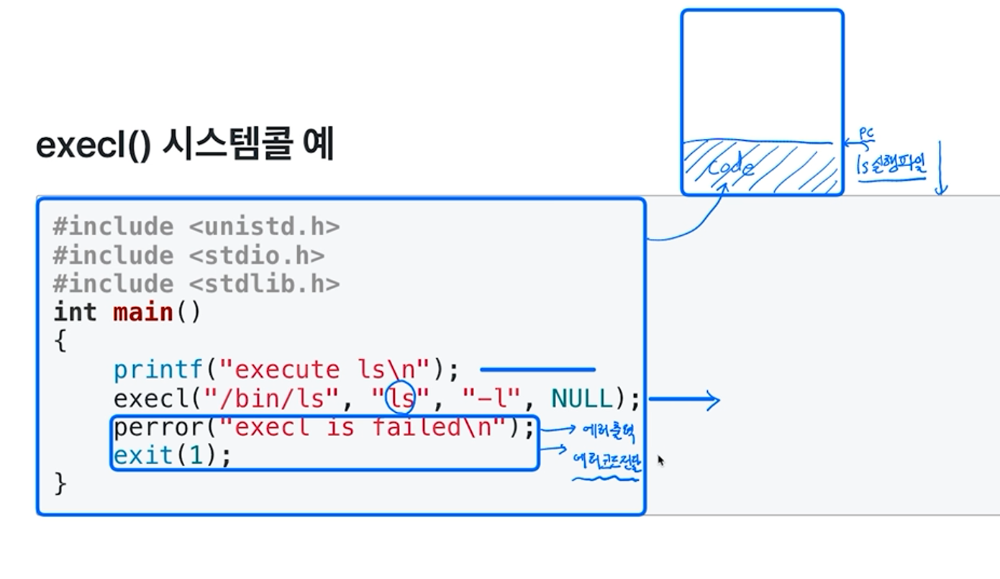
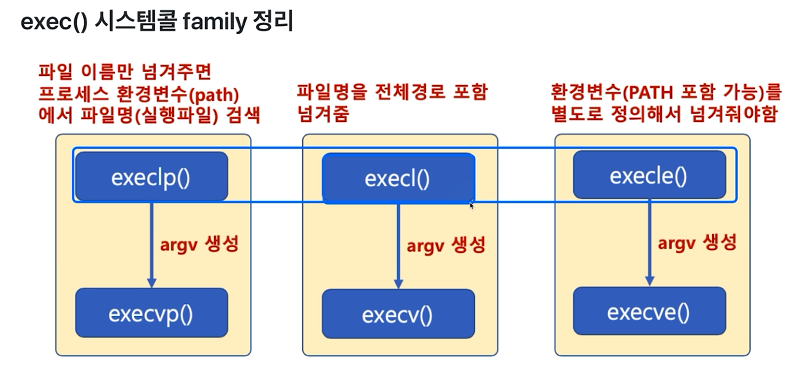
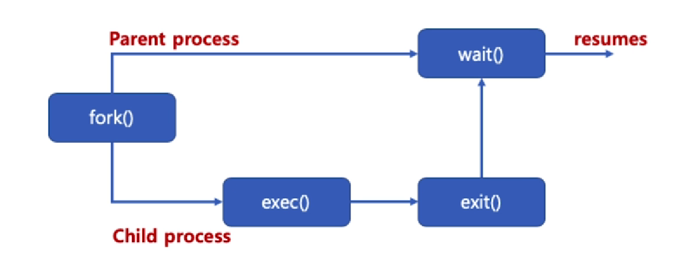
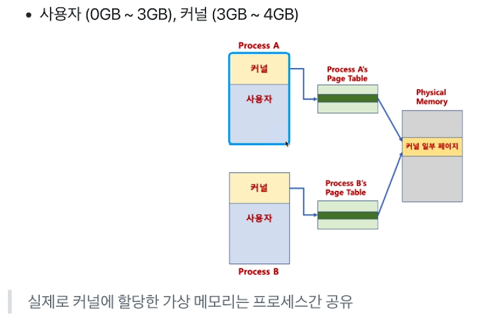
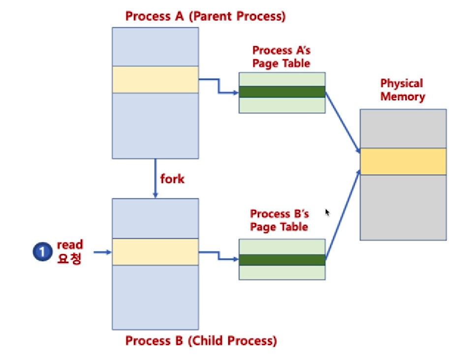
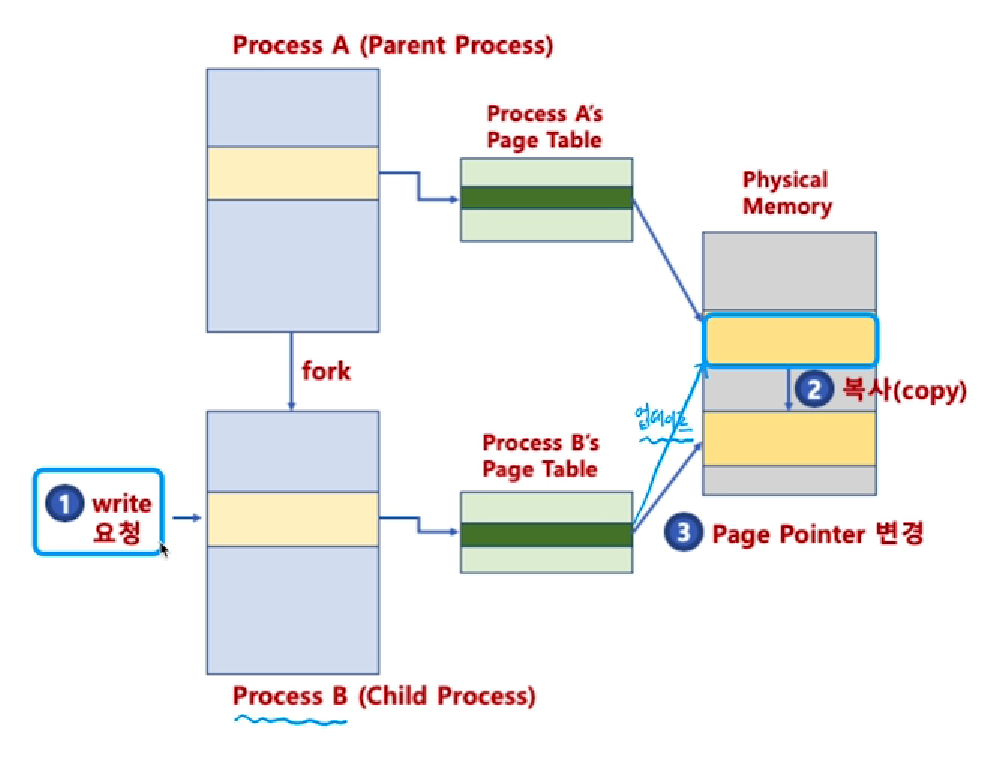

# chapter5 프로세스 관리

## 01 프로세스 ID

### 프로그램, 프로세스, 스레드

- 프로그램: 바이너리, 코드 이미지, 응용 프로그램, Application, 또는 실행 파일 
- 프로세스: 실행중인 프로그램(메모리 적재 + 프로세스 상태 정보 포함)
- 스레드
  - 리눅스 프로세스는 기본 스레드 포함
  - 싱글스레드 프로세스: 기본 프로세스 
  - 멀티스레드 프로세스: 여러 스레드 존재 

### 프로세스 ID

- 프로세스 ID
  - pid, 각 프로세스는 해당 시점에 unique한 pid를 가짐
  - pid 최대 값은 32768
  - 부호형(signed) 16비트 정수값 사용

```shell
sudo vi /proc/sys/kernel/pid_max
```

- 최근 할당된 pid가 200이라면, 그 이후는 201, 202... 식으로 할당

### 프로세스 계층

- 최초 프로세스: init 프로세스, pid 1
- init 프로세스는 운영체제가 생성
- 다른 프로세스는 또다른 프로세스로부터 생성
  - 부모 프로세스, 자식 프로세스
- ppid 값이 부모 프로세스의 pid를 뜻함

### 프로세스와 소유자(owner)관리

- 리눅스 내부에서는 프로세스의 소유자(사용자)와 그룹을 UID/GID(정수)로 관리

- 사용자에 보여줄 때에만 UID와 사용자이름 매핑 정보를 기반으로 사용자 이름으로 제공

  ```
  ps -ef
  sudo vi /etc/passwd
  sudo vi /etc/shadow
  ```

  



## 02 프로세스 ID 시스템콜

### 프로세스 관리 관련 시스템콜

- 사전작업: 우분투 리눅스에 gcc설치 (+ vi 에디터/한글 설정)

  ```
  sudo apt-get install gcc
  gcc --version
  gcc -o test.c test
  ```

    ```c
    #include <sys/types.h>
    #include <unistd.h>
    #include <stdio.h>
  
    int main()
    {
            printf("pid=%d\n", getpid());
            printf("ppid=%d\n", getppid());
            return 0;
    }
    ```


## 03 프로세스 생성(fork)

### 프로세스 기본 구조

- TEXT, DATA, BSS, HEAP, STACK



### 프로세스 생성

- 기본 프로세스 생성 과정
  - TEXT, DATA, BSS, HEAP, STACK의 공간을 생성
  - 프로세스 이미지를 해당 공간에 업로드하고, 실행 시작
- 프로세스 계층: 다른 프로세스는 또다른 프로세스로부터 생성
  - 부모 프로세스, 자식 프로세스

### fork()와 exec() 시스템콜

- fort() 시스템콜
  - 새로운 프로세스 공간을 별도로 만들고, fork() 시스템콜을 호출한 프로세스(부모 프로세스) 공간을 모두 **복사**
    - 별도의 프로세스 공간을 만들고, 부모 프로세스 공간의 데이터를 그대로 복사
- exec() 시스템콜
  - exec() 시스템콜을 호출한 현재 프로세스 공간의 TEXT, DATA, BSS 영역을 새로운 프로세스의 이미지로 **덮어씌움**
    - 별도의 프로세스 공간을 만들지 않음

#### fork() 시스템콜

```
헤더 파일: <unistd.h>
함수 원형: pid_t fork(void);
```

```c
#include <sys/types.h>
#include <unistd.h>
#include <stdio.h>

int main()
{
        pid_t pid;
        printf("Before fork() call\n");
        pid = fork();

        if (pid == 0)
                printf("This is Child process. PID is %d\n", pid);
        else if (pid > 0)
                printf("This is Parent process. PID is %d\n", pid);
        else
                printf("fork() is failed\n");

        printf("%d process quit\n", pid);
        return 0;
}
```

- pid=fork()가 실행되면 부모 프로세스와 동일한 자식 프로세스가 별도 메모리 공간에 생성
- 자식 프로세스는 pid가 0으로 리턴, 부모 프로세스는 실제 pid 리턴
- 두 프로세스의 변수 및 PC(Program Count) 값은 동일
- 새로운 프로세스 공간을 별도로 만들고, fork() 시스템콜을 호출한 프로세스(부모 프로세스) 공간을 모두 복사한 후, fork() 시스템콜 이후 코드부터 실행


## 04 프로세스 생성(exec)

```
헤더 파일: <unistd.h>
함수 원형:
int execl(const char *path, const char *arg, ...);
int execlp(const char *file, const char *arg, ...);
int execle(const char *path, const char *arg, ..., char *const envp[]);
int execv(const *path, char *const argv[]);
int execvp(const char *file, char *const argv[]);
int execvpe(const char *file, char *const argv[], char *const envp[]);
```

### execv(), execvp(), execve() 시스템콜 사용법

```c
// 인수 리스트를 내용으로 하는 문자열 배열
char *arg[] = {"ls", "-al", NULL};
execv("/bin/ls", arg);

// 파일 이름을 해당 프로세스를 실행한 프로세스의 환경변수(path)를 검색함
// 인수 리스트를 내용으로 하는 문자열 배열
char *arg[] = {"ls", "-al", NULL};
execvp("ls", arg);

// 환경 변수를 지정하고자 할 때
char *envp[] = {"USER=dave", "PATH=/bin", (char*)0};
char *arg[] = {"ls", "-al", NULL};
execve("ls", arg, envp);
```


### execl() 시스템콜 예

```c
#include <stdlib.h>
#include <stdio.h>
#include <unistd.h>
#include <sys/types.h>

int main()
{
        printf("execute ls\n");
        execl("/bin/ls", "ls", "-l", NULL);
        perror("execl is failed\n");
        exit(1);
}
```



- execl이 실행되면 코드가 덮어씌워지기 때문에 execl 밑으로는 실행이 되지 않는다. 만약 아래 코드가 실행이 된다면 execl이 올바르게 실행되지 못한 것임. 새로운 프로세스가 만들어지는 것이 아니다.

### execl()와 execlp() 시스템콜 사용법

```
execl("디렉토리와 파일 이름이 합친 전체 이름", "명령어 인수 리스트", "끝은 NULL로 끝나야함");

// 파일 이름을 해당 프로세스를 실행한 프로세스의 환경변수(path)를 검색함
execp("파일 이름", "명령어 인수 리스트", "끝은 NULL로 끝나야함");

execl("/bin/ls", "ls", "-al", NULL);
execlp("ls", "ls", "-al", NULL);
```

- 명령어 인수 리스트
  - argv[0] = "ls"
  - argv[1] = "-al"

### execle() 시스템콜 사용법

```c
// 환경 변수를 지정하고자 할 때
char *envp[] = {"USER=dave", "PATH=/bin", (char*)0};
execle("ls", "ls", "-al", NULL, envp);
```



### execve() 사용법

```c
#include <stdlib.h>
#include <stdio.h>
#include <unistd.h>
#include <sys/types.h>

int main()
{
        char *envp[] = {"USER=DAVE", NULL};
        char *arg[] = {"ls", "-al", NULL};

        printf("execute ls\n");
        execve("ls", arg, envp);
        perror("execl is failed\n");
        exit(1);
}

// 위 코드는 실패함, PATH가 없기 때문에
```


## 05 프로세스 생성(wait)과 나만의 쉘 만들기

### fork()와  exec()

- 리눅스 프로세스 실행
  - 부모 프로세스부터 새로운 프로세스 공간을 만들고 부모 프로세스 데이터 복사(fork)
  - 새로운 프로세스를 위한 바이너리를 새로운 프로세스 공간에 덮어씌움(exec)
- 사용 예
  - fork를 통해 새로운 자식 프로세스를 만든 후에, 자식 프로세스에서 실행하고자 하는 다른 프로그램을 exec를 하여 병렬적으로 작업을 수행하고자 할 때

### wait() 시스템콜

- wait() 함수를 사용하면, fork() 함수 호출시, 자식 프로세스가 종료(exit())할 떄까지, 부모 프로세스가 기다림

- 자식 프로세스와 부모 프로세스의 동기화, 부모 프로세스가 자식 프로세스보다 먼저 죽는 경우를 막기 위해 사용(고아 프로세스)

  

### fork(), execl(), wait() 시스템콜

- execl()만 사용하면, 부모 프로세스가 사라짐

- 이를 유지하기 위해, fork()로 새로운 프로세스 공간 복사 후, execl() 사용

- wait() 함수를 사용해서 부모 프로세스가 자식 프로세스가 끝날 때까지 기다릴 수 있음

  > 쉘 프로그램은 fork(), exec()계열, wait() 함수를 기반으로 작성 가능!


### 나만의 쉘 만들기

```c
#include <unistd.h>
#include <stdlib.h>
#include <stdio.h>
#include <string.h>
#include <sys/wait.h>
#include <sys/types.h>

#define MAXLINE 64

int main(int argc, char** argv) {
        char buf[MAXLINE];
        pid_t pid;
        printf("HoonShell ver 1.0 \n");
        while (1)
        {
                memset(buf, 0x00, MAXLINE);
                fgets(buf, MAXLINE - 1, stdin);
                // char *fgets (char (string, int n, FILE *stream)
                if (strncmp(buf, "exit\n", 5) == 0) {
                                break;
                }
                buf[strlen(buf) - 1] = 0x00;

                pid = fork();
                if (pid == 0) {
                        if (execlp(buf, buf, NULL) == -1) { // args 배열 만들어서 넣어줄 수도 있음
                                printf("command execution is failed\n");
                                exit(0);
                        }
                }

                if (pid > 0) {
                        wait(NULL);
                }
        }
        return 0;
}
```


## 06 프로세스 생성(copy on write)

### 리눅스 프로세스

- 프로세스당 4GB 가상 메모리 할당



- 가상메모리 시스템 덕분에 추가 공간 사용의 필요가 없어짐

### copy-on-write

- fork()는 새로운 프로세스 공간 생성 후, 기존 프로세스 공간 복사

  > 4GB를 복사한다면, 프로세스 생성 시간이 오래 걸림

- 자식 프로세스 생성시, 부모 프로세스 페이지를 우선 사용
- 부모 또는 자식 프로세스가 해당 페이지를 읽기가 아닌, 쓰기를 할 때
  - 이 때 페이지를 복사하고, 분리함
- 장점
  - 프로세스 생성 시간을 줄일 수 있음
  - 새로 생성된 프로세스에 새롭게 할당되어야 하는 페이지 수도 최소화

#### copy-on-write(read시)

- 자식 프로세스 생성시, 부모 프로세스 페이지를 우선 사용

  

#### copy-on-write(write시)

- 부모 또는 자식 프로세스가 해당 페이지를 읽기가 아닌, 쓰기 처음 요청시 페이지 복사 및 분리

  - 모든 페이지를 복사하는 것이 아니고(특히 사용자 공간 중), 필요한 페이지를 복사한다.
  - CODE 영역은 특히 복사할 필요가 없을 것.

  


## 07 프로세스 종료(exit)

### exit() 시스템콜

- exit() 시스템콜: 프로세스 종료

  ```c
  #include <stdlib.h>
  void exit(int status);
  ```

- main 함수의 `return0;`와 `exit(0);`의 차이는?

  - exit() 함수: 즉시 프로세스를 종료함(exit() 함수 다음에 있는 코드는 실행되지 않음)

  - return  0:  단지 main()이라는 함수를 종료함

    - 단, main() 에서 return 시, C언어 실행 파일에 기본으로 포함된 _start() 함수를 호출하게 되고, 해당 함수는 결국 exit() 함수를 호출함

      > main() 함수에서 return 0;는 exit() 호출과 큰 차이가 없음

- 부모 프로세스는 status & 0377 (비트연산임) 계산 값으로 자식 프로세스 종료 상태 확인 가능

- 기본 사용 예

  ```
  exit(EXIT_SUCCESS); // EXIT_SUCCESS는 0
  exit(EXIT_FAILURE); // EXIT_FAILURE는 1
  ```

- exit() 시스템콜 주요 동작

  - atexit()에 등록된 함수 실행(exit()가 실행될 때 같이 실행될 함수들을 등록할 수 있음)

  - 열려 있는 모든 입출력 스트림 버퍼 삭제(stderr, stdin, stdout 등)

  - 프로세스가 오픈한 파일을 모두 닫음

  - tmpfile() 함수를 통해 생성한 임시 파일 삭제

    - 참고: tmpfile() - 임시 파일을 wb+(쓸 수 있는 이진파일 형태) 모드로 오픈 가능

      ```c
      #include <stdio.h>
      FILE *tmpfile(void);
      ```

#### atexit() 함수

- 프로세스 종료시 실행될 함수를 등록하기 위해 사용
- 등록된 함수를 등록된 역순서대로 실행

##### atexit() 함수 예제

```c
int main(void) {
    void exithandling(void);
    void goodbyemessage(void);
    int ret;
    
    ret = atexit(exithandling);
    if (ret != 0) perror("Error in atexit\n");
    ret = atexit(goodbyemessage);
    if (ret != 0) perror("Error in atexit\n");
    exit(EXIT_SUCCESS);
}

void exithandling(void){
    printf("exit handling\n");
}
void goodbyemessage(void) {
    printf("see yo again!\n");
}
```


## 08 프로세스 생성과 종료 총정리 및 wait 시스템콜 상세

### wait() 시스템콜

- wait() 리턴 값

  - 에러가 발생한 경우

    ```c
    #include <sys/wait.h>
    pid_t wait(int *status);
    //  리턴값은 종료된 자식 프로세스의 pid 
    ```

    - status 정보를 통해 기본적인 자식 프로세스 관련 정보를 확인할 수 있음
      - 예:

    ```c
    int WIFEXITED(status); // 자식 프로세스가 정상 종료시 리턴값은 0이 아닌 값이 됨
    ```

     

- wait()함수를 사용하면, fork() 함수 호출시, 자식 프로세스가 종료할 때까지, 부모 프로세스가 기다림
- 자식 프로세스가 종료되면, 좀비 프로세스가 되어, 해당 프로세스 조사를 위한 최소 정보만 가지고 있는 상태가 됨
- 완전히 끝나면, 해당 정보도 삭제하고, 부모 프로세스에 SIGCHILD 시그널이 보내짐
  - 시그널을 받고나면 부모 프로세스의 wait가 풀리고 그 다음이 실행되게 됨

```c
#include <stdlib.h>
#include <stdio.h>
#include <unistd.h>
#include <sys/types.h>

int main() {
        int pid;
        int child_pid;
        int status;
        pid = fork();
        switch (pid) {
                case -1:
                        perror("fork is failed\n");
                        break;
                case 0:
                        execl("/bin/ls", "ls", "-al", NULL);
                        perror("execl is failed\n");
                        break;
                default:
                        child_pid = wait(&status);
                        if (WIFEXITED(status)) {
                                printf("Child process is normally terminated\n");
                        }
                exit(0);
        }
}
```


## 09 프로세스 스케쥴링 관련(참고)

### 참고: 우선순위 기반 스케쥴러

- Priority-Based 스케쥴러
  - 정적 우선순위
    - 프로세스마다 우선순위를 미리 지정
  - 동적 우선순위
    - 스케쥴러가 상황에 따라 우선순위를 동적으로 변경

### 우선순위 변경하기

#### nice()

- 프로세스 중 사실상 root가 소유한 프로세스만, 우선순위를 높일 수 있음

  - 다른 프로세스는 우선순위를 낮출 수만 있음

  - 스케쥴링 방식에 따라 우선순위가 적용될 수도 있고, 안될 수도 있음

    ```c
    #include <unistd.h>
    
    int nice(int inc);
    ```


#### getpriority(), setpriority()

```c
#include <sys/resource.h>
int getpriority(int which, id_t who);
int setpriority(int which, id_t who, int value);
```

- which: 프로세스(PRIO_PROCESS), 프로세스 그룹(PRIO_PGRP), 사용자(PRIO_USER) 별로 우선순위를 가져올 수 있음

##### 예제 - priority.c(root 소유로 실행)

- 이외에 스케쥴링 조작 시스템콜 기본 제공(POSIX 기반), 스케쥴링 알고리즘 변경으로 사용은 어려움

```c
#include <sys/resource.h>
int which = PRIO_PROCESS;
id_t pid;
int ret;
pid = getpid();
ret = getpriority(which, pid);
```


