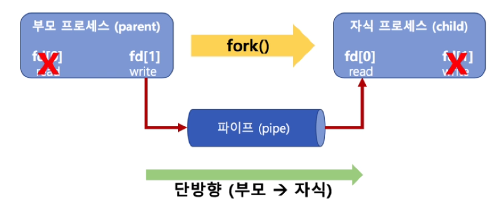
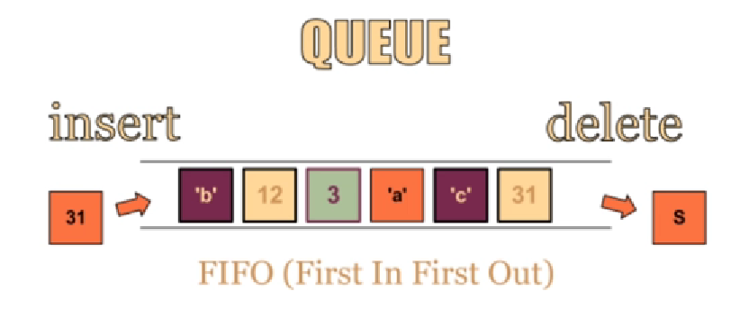
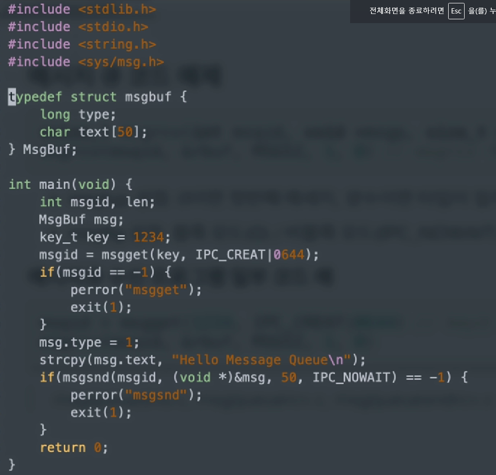
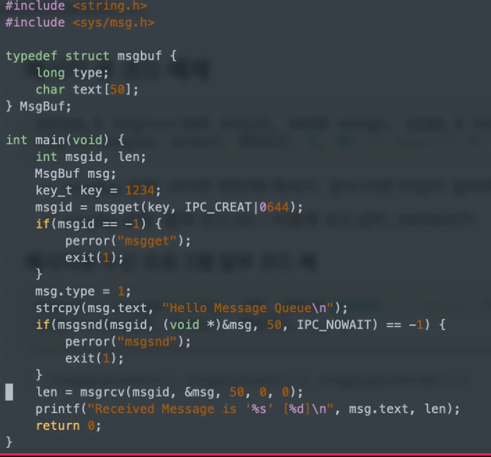
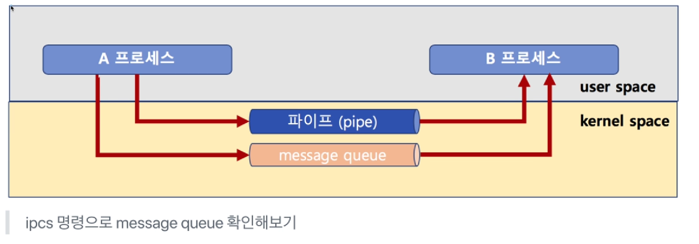
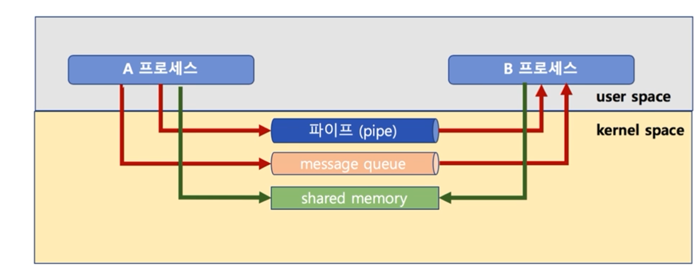
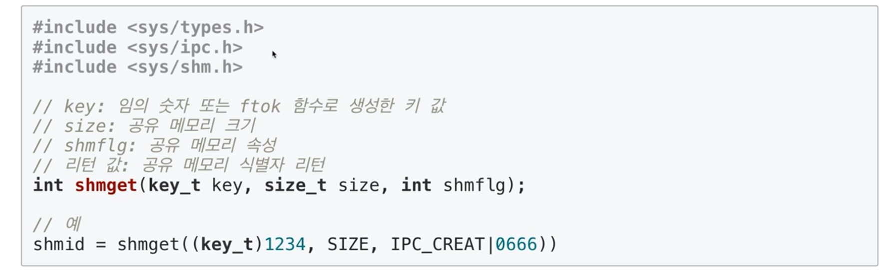
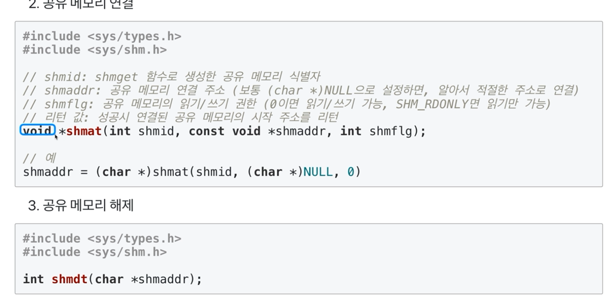
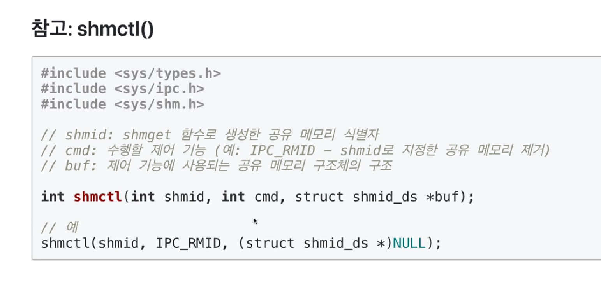
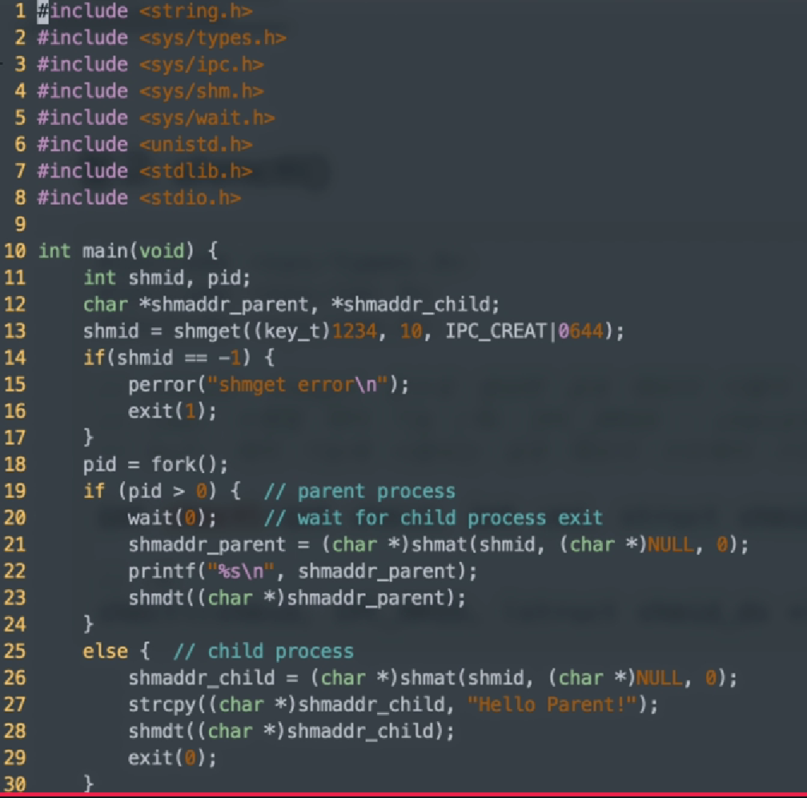

# chapter6 IPC 기법

## 01  IPC 실습1

### 다양한 IPC 기법

- IPC: InterProcess Communication
  - file 사용
  - Message Queue
  - Shared Memory
  - Pipe
  - Signal
  - Semaphore
  - Socket


### 파이프

- pipe(파이프)

  - 기본 파이프는 단방향 통신

  - fork()로 자식 프로세스 만들었을 때, 부모와 자식간의 통신

    			

    ``` c
    #include <stdio.h>
    #include <stdlib.h>
    #include <unistd.h>
    #define MSGSIZE 255
    
    char* msg = "Hello Child Process!";
    
    int main()
    {
            char buf[255];
            int fd[2], pid, nbytes;
            if (pipe(fd) < 0) // pipe(fd)로 커널영역에 파이프 생성
                    exit(1);
            pid = fork(); // 이 함수 실행 다음 코드에서 부모/자식 프로세스로 나뉘어짐
            if (pid > 0) // child process pid in parent process
            {
                    printf("parent PID: %d, child PID: %d\n", getpid(), pid);
                    write(fd[1], msg, MSGSIZE); // fd[1]에 씁니다.
                    exit(0);
            }
            else // 자식 프로세스에는 pip값이 0이됨
            {
                    printf("child PID: %d\n", getpid());
                    nbytes = read(fd[0], buf, MSGSIZE); // fd[0] 으로 읽음
                    printf("%d %s\n", nbytes, buf);
                    exit(0);
            }
            return 0;
    }
    ```


### 메시지 큐(message queue)

- 큐니까, 기본은 FIFO 정책으로 데이터 전송

  

#### 메시지 큐 코드 예제

```
msqid = msgget(key, msgflg) // key는 1234, msgflg는 옵션
```

- msgflg 설정
  - IPC_CREAT: 새로운 키면 식별자를 새로 생성, IPC_CREAT|접근권한
  - 예: IPC_CREAT|0644 - > rw-r--r--

```
msgsnd(msqid, &sbuf, buf_length, IPC_NOWAIT)
```

- msgflg 설정: 블록 모드(0) / 비블록 모드(IPC_NOWAIT)

##### 메시지 큐 전송 프로그램 일부 코드 예

```c
msqid = msgget(1234, IPC_CREAT|0644); // key는 1234, msgflg는 옵션
msgsnd(msqid, &sbuf, buf_length, IPC_NOWAIT)
```

##### 
```c
ssize_t msgrcv(int msqid, void *msgp, size_t msgsz, long msgtyp, int msgflg);
msgrcv(msqid, &rbuf, MSGSZ, 1, 0); // msgrcv 예
```

- msgtyp 설정: 0이면 첫번째 메시지, 양수이면 타입이 일치하는 첫번째 메세지
- msgflg 설정: 블록 모드(0) / 비블록 모드(IPC_NOWAIT)

##### 메시지 큐 수신 프로그램 일부 코드 예

```c
msqid = msgget(1234, IPC_CREAT|0644); //key는 동일하게 1234로 해야 해당 큐의 msqid를 얻을 수 있음
msgrcv(msqid, &rbuf, MSGSZ, 1, 0);
```







#### 참고: ftok()

- ftok(): 키 생성을 위한 함수
  - path 경로명의 inode값과 숫자값(id)를 기반으로 키 생성
  - 경로 삭제 후 재생성시 inode 값이 달라지므로, 이전과는 다른 키 값이 리턴

```c
#include <sys/ipc.h>

key_t ftok(const char* path, int id);

// 예
key = ftok("keyfile", 1);
id = msgget(key, IPC_CREAT|0640);
```


## 02 IPC 실습2

### IPC 기법과 커널 모드

| pipe, message queue는 모두 kernel 공간의 메모리를 사용합니다.



> 메시지큐를 만들으면 삭제하면 명령도 해줘야함


###  공유 메모리(Shared Memory)

- 노골적으로 kernel space에 메모리 공간을 만들고, 해당 공간을 변수처럼 쓰는 방식

- message queue처럼 FIFO 방식이 아니라, 해당 메모리 주소를 마치 변수처럼 접근하는 방식

- 공유메모리 key를 가지고, 여러 프로세스가 접근 가능

  

#### 공유 메모리 코드 예제

1. 공유 메모리 생성








