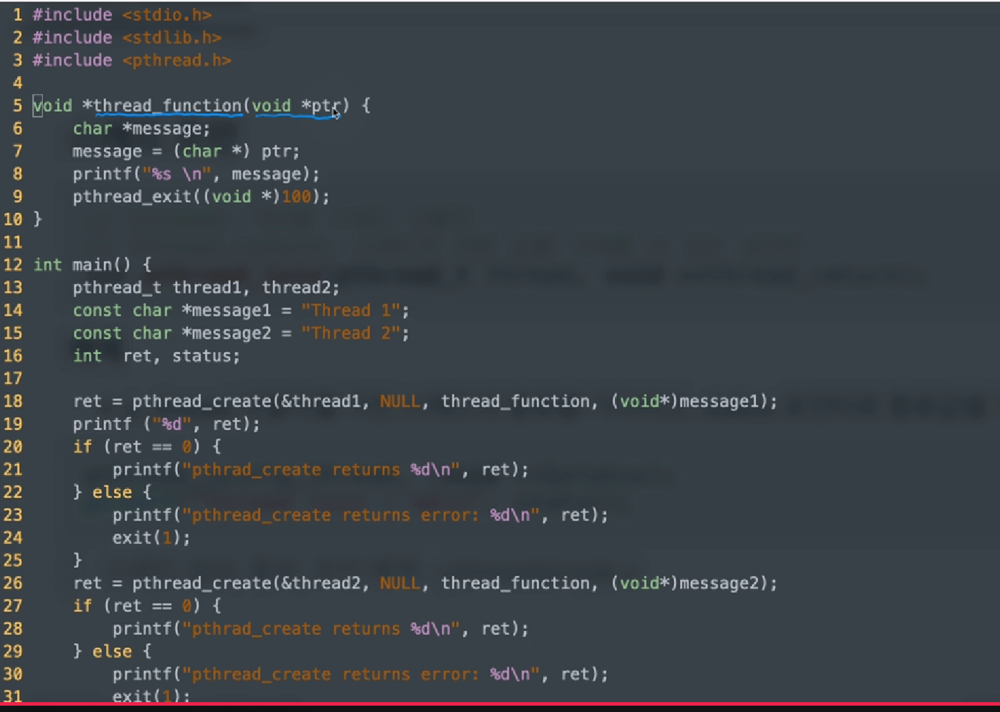
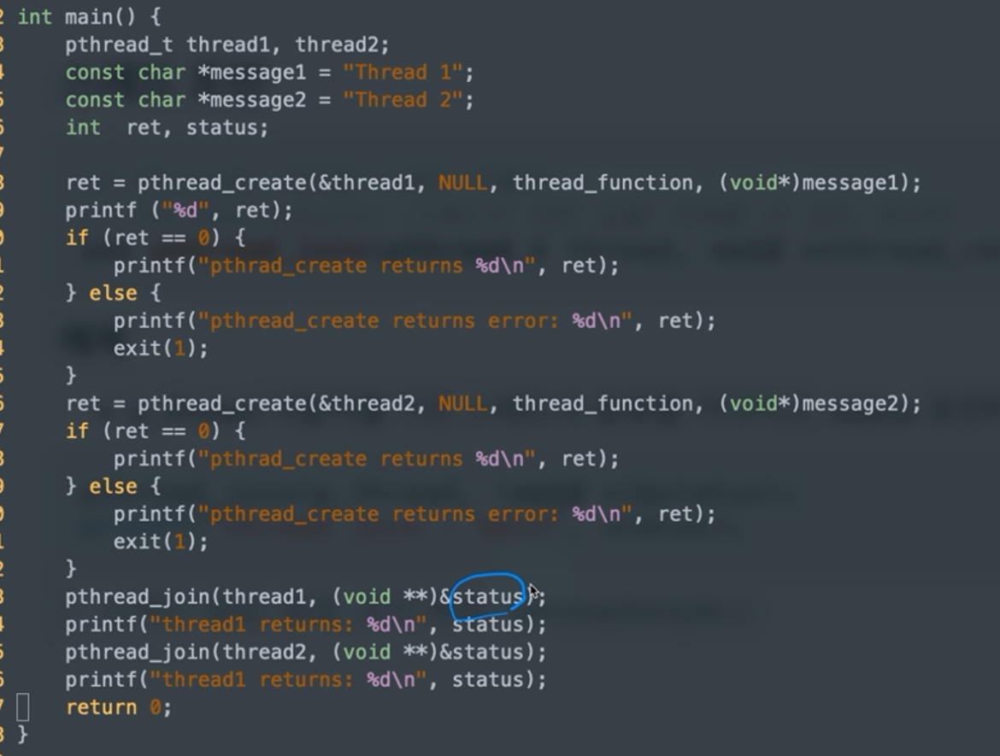
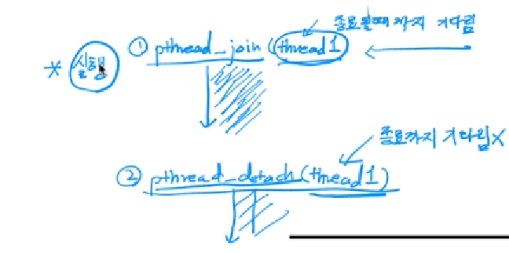
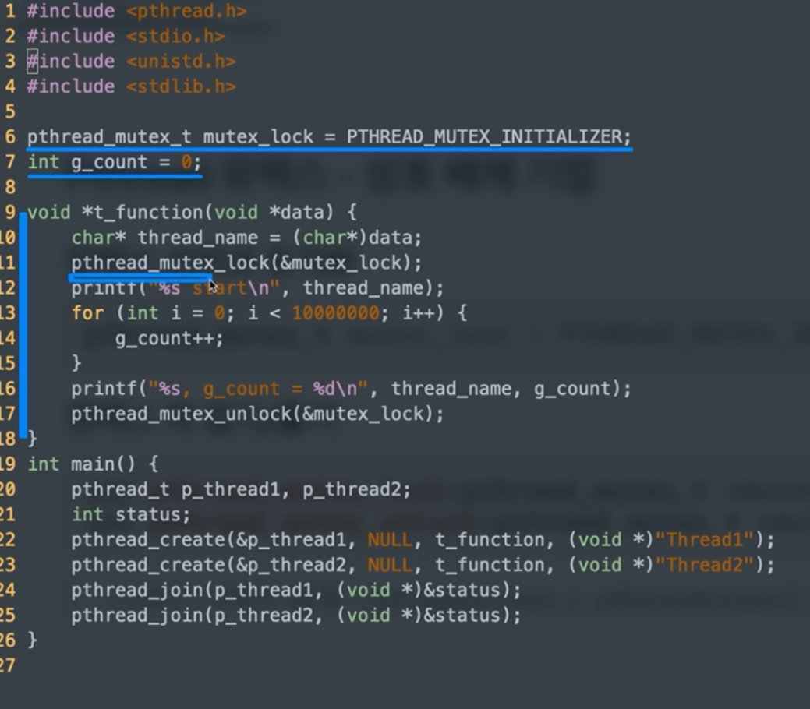

# chapter9 스레드

## 01 스레드 기본

### Pthread란? 

- thread 표준 API
  - POSIX 스레드 또는 Pthread(피-스레드)라고 부름
- Phtread API
  - 저수준 API로 100여개의 함수 제공
  - 복잡하지만, 유닉스 시스템 핵심 스레딩 라이브러리
  - 다른 스레딩 솔루션도 결국 Pthread를 기반으로 구현되어 있으므로, 익혀둘 가치가 있음

#### Phtread 라이브러리

- <pthread.h> 헤더 파일에 정리
- 모든 함수는 pthread_로 시작
- 크게 두 가지 그룹
  - 스레드 관리: 생성, 종료, 조인, 디태치 함수 등
  - 동기화: 뮤텍스 등 동기화 관련 함수

- 기본 라이브러리(glibc)와 분리된  libpthread 라이브러리에 pthread가 구현되어 있으므로 컴파일시 명시적으로 -phthread 옵션 필요

  ```
  gcc -pthread test.c -o test
  ```

#### 스레드 조인

```c
// thread: 기다릴 스레드 식별자
// thread_return: 스레드의 리턴 값을 가져올 수 있는 포인터
int pthread_join(pthread_t thread, void **thread_return);
```

#### 예제

- p_thread 식별자를 가진 스레드의 종료를 기다리고, status 포인터로 종료값을 가져옴

```c
pthread_join(p_thread, (void*)&status);
printf("thread join: %d\n", status);
```






## 02 스레드 기본과 동기화

### 스레드 디태치

- 해당 스레드가 종료될 경우, 관련 리소스를 해제(free)한다.
  - pthread_join를 기다리지 않고, 종료 즉시 리소스를 해제한다.

```c
// thread: detach할 스레드 식별자
int pthread_detach(pthread_t thread);
```

#### join과 차이점

- pthread_join: 메인스레드에서 기다렸다가 종료
  - 상태값을 가져온다거나 추가처리 가능
  - main thread에서 자식 스레드의 작업이 끝날 때까지 기다린다
- pthread_detach: 바로 종료



### Pthread 뮤텍스 - 상호 배제 기법

#### 뮤텍스 선언과 초기화

```c
pthread_mutex_t mutex_lock = PTHREAD_MUTEX_INITIALIZER;
```

#### 뮤텍스 락 걸기/풀기

```c
int pthread_mutex_lock(pthread_mutex_t *mutex);
int pthread_mutex_unlick(pthread_mutex_t *mutex);
```

